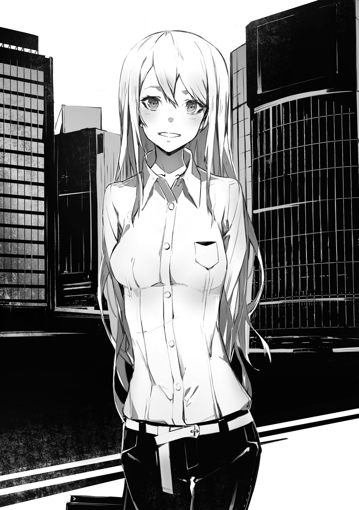

A red land.
In this wasteland filled with stone and pebbles, there is no sign of animals.
And in this harsh land, where only few brushes and grass could grow, a gun truck had its stop.
The truck has been covered in think armour and carried impressive looking auto-cannon

"2PM, right on schedule"

From the back of truck, a lone soldier descended, Kay Sakuravent, and took out his binoculars.
Age is 17.
It is a young man whose hair and eyes had colour of dark ultramarine.
He was wearing a "mankind defence agency" battle suit.
Forged by daily training he gave off aura of certain strength, and you could feel strong will in his eyes.

"Saki and you too Ashlan, we are starting _graveyard_'s monitoring"

With his binoculars Kay could see a strange structure standing beyond horizon.
Black pyramid.
As if made by precise machine, perfect triangular pyramid.
This black, as if painted by ink, object stood out among red wastelands

"Situation is..."

"Nothing as usual"

From inside of truck, on a passenger seat, a young man, with clipboard on his knees, lazily answered.
His name is Ashlan Highrol
Year older than Kay, and also soldier as Kay.

"Just nothingness, right, Kay?"

"Only 70 seconds passed, graveyard's observation procedure requires 300 seconds"

The graveyard is what they call this black pyramid.
The target of Kay's diligent observation has been 200 meters tall, which was comparable to modern skyscraper buildings.

"There is really nothing, isn't? 300 seconds should already pass, right?"

"Only 170 passed"

"Ah... damn, isn't it more than enough already? I got carsick from all this shaking, and want to return already"

Ashlan, who already wrote down "Nothing out of order" in report and lazily laid in passenger seat.
Kay, on other hand, shows no sign of lowering his binoculars.

"300 seconds"

"Ugh... As usual so serious..."

"Reporting: no sight of abnormalities in Urza Federation's graveyard. Demons are still sealed up as usual"

"...Huh..."

Ashlan made a deep sigh and from his passenger seat faced person in driver seat.

"Hey, Saki, can you say something to him too? Yesterday, and today everything is fine. And pretty sure tomorrow will be the same"

"Hm?"
Orange haired girl by the name Saki raised herself from the seat.
While chewing her favourite gum, she was leaning against driver's wheel in relaxed pose.

"Isn't it fine? While Kay doing his work seriously, we can take it easy"

"I mean there should be limit! It is been hundred years, hundred! Was there even record of any, among four races, to escape the seal?"

"None"

"See?"

"And to prevent that, we're continuing our observation"

"...Fair enough, but aren't you too inflexible?" - said Saki, while getting herself new gum to chew -
"Doing it diligently only in our area is not enough, right? There are four graveyards after all"

"Obviously 3 other places are being properly handled too" - Kay stated as if it is obvious thing and started moving toward truck -
"We have great responsibility, after all it will become a disaster if by some tiny chance demons would escape."

There are four black pyramids in this world.
These buildings are so called graveyard, where mankind imprisoned other races against whom they once fought.

Wielders of strong magic, Demon race.

Powerful demi-humans, like angels, elves and dwarves, Foreign gods race.

Ghost-like, Spirit race.

Enormous and powerful beasts, with dragons being at top, Cryptid race.

No human logic could comprehend the might of four races, and so mankind cowered in fear before their strength.
But 100 years ago a turning point in mankind's history happened, from which humans could finally fight back.
With humans joining the other four races, the greatest conflict in history started, Five Races Great War.
After all battles, mankind was able successfully seal away four other races in black pyramids, _Graveyards_.
Since then, mankind continued to diligently manage graveyards.

"That's right, Kay, I almost forgot about very important matter" -
Saki, who is been in driver's seat, turned towards him -
"We got party on next week, to celebrate Jeanne's promotion. And we need to discuss present..."

"Sorry, We're in the middle of mission right now, save it for later"

"...Eh? There is nothing going on anyway, it is fine, isn't it?" - Saki raised her voice in protest.

Nearby Ashlan just sat at passenger's seat, bewildered by Kay.
So-called "World peace" is a common perception of current era.
It is impossible for four races to escape from graveyard...
It wasn't opinion of only Saki and Ashlan.
Most, if not all, young people who were conscripted for two years military service shared the same opinion.
Almost no one doubted it.
And then there are some rare cases of people, like Kay, who rejected such ideas.

"Even if nothing is going to happen, I do not want to be negligent. Half of it might be coming from my stubbornness, though"

Both Saki and Ashlan are not just being negligent.
Their logic is only sound in this case.
After all, seal, that has been safe for hundred years, wouldn't collapse out of nowhere normally.
But...
For Kay there is a reason why he cannot help but worry about seal.

"Because I saw it"

10 years ago he fell into Demon's graveyard.
And there, inside the black pyramid, Kay saw demons and that's why.

"Again this story? We heard with Ashlan around 20 times by now"

"That's just your imagination, falling into graveyard and then escaping it? That's a den of demons, after all"

It is as Ashlan says, Kay too thinks that it is miracle that he was able to survive.
He was attacked by countless demons and lost his consciousness.
And after he woke up, he already was outside of graveyard.
But there is no proof to support his claims
...Still, the sense of dread from these demons
...It cannot be just his delusion.
There is no way it was a dream.
The horror he felt from these demons.
Even if people around him disagrees, a scenario, where demons tear apart seal and escape, is _possible_, or so Kay feels.
Therefore they must be ready for demons counter attack.
And so Kay, more than anyone else, diligently trained for past 10 years.
Not sparing a moment for break from his training, even during meals or baths Kay would continue with image training in his head.
And even his superiors are amazed by "Training maniac" Kay.

"At that time, Kay should've been around 7 or 8 years old. There is just single entrance to graveyard.
For Kay to enter and fall into graveyard, with no soldier that standing guard to notice him would be strange, right?"

"Moreover, there are surveillance cameras. But, Kay, it didn't have any records of you, right?"

There are also no witness that could testify Kay's fall into graveyard.
To be specific, all adults that were there at that time said: "Don't remember a thing".

"That's why, it is just a dream! A scary dream that you had as a kid!
And, Kay, did you forget the face of our instructor when you were telling him it with all seriousness?"

"No, I remember"

"Don't you agree?"

Saki nodded in agreement

"You must got it all wrong, Kay"

"Doesn't matter, it is not an excuse to neglect our duty to watch over the graveyard"

"Eeh...!?" - Both Ashlan and Saki wanted to scream

"Let's contact HQ. 2PM watch is over, there is no abnormalities with the graveyard"

Kay looked over the graveyard and said so, not even being slightly bothered by his colleagues.

-------------------------------------------------------------------------------

Mankind Defence Agency

Anti non-human organization, that has been established after Five Races Great War, in case emergency related to non-human races to happen.
For example, if incident would happen at graveyard.
Or if someone among four races would escape and attack.
Or if Five Races Great War to occur again.
In preparations to such emergencies Mankind Defence Agency is working on creating necessary defences: from various highly destructive weapons to transport infrastructure.
They work on it in all of the world countries steed. (Note: it is a bit unclear whether Agency replaced local governments or acts more like global force)
And it even manages  military forces.
Each person is obliged to two year military training as soldier of Mankind Defence Agency
Still it is quite old organization, and nowadays people that take military service seriously are mostly non-existing.

"Ah, I'm tired... Taking a break"

MDA training grounds.
There in its corner, Saki was sitting on the bench in her sportswear.

"We're against machine doll, you know!? Beating it would only hurt your own hands, and if you even fail to avoid its attack, you gonna get broken bones!
There is no way I'm doing it, just no way!"

"...."

"Hey, Kay, are you listening?"

"It cannot be helped, Cryptids are like that, after all"

In front of Kay is 3 meters tall machine that imitates Dragon.
_If by any chance Cryptids would escape from graveyard_.
For that reason there is such training, but.
Most people supported Saki's opinion that is is useless.
After all there is no way to beat them.
According to Great War records, the strongest among Cryptids Dragons couldn't even be scratched by tank's weapons.

"True, it might be futile to even try"

Contrary to his own words, Kay slips under machine dragon's feet.

"Wait, Kay!?" - Saki screams

If he'd get trampled at this moment, he would definitely get his body bones completely broken.
Yet despite the risk, Kay faces the thick, as log, foot and using his whole body...
Tries a ramming attack.
Fourth World Fighting Arts.
Adopted by MDA technique to be used against non-human races.
But, Kay's attack didn't even budge robotic dragon an inch.

"...Failed, huh?"

"What are you doing, Kay!? Under its weight you'd get crushed completely!
In first place we're not even supposed to use machines of Cryptid type without instructors to watch us..."

"There is no meaning to it without a resolve"

"...Oh no, Kay, I think you've been wrong at wrong times"

She had a bitter smile on her face while drinking a bottle water.
Half of it was amazement at him, but another hand it was almost as if seeing a rare animal in Zoo.

"Ashlan, don't you agree with me?"

"...D.on't talk... to me... My wounds... are really... killing me"

Behind Saki's bench was crouching and unmoving young man.
He was fighting against different from Kay training doll, but got seriously kicked to his sides and no longer could get up.

"Well, leaving aside Ashlan. Even instructors are saying that if Kay would be born at time of Great War, maybe you'd leave mark on history instead of Sid"

"I don't really qualify to be a hero. It is just I don't want to slack off when it comes to training" -
Kay looked at robotic dragon, and replied in his normal tone.

Hundred years ago.
Various races: Demons, Foreign gods, Cryptids and Spirits - were ruled by strongest among their kind.
Each could has own title: Elder, Leader or Commander.
But in human language there was a single way to refer to these mightiest: _Four Heroes_.

Demon's hero **Dark Empress Vanessa**

Foreign god's hero **Heaven Lord Alfreya**

Cryptid's hero **Fang King Rath=IE**

Spirit's hero **Lord of Spirits Rokugen Kyouko**

All four of them boasted unparalleled strength and therefore they led their race.
But for humans, who were weakest, they were unstoppable obstacle.
That was until the one who could stand against four of them has risen.
The hero of mankind.

"Prophet Sid, huh?" - said Saki who were looking up at ceiling.

"Hero of mankind **Prophet Sid**, wielder of otherworldly shining fire sword. He defeated non-human races and sealed them away...
Well, that's basically all we know about Sid"

"It is certain that a man by the name Sid existed hundred years ago. We even have his photo"

Photo of a man in robes.
That was a photo of Prophet Sid.
Kay already saw it multiple times.

"But you know, Kay, historians have doubts about Sid's legend" - said Saki with a shrug.

There is established theory that human hero **Prophet Sid** didn't even exist.
His shining sword is not found at the current moment.
Moreover there are no records of his fight against four heroes.

"As far as we know there is no proof that Sid fought against four heroes of non-human races.
There is no photo or video records of his fights.
And even Sid's sword has never been found."

"...Yeah"

No proofs.
Surprisingly similar to his own situation with fall into Demons graveyard.
Even thought it is been a hundred years since then, it is still very strange that not even single image of his fight against four heroes remained.
For that reason nowadays there are not many people who believe in Sid's legend.

"So, Kay, even if Sid did actually exist, it is likely that he wasn't really all that active for the mankind's hero.
What do you think?"

"I had similar thoughts about it. But still..." - he said while wiping away sweat from his forehead -
"Isn't it fine to let people dream?"

"Well, that's... Never mind, changing topic. Hey, Ashlan, wake up!"

"...Ugh!?"

Without even slight hint of mercy Saki kicked Ashlan

"We already started talking about it during a day, but what are we going to do about Jeanne's promotion?
We don't really have much time to prepare a present"

"Huh? For promotion, wouldn't just bouquet of flowers suffice?" - said Ashlan who finally got up and sat on a bench.

"Something typical should be fine too, right?"

"No way we're going with it. Jeanne is scholarship student so she get flowers each year as part of official commendation.
Hey, Kay, you too think flowers are not good, right?"

"...."

"Eh, hey Kay, are you listening?"

Kay, who turned his back toward Saki, heard notification from his communication device in his breast pocket.

"...Jeanne?"

Contact's name belonged to a girl, his childhood friend.
Similarly to Saki and Ashlan, she was conscripted for military service

"Hm? Jeanne? What's with her?"

"Hm... I got nothing, is this a message only for you, Kay?"

Both of them risen to try and take a peek at content of Jeanne's message on Kay's commendation device screen.

_To Kay_

_Tomorrow you're off duty, right?_
_Let's meet in front of cat's statue of 9th terminal at 10AM_
_But make sure to keep it a secret from Saki and Ashlan, ok?_

"..."

Even if you ask to keep a secret.
How I'm supposed to do it?
There are already two curious people that are trying to approach me (Kay) for a sneak peek.

"Kay, what Jeanne says?"

"Even I got nothing from her. Suspicious, a secret from both me and Saki...?
Hey, Kay, could it be are you gotten in some forbidden relationships with Jeanne!?"

"Hold on" - said Kay and extended his hand to stop them.

"My bad, it seems that is not a message from Jeanne"

"Oh ho, is that so, Kay? Then just what was that ringtone?"

"Trying to lie to us so lamely. Could it be this is some special message, Kai-kun?"

Saki is smirking, and Ashlan has a ghastly look on his face.
Both were approaching Kay to take a look at his communication device.

"...Ah by the way"

Kay tightly grasped his communication device and turned his back towards them.
And he run at full speed.

"I haven't done any running today yet. Time to do my 10km course!"

"Oi, stop, you bastard!"

"Someone! Help us to catch and stop Kay! He is a criminal who wants to conspire in secret with Jeanne in some wicked scheme!"

"That's misunderstanding...! I only wanted to take my training seriously!"

Jeanne, please, don't use MDA's commendation device for private needs!
So Kay shouted in his mind, while desperately trying to escape a chase from two of his colleagues.

-------------------------------------------------------------------------------

Urza Federation -
A highly developed country with its capital in Urzak.
It resides in northern part of continent.
Once it has fallen under Demon invasion, led my demon hero, **Dark Empress** Vanessa.
But it is a story of hundred years ago.
With the victory in Five Races Great War, it has been re-taken by mankind.

"10AM. Guess Jeanne is going to be a hour later then?"

9th Terminal
For Kay it takes around 15 minutes to reach this place by subway.
This area around capital Urzak became a business center with lots of modern buildings.

"Kay, sorry that I made you wait" - a lively voice could be heard.

Kay looked in the direction of vice.
There is been standing silver-haired young girl with a bag in her hand.

"Jeanne you're right on time? I honestly thought I'd have to wait another hour"

"Mu? How rude!" - she pouted.

But it ended pretty quickly and she already smiled.

"Since I'm leaving to capital on next week, I'll make exception this time"

Jeanne E Anisu

She is somewhat tall, comparing to most girls of her age, and has slender figure.
Together with long silver hair, her face gives off a dignified aura fitting to a model on magazine's cover.
Kay's neighbour, 17 years old.
Her long sleeved shirt and skinny pants gives a boyish feeling.
But contrary to that feeling, it only gives her more charm as a girl.

"Let's go, walk, walk. Cadet, Kay! Crawl your way until that building!"

"In the middle of city?"

"I'm joking of course! It is just..." - Jeanne pointed at his clothes

Kay has been wearing MDA's uniform, and on his shoulder was a bag that could fit a battle rifle.
But of course since it is middle of city, rifle was locked away in case.

"Aren't you off-duty today? Why are you wearing such heavy equipment, Kay?"

"Before our shopping I had a training on my own, after all"

"...I know, I know. It was a sarcasm. Good grief" - Silver haired girl laughed in astonishment.

"I guess among these who I could invite to enjoy off-duty time, you're the only one who wouldn't get fazed by it, Kay"

"You hanging out with someone during off-duty time?"

"No, I'm not! As I said I'm being sarcastic here" - Jeanne responded while pouting and poked his side with elbow.

Strangely enough, her voice had amused tone.

"...Well, I like this side of yours, Kay"

Then, they started to walk side by side.
All around them were famous clothing shops and confectionery shops.
Jeanne seriously looked around each and every one of them.

"I wonder which shop we should visit. It is been a while since I went out, I just cannot decide where to go"

"By the way, for what purpose we're here?"

"Shopping. For Saki and Ashlan" - and the names of his colleagues went out
(To be honest here it says 同僚たちの名前が、ジャンヌの唇を伝ってこぼれた which is roughly could be translated as "Names of colleagues left Jeanne's lips" which sounds weird).

"With Kay, it would be for three people.
And three of you have been thinking about preparing some farewell gift before my departure to capital(Urzak), right?"

"...You're asking me that?"

Bull's eye.
Indeed they were thinking about her present.
But it was Kay together with two of his colleagues who are supposed to shop for her gift and keep it secret until the fateful date.
There is no way Kay could just answer to the person himself: _Yes, indeed we're thinking about it_

"It is fine, fine. I had exactly the same thoughts"

"...Same?"

"Farewell gifts. Before I'll depart for capital, I'd like to make a present for you"

Multiple generations of Jeanne's ancestors were serving in top position of MDA.
She was from renowned and elite family.
Her father was one of the most renowned officer at Urza's MDA HQ.
And grandfather was a great soldier who served as general at HQ.
And then Jeanne, who was their descendant, is obviously going to rise in ranks faster than anyone among her colleagues.
Beautiful 17 years old maiden that is bound to depart to capital.
She is fastest in history to be promoted so quickly.
And her story was even featured in news few weeks ago.
There is even story going around that eventually she'll surpass both her father and grandfather.

"Oh yeah, now I think about it, with Jeanne leaving, lots of guys are going to grieve"

Valkyrie

Both her colleagues and instructors are openly call her like that.
From a very young age she is been studying military leadership under guidance of experienced veterans.
And even carrying leadership aptitude from generation to generation in her family.
Together with her beauty, Jeanne already has been acknowledged by top brass in Urza's HQ for her charisma.
To no one surprise, a notice about Jeanne's transfer to capital became a grave news to all of her male colleagues.

"Even Ashlan is down because of that. Sake is the same"

"...Well, most likely last time we'll be seeing each other after all"

"Aren't your transfer is for two years top? It is not like you'll never return"

After two years, when she'll become candidate for leadership position, they'll be able to have their reunion.
There is no reason to be depressed.
Or so Kay thought, until he heard her reply.

"When I'll come back, both Saki and Ashlan will finish their military service"

"...Ah, that's true"

Mandatory military service requires 2 years, and afterwards each among young people can choose own road.

"Guess the only friend left will be you, Kay, right?"

"Yeah, true"

People who finish their military service are going to leave.
Probably only few exceptions, like Kay, would willingly continue their service at MDA.

"There are not many who would decide to become professional soldier, like me"

"Well, I want too, you know?"

"I know. You want to surpass your old man, right? Like how many tens of times I heard this story?"

"Think you lost one digit, it is at least one hundred"

Walking under sunlight coming through trees, Jeanne made amused face (really not sure how to say it, but she is having fun).

"I've told this story so many times, that you already got tired of it, right?"

"Pretty sure once you'll surpass your father, he'll be very proud of you...
But I'm pretty sure there are not many odd fellows like me who is going to continue serving in military."

"I know, you're always saying that watching over graveyard is your duty, right, Kay?
Not to mention, we can never know when hordes of demons will appear.
And that you want to discover Sid's sword once again"

"...."

Prophet Sid certainly existed.
Mankind's hero who fought against non-human races heroes.
Kay never ever doubted this story.

_...Because I saw it_

_...Ten years ago, Sid's sword was before my eyes_

Hero's sword actually exist
At demons graveyard.
When he fell into depths of black pyramid, he definitely saw it.
A sword that shine like a sun, surrounded by demon masses.
And that feeling of desperation as he was trying to reach out the sword.
This is all that Kay could remember.

"Well... I wouldn't say I cannot understand your feelings" _TL Note:_ this is a bit confusing まあ……その気持ちがないわけじゃないけど

Why Sid's sword could be inside demons graveyard?
While it certainly a mystery, without a doubt that _shining sword_ is definitely fits a description of Sid's legendary sword.
Though the only who believes in it is Kay himself.

"Even if I to tell you about it, you'd only tease me about it"

"I wouldn't do such thing though?" - said Jeanne with a smile on her face.

"I'm serious"

"I really wouldn't make fun of your resolve. But, Kay, your cute sulky face is just asking for it"

"Yeah, Ok"

"How many years ago was that, I wonder. You suddenly told me: _I saw Sid's sword!_
I think we were only around ten years old at that time.
And since then we were always playing together."

While we were walking through crowd.
The girl by my side suddenly stops when we reach the middle of road's crossing.

"Kay, you're the only one who played with me since our childhood,
And even now walking by my side.
Even after I'll return back you'll remain by my side as well"

She turns toward him.
And her eyes, without even blinking, looks seriously at him _TL Note:_ this is actually hard to translate. ゆれる双眸が、まばたき一つなくこちらの顔を覗きこんできた。

"Listen, Kay, about us. What do you think we're going to do from now on?"

"From now on...? Jeanne, you're going to capital for two years, and then you'll be back"

"Yeah... But I mean after that" she said and swallowed her breath.

She, who is his childhood friend and colleague, takes a step further.

"Kay... What if I..." - and in that moment...

Jeanne's body started to become distorted.

"Jeanne!?"

"Eh? Kay, what is it?"

Like it is been only her reflection in water that got distorted, she replied as if nothing happened.
But she wasn't the only one.
Everything before Kay's eyes started to change.
Surrounding him buildings, trees and passerbyes, all started to distort and twist.
Sudden wind followed it.
Storm of black particles started around him.

_No one sees it? This storm that is around us?_

_Just what's going on here!?_

Kay looked up and could only see a sky that started to turn black.
White clouds, as if being sucked, started to flow towards a single point.
And even blue skies, as if being pulled by something, disappeared.
All being swallowed into single black point in the sky.

Not only sky became its victim.
Even distorted buildings, trees and people around.
Everything from the ground itself starts being sucked in.
Each after each follows inside and disappears.
Like giant black hole, it swallows everything and everyone.

_No one notices it?_

_It cannot be... Am I the only one who can see it?_

And even the girl, his childhood friend, started to rise above surface.

"Jeanne!"

"Eh? Kay, what's all of sudden? Calling my name in public like that...
Could it be... Can I expect something then?"

Despite starting to float, she said with a smile on her face.
Not even understanding what's going on.
Before Kay's own eyes his childhood friend started was sucked into the sky.

"Jeanne, take my...!" - he desperately extended his hand in the middle of storm.

And at the same time, Kay lost his consciousness.

Activating **World Reincarnation**

Initiating World's **Overwrite**

-------------------------------------------------------------------------------

