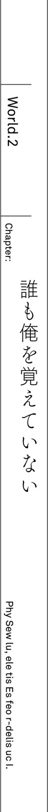

"We're here. This is out town, or I prefer to call it our secret base"

They've been going through ruined city for quite a while.
But finally Ashlan stopped car by empty highway

_TL Note:_ I don't really get this sentence, especially the _道路の一画で_ so I tried my best here...

...It took us for about 30 minutes?

...Considering that we are coming from direction of 9th Terminal, and this building.

Twin Tower is towering over surroundings.
It has 10 floors, and despite its sad state with broken windows, its shape is difficult to forget.

"That seems like 10th Terminal's building...? Then it is 10th Terminal?"

Urza Federation's 10th Terminal.
Originally at this place has been lushly green avenue.
Looking at it now, there were just piles of pebbles from destroyed buildings nearby, and broken road full of cracks.

"Oh? You know about this place?"

"You're real mystery. Do you live nearby?"

Said Ashlan and Saki who came out from car.

"...Well"

Kay is coming from outskirts of 8Th Terminal, and they should know about.

"Well, you should take your time to calm down.
Considering you were just attacked by demon, I imagine you're still a bit confused.
Rest a bit and calm yourself"

"That's right! Although you seem to know about us,
your clothes and gun... are not familiar to me"

Both were looking at Kay's attire and bayonet.
He was wearing MDA's standard equipment, but Saki and Ashlan had something different.
...No, at its core, the design of both uniform is the same.
...There are few different details. While both uniforms had coat of arms on left side, theirs was different from Kay's
Kay's coat of arm belonged to MDA, but these two had something different.

"Hm? We're working for Urza Mankind Resistance Army. Wait, you don't even know about it?"

"Mankind Resistance Army?"

"Ah that's... Rather than confused, you seem like to suffer from temporary amnesia.
There are no one out there who doesn't know about Resistance"

In response to Ashlan, Saki only gave a shrug.

"Anyway, let's go in. If we're going to remain here, we might be discovered by demon patrols.
We have some business underground. I mean this Terminal's underground."

Ashlan guided Kay, who walked alongside Saki.
The Terminal's doors seem to be blown off with by impact of explosion.
Passing through crashed entrance, they started to descent to underground.

"What about elevator?"

"I'm pretty sure you can guess just by looking, but do you think there is any electricity left?"

Ashlan pointed towards dark passage with his chin
It certainly would be pitch black, if not for sun's light that is coming from broken windows.

"You know, I have a favour to ask..."

Kay swallowed his breath, and said.

"I don't care if you think I lost my memories, but please tell me what happened?
Why city is ruins and why demons are roaming this place like they own it?"

That demon said: The best way to order around your slave, is to use their language

The situation here is different from what Kay remembers.
He got approximate picture, but right now he needs to know situation with all possible details.

"It is as you can see"

As they were going through dim underground passage, Ashlan pointed to a ruined walls of the building.

"This world is filled hordes of natural enemies to mankind.
And especially troublesome are four races: Demons, Cryptids, Foreign gods and spirits.
We lost to them in last war.
It is been 30 years ago by now."

"...Mankind has lost? That's..."

This is opposite to what Kay remembers.
He would love to think it is just a bad dream.
Just what happened when he was shopping with Jeanne?

"...Please continue. What happened to humans? Are they safe?"

"Escaped and hid whenever they could. Barely made it" - answered instead Saki, who was walking besides him.

"The continent is now dominated by these four races.
And even now they continue to compete for dominance.
Urza Federation has been conquered by demons,
So all people could do is abandon everything and run away.
That's more or less current situation."

Saki points towards the end of staircase.
Third underground floor was in complete silence, and then bright light blinded Kay's eyes.

"It is bright?"

From bright light has been shining, and for a second you could think that you're on surface.

...So it was like that. If demons dominate the surface.

...Humans can escape underground.

They used this big underground shopping mall to create city.
There were shops, people houses, and even hotels with restaurants.
Kay could see parents with their children walking around and soldiers that were patrolling area with their guns.
Everything here fits well together.
Despite it looking different, it was certainly human city. _TL Note:_ The wording here is a bit weird ここには、人間の都市が姿を変えながら確かに存在していた。

"Welcome to human city _Neo Vishal_.
All unused underground space has been remodelled to create this city.
It is quite a sight, isn't it?"

Originally, Vishal is the name of ward where was 10th Terminal.
Naming city the Neo Vishal, most likely was in place of conquered city on surface.

"Since demons took away our city and made their nests on its territory,
it makes sense for us to hide underground, what do you think?"

"...It is really great, to develop it to such extent"

Hearing how this place was made by people who escaped demons in fear,
Kay imagined it would look miserable.
But he was pleasantly surprised.
People looked lively and full of life.

"What about food?"

"Of course we produce everything here.
Since trains are no longer running, it felt like a waste.
So we removed railway tracks and instead used it to build nice farms.
Oh and we use solar panels on surface to generate electricity."

"Wouldn't demons destroy it?"

"Demons wouldn't bother to scout rooftops of high buildings.
And even if they would, to them there isn't much difference between solar panels and rest of the ruins.
And with electricity we could restart various production plants that could be used to produce medicine and clothes."

There is electricity and food.
Despite four races dominating continent, humanity is able to survive.

"Saki, Ashlan, do you live here?"

"Around year by now.
We were employed in this city as guards.
The only force that can fight against non-humans is Resistance"

Saki lowered her hand towards her waist where was hanging gun.
Normally for young girl like Saki, the automatic rifle of this size would be just too big.

"Resistance goal is to re-take control from demons in Urza Federation.
But of course resistance exists all over the world, and in every place there is a similar situation."

"...Listen, guys"

Resolving himself, Kay looked at two of them.
Humans lost a Great War.
But it brings a question then.

"It might sound... as a dumb question. But I really have no idea what's going on here"

He then pressed on his question to silent Saki and Ashlan.

"Why we lost Great War?"

"....What?"

"...Even if you're asking why..."

They were bewildered.

"Because... there was no way for us to win" - timidly answered Saki.

"Neither knife or gun could work against Cryptid's dragons.
As for spirits, bullets just pass through.
Then there is demon magic that can vaporize buildings.
And elfs of foreign gods could create magic tools that are superior to our weaponry.
Moreover the main reason are leaders of these four races who are just incredible strong"

"You mean four heroes?
Like Dark Empress Vanessa or Fang King Rath=IE?"

"Oh, you actually know that much, Kay?"

After saying that, she looked towards him.

"If you know that much, then why you thought that there is a chance for us to win in first place?"

"Why, you ask... I'm just in doubts about this situation."

He gave Saki a straight answer.

"It is just as far as I know, didn't Sid defeat demons and other races?
Afterwards they were sealed away in graveyards"

_TL Note:_ To be honest in first place I'm not sure how single person could defeat all of them in his reality...

"Sid?"

"Who's that?"

"Wait, guys, I mean we're talking about Prophet Sid. Surely you know about him..."

The hero who was able to defeat non-humans.
Just few days ago, they talked about him.

_TL Note:_ Kay really cannot comprehend this situation... *facepalm*

"If it would just name alone... Hey, Ashlan, do you know anything?"

"Prophet, you say? And he defeated demons?
If there would be such guy, do you think we'd continue living underground?"

Saki and Ashlan looked at each other.
It looks like, no one is even aware about him.

...Not like they are not aware about him.

...Prophet Sid doesn't even exist in this world!?

Little by little, Kay come to realization just how much differs this world from what he remembers.

"According to my memories human hero existed.
Prophet Sid defeated four heroes and thanks to that mankind won Great War
But..."

Then...

_What would become of world, if Prophet Sid wouldn't exist?_

Since there was no one to fight against four heroes, mankind lost.
That's more or less, the outline of current history.

...Certainly at that time...

...When we went shopping with Jeanne, because of that phenomenon, something has changed.

The black hole in sky sucked everything in: clouds, buildings, people, even Jeanne.
Everything except Kay himself.
Before he became aware, history of the world itself has changed.

"Oh is that...? Hey, Ashlan"

"Yeah, that's our main force coming. Hour earlier than planned"

From within city could be heard cheers.
There is crowd of people.
People, who were on their way, stopped and moved toward them to give cheers too.

"We're with Saki are part of unit that is stationed here.
These guys belong to main body of Resistance.
And once a month they are going around human cities.
Their main duty, to put it simply, is to find a way to re-take Urza Federation"

The hope to take back surface world.
But still, even if main body of army comes, would it really cause such cheers?

"It seems they are quite popular"

"Well, that's because there is also Resistance's commander.
For people it is like a coming of their saviour from demon's menace.
Well, you can hear these high-pitched cheers."

These loud cheers seems to be coming female population.
To that Ashlan only shrugged.

"They are cheering commander, not army itself.
That's our great leader.
Young, excellent and as you can see quite popular."

"...Paladin" -
muttered Saki.

"Symbol of hope that Urza Federation will be liberated.
Though it is not only here in Urza.
Even resistance in other regions acknowledges it."

Getting closer to the crowd, you can see several soldiers in the same uniform as Saki and Ashlan.
With the same coat of arms belonging to Resistance.

"So where is that commander?"

"Look there, guy in the middle of crowd.
You can recognize him by his knight like armour.
Oh, it seems like he is coming here"

Saki took a breath and continued with admiration in her voice.

"Jeanne-sama is really so cool!
Despite being a man, his face is prettier than that of most girls here.
Of course he would be popular.
And his feminine name is not so bad"

_TL Note:_ Yes you got it right, that's our cute osananajimi :D

"...Saki, what you said right now...?"

There is no mistake about it.
Girl, near him, uttered that name:

"Jeanne-sama!"

"We were awaiting your arrival!
No abnormalities so far.
We'll diligently continue our guard duty!"

Saki and Ashlan straightened their posture and saluted their commander in knight's armour, surrounded by citizens.

"Good work, I appreciate your efforts." - responded commander with beautiful smile.

Commander is beautiful and young _man?_ clad in heavy armour.
Most likely around the same age as Kay.
His gentle facial features gives off a very feminine aura.

But as for Kay...

...The face looks like it is covered with make-up to make it look more boyish.

...And this armour, could it be to hide feminine slender figure?

Voice too, feels like it is forced.
And _his?_ silver hair...
Since it is so long for a man, it is tied behind.
This was just like in their childhood.
Jeanne used to tie her hair like that since long hair caused troubles moving around and running.

"Jeanne?"

"..."

Silver haired knight turned towards him, standing between Saki and Ashlan.
Urza Resistance commander titled head as if being puzzled.

"Oh, who could it be? I don't recognize him"

"We found him on surface and took under protection.
His name is Kay.
Not registered as resident of this city."

"He hit his head a bit so his memories are in disorder.
But rest assured, Jeanne-sama, he is not bad guy."

Saki and Ashlan gave quick response.
To which Jeanne nodded in acknowledgement.

"I see, well then..."

"Please wait, Jeanne, it's me!"

Kay pushed aside both them and shouted towards his childhood friend.

Please let it be some sort of prank.
World that is ruled by demons.
Humans that now had to live in underground city.
Saki and Ashlan who don't remember him at all.
Could it be she is just playing a prank together with them?

"Just few moments ago we were doing shopping together!
And since you were planning to depart to capital, you wanted to give some presents to us!
Do you really remember nothing!?"

Seeing some noise, crowd became agitated.
And not with sympathy towards him.
They were giving a weird looks to a person of unknown origin, yet who dared to shout at the knight that was symbol of hope for mankind liberation.

"Forgive me" - said knight by the name Jeanne and shook his head.

Pretending to be a man...
Kay couldn't believe it.
_TL Note:_ Not sure about this line `男のフリをした────そうとしかカイには思えない裏声で`

"Did we meet somewhere? I feel you mistook me for someone else"

"...You really don't remember me..."

"Pardon me, I have to attend to meeting with my subordinates afterwards.
Saki, Ashlan, hear him out in my steed"

Surrounded by subordinates, Jeanne turns away from Kay.

...Really?

...Even Jeanne doesn't remember me?

He really wished for it to be some kind of joke.
Just a moments ago they were together.

"Jeanne!"

Kay bite his lips and kicked ground.
He moved towards knight, who turned his back to him, despite being pushed back by knight's subordinates.

"Was your dream to become commander by pretending to be man!?
That cannot be right?
You said yourself, that you want to surpass your father, as his daughter.
Do you not remember even that?"

_TL note:_ the first sentence is a bit difficult so I tried my best to catch its meaning `お前……そんな男のフリして指導者顔して`

"...!?"

He said in voice that could be only heard by Jeanne.
And it seemed that Resistance's commander shoulders dropped down a bit...
Or so it seemed to Kay.
But in that instance.

"Bastard, what are you doing to Jeanne!"

"Get away! Jeanne-sama, are you all right?"

Kay has been taken by shoulders and dragged away from Jeanne by her subordinates.

"H-hey, Kay, what are you doing!?"

"You! Why you suddenly lunged toward Jeanne-sama...
We're really sorry, Jeanne-sama.
He is not bad guy, really!"

While being hold between Saki and Ashlan, Kay could only watch Resistance's Commander leaving with dumbfounded look on his face.

-------------------------------------------------------------------------------

Night has fallen upon Neo Vishal.
In this underground city, the daylight has been replaced by lights from ceiling.
And at the midnight, to match night from surface, city's lights were on only around roads.

"..."

At a certain hotel, in dimly lighted room.
Key were sitting in front of desks full of various documents and maps, that he borrowed from Resistance with help of Saki and Ashlan.

"...How could it happen"

Before long, he became too tired to neither sigh or even show a bitter smile. _TL Note:_ weird original line `やがて。溜息とも苦笑ともつかない、疲労まじりの息がこぼれた。`

"If this is a _general knowledge_ of this world... Then history of this world is certainly different from what I remember"

In Kay's world history, humans won in Five Races Great War.
But it was different here.

"We lost in Great War.
And it happened just 30 years ago."

But except for history, everything else matches Kay's memories, including continent geography.
And the same could be said about people.
Among citizens of this city Kay was able to find familiar names of his neighbourhood.
Even currency that were used here, was the same as the one Kay got from his old world.

...There are some minor differences like Ashlan getting over his motion sickness.

...But other than that, people here are more or less how he remembered them.

The only mystery is why both Kay and Prophet Sid have been forgotten.
Both of them never ever existed in first place.
As if they are erased from history.

"...Just why"

It is understandable why Prophet Sid would cease to exist from this world.
After all, human hero is the sole reason mankind won Great War.
That he could understand.

"But why I no longer exist...!?"

_TL Note:_ I wonder if Kay really would love meet himself in this alternative world :D

Even his friends from MDA are here.
Yet despite that why he is the only one who has been forgotten?
And what about his parents or relatives?
Although he couldn't find their records in Neo Vishal, it is possible that they could escape to a different ward.
So for now he can be certain that only he and Prophet Sid are no longer exist.

"Are there any... clues?
Since there is no Prophet Sid, mankind is now dominated by other races.
Are there any other changes aside from that!?"

He continued to look through every history book and map.

"Urza Federation has been defeated by demon's hero.
Obviously, since Sid is no longer here.
Is there something else that differs from my memory!?
Damn, even the graveyards are the same black pyramids.
How about history of governing generals..."

In that instance he felt strange.
After turning page, Kay felt that he should go to previous one.
Urza Federation map.
There was a photo of black pyramid.
Demons graveyard.

...Wait a second, could it be I made mistake.

...I have feeling I overlooked something regarding this graveyard.

"Right! How I could forget about it!?"

Kay vigorously stood up from his chair.

"This graveyard... For _this world_ existence of this thing is just weird!"

After winning Great War, mankind creates graveyards to seal away non-human races.
But in this world we have been defeated.

"There is no Sid in this world... And despite the fact that we lost, these things still there."

If humans would lose, then no one would create graveyards to seal away non-human races.
Isn't that a contradiction in this world's history?

"..."

Within dim lights, Kay bitten his lips.

-------------------------------------------------------------------------------

