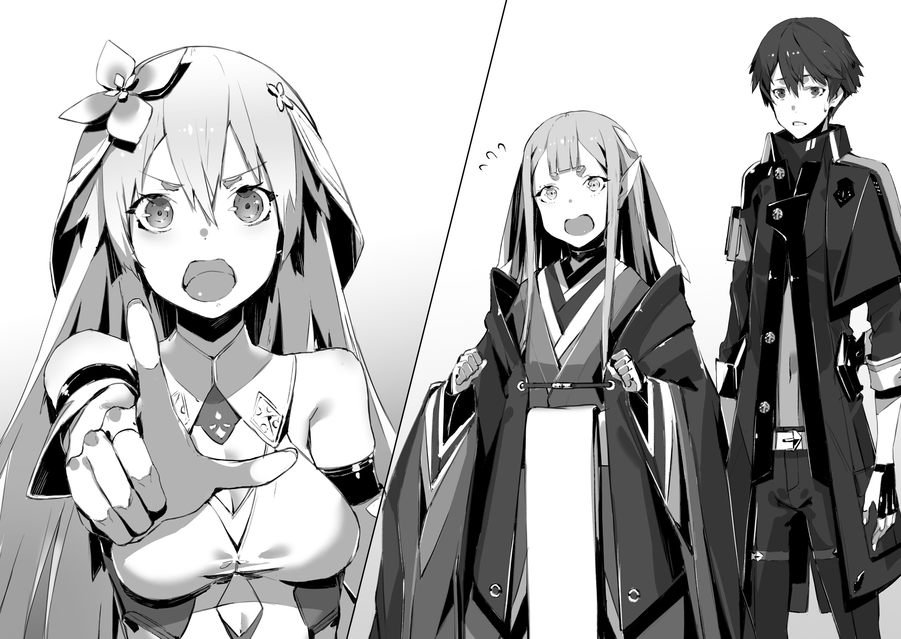

Io Federation - 8th ward Cassiopeia -
Resistance base.

From his office on the second floor, emperor Dante was gazing at lively chatter of his subordinates down below.

"How are you felling?"

He turned back towards staff officer Tsekhman.
The man was experienced soldier who have been serving in Io Resistance Army since it's foundation.
Even though he was already over 50 years old, his trained and tanned body looked as tough as a steel.

"How am I feeling? Do I look fine to you?"

"..."

"Falling into such pathetic state, by inhaling this poisonous pollens of elven forest, and remaining unconscious for three days.
My body still feels heavy.
And just standing makes my knees about to give away."

It is been two days since his release from elven forest.
On night before yesterday, while remaining unconscious he've been brought to the base together with their military cars.
And yesterday he came back to their senses.
Though the same could be said about Tsekhman.

"What about you"

"...Meaning?"

"I'm asking how are you feeling."

Hearing these words from Commander, left streaked with grey soldier blankly stared with his mouth half opened, as if confused.

"What is it? Is that so strange for me to ask about my subordinates state of health?"

"O-of course not. I'm thankful for your concern, Your Majesty."

"You should answer like that from the very beginning."

He turned away from old soldier.
And for a short while, they remained silent.
Only sound of ticking away seconds echoed in the room, from the clock in the corner...

"Is he a destined hero?" _TL Note:_ I honestly not sure how to TL `運命の落とし子か`

"...Your Majesty?"

"My credo is to never fighting a battle that cannot be won.
After all it is waste of time, people and resources."

Tsekhman wondered what was meaning behind these words:
By [battle] did commander mean their fight against foreign gods?
After pondering for a short while, staff officer Tsekhman carefully said:

"Your Majesty is excellent commander.
But this time it is Jeanne-dono's win.
I assume we're talking about it."

"That's right. It was unlikely for me to make such a blunder."

_TL Note:_ I highly doubt it.

He gritted his teeth with loath.

"It would seem I bared my fangs against a wrong opponent."

"..."

"Staff officer, I thought this world got no hero for the mankind.
So I set up my course on leading Resistance armies across the world starting from Io."

"I'm aware."

"Then how about it?
We've been out unconscious for 4 days.
And when we came back to our senses, that man, Jeanne, already got us truce with foreign gods."

Going to elven forest in order to rescue the emperor, and even achieving truce.
Being so sudden it seemed unbelievable.
Whether it was proof of person own excellence, or his subordinates.
Dante had no idea.

"That guy, did he already depart?"

"Yes. This morning, he took few subordinates with him and ventured into elven forest.
It would seem they are returning this night."

There was a matter of signing a treaty with elven elder.
First cease-fire agreement between humans and foreign gods.
According to emperor's secret plan, he was the one who supposed to do honours himself.

But if one would ask if he planned to compete for this important duty.
The answer would be no.
He had no will to compete any longer.
As his previous words stated: his main credo was never fight a battle that he cannot win.

"It is first time I saw a [real thing].
A hero who is favoured by world's fate."

"...Yes."

"I'm willing to step down if he is the one to change the state of affairs in this hopeless world.
The only thing that irritates me is that I'm not going to be at the center of this stage."

Light Knight Jeanne...
He wondered if Jeanne was the one who is destined to free them of four races tyranny.

"This time, even though it is vexing for me, Light Knight, it is your victory."

"..."

"Staff officer. Say nothing of today to that guy."

"I'll take your words to a heart."

Taking a sit in own chair, the emperor glared at bowing subordinate in silence.

 
 

Ancient forest.
Dwelling forest of elves was filled with silence.
Two days before...

One would expect a fall of the Angel Palace to cause serious troubles in the forest, but in reality almost no debris reached the surface.

"Did thee understand a bit why our forest is considered a sacred place?"

While walking through a animal trail.
Elven girl, who was wearing seventh layered garments, proudly pointed above their heads.
Towards ancient tree...

Trees thick and solid branches and leaves caught falling from the sky wreckage.
Elven village sustained no damage, and Kai and Co was able to escape quickly enough.
This is what happened day before yesterday.

"Birds were caught by surprise, but they should return soon enough."

"Big birds?"

"We sheltered them in our village.
Some need treatment after all."

As she answered, elven girl made a wry smile mixed with sigh.

"I cannot tell thee all details, but elves were able to preserve relations with angels.
The same goes for dwarves and fairies."

"Understood. That's more than enough."

"...Once we'll pass through this brush, we'll reach elven village.
But before that, Kai."

Reiren, who was ahead of him, stopped.
And it came to his mind that it was the first time for this elf to address him other than [you].

"I have one question.
That girl, called Rinne, is not human."

"Yeah."

He couldn't trick her.
Elves had had strong sense of magic, and dwarves had strong sense of smell.
He already resolved for the secret to be discovered once they enter the elven village.

"At first, I thought she was a spy from different race.
Like Qubiley, spy of another race that transformed into human.
But it seems slightly different case.
That girl is quite attached to thee."

"Yeah. I'm certain you can trust her."

"I understand, then I shall not pry any more into this matter."

"Is that ok?"

"Getting burned by poking our noses into fire for no reason once again would not be something that Alfreyja-dono would wish.
I'm pretty interested to hear about that girl fight against Raphael-dono, but...
I'll finish with questions."

The elf shrugged.

_TL TODO:_ Honestly a bit unsure how author mean it `と、そんなおどけた仕草も程々に。`

"And also just saying but I find the idea of constantly to remain in debt to humans quite unpleasant...
Allow me to thank you this time.
But this is first and last time when I bow my head to the enemy race."

"There is no need for that.
After all we had a deal."

They had to rescue the elven elder in exchange for freeing commander Dante.
And that's all he did.

"Thee stopped Alfreyja-dono. This wasn't included into our contract."

"..."

"And last, I'm not sure what Alfreyja-dono, when he regained his sanity, meant by these words about leaving things to thee...
But his words were filled with certain strength."

At these last moments...
Before turning into dust and disappearing, heaven lord Alfreyja said these words towards Kai:

[I ask you, break the cycle of hatred in this world...!]

_Who would think..._

_The foreign gods hero would ask for a favour._

It was obscure message.
As Reiren he couldn't completely understand the meaning behind it.
Even so, at that moment, he felt that both he and Alfreyja shared something in common that transcended them being enemies.

_TL Note:_ `自分と主天は、敵味方を越えた共通の意識で繫がっていたように思う` Might need to improve wording here.

"Ahem"

Elf coughed.

"I didn't tell about it to my friends in the village.
If someone would know that elf bowed in thanks to a human, it would become quite a uproar.
I also have to consider my position."

Reiren said in slightly awkward manner.

"Not a word about it, got it?"

"Understood. Not planning to talk about it."

"Good, good, attaboy! Let us go to the village then. This way."

With feeling of relief the elf relaxed and started walking.
To the elven village...

Two enormous ancient trees were standing towering over village's entrance like a gate.
And there he could spot two girls.

"Ah, Kai, you're back. Come, come!"

Rinne was vigorously waving her hand.
And nearby was Jeanne, standing calm in her usual knight armour.

"You're late, Kai. Rinne was worried."

"My bad, I've been just looking around for remains of the angel palace, but Reiren was quite eager to show me around."

"H-hey! Do not say unnecessary things!"

Blushing elf exclaimed in response.

"Enough of that. What about that human? Did he return already?"

"Yesterday, I just got message from my subordinate."

In Jeanne's hand was radio device.
Likely she was talking over it before Kai return.

_TL Note:_ A bit unclear phrase `今のところ大人しいと聞く。今度ばかりは彼も堪えたのかな。あとは盛られた薬が抜けてきたか`

"I heard that at the present moment he is docile.
But I wonder if he'll be able to bear it this time.
The drug, he has been given, should wear off later."

"Only elven medicine?"

Commander aide Qubiley has been putting elven enhancement drug into his meals little by little.
This drug was able to enhance your mind during battle, but continuously taking the medicine would make you to behave violently.
And in fact it was likely that Dante's violent outbursts were due to taking it every day.

_There was a talk that Dante was so violent since birth..._

_That's why his subordinates never noticed when it became worse._

It was exactly opposite of Alfreyja.
Because foreign gods hero was known a gentle and calm person, his change was could be sensed by other angels and elves.

"That's right, speaking of medicine..."

Dante wasn't the only one taking elven medicine.
Remembering the battle day before yesterday, Kai addressed the Commander, who was dressed as man.

"Jeanne, how is your wound? This morning, you mentioned it was still in pain."

"It is all right.
At morning I've been worried since the pain remained, but today I was able to walk in the forest just fine."

The knight, who was pretending to be a man, placed her hand on armour.
Armour, that covered Jeanne's body, was solid metal, but despite that she was left  with terrible acute cutting wound, which was going from her back to side.
By fallen angel's sword.

The wound came when she protected Reiren.
And in fact, after escaping from the angel palace, Jeanne was so exhausted that she couldn't make even a single step.

"Scar completely vanished. I was really surprised by the level of elven medicine."

"But of course."

Reiren puffed up with pride.

"I was the one to make it.
If I wouldn't be able to make this much, I wouldn't be given a shrine maiden role.
Jeanne, thee ought to show me a great appreciation."

"But I got injured, protecting you though?"

"Mu, T-this is... Oh well, that's right. Guess we're even."

The elf winced at Jeanne's sigh.

"Ah yes, Jeanne, there is one question I'd like to clarify."

The elf was standing still, watching the knight.
But she wasn't looking only at face, instead she watched her whole body as if examining from toe to head.

"Day before yesterday, I've been nursing thee,
so I took armour off and undressed thee."

"...W-well."

Before answering, Kai was certain she did take a glance towards him.
She was likely at loss of words, since besides her was Kai.

"Thou art female?"

"Yes?"

"Like any living organism then.
I have no confidence when it comes to distinguishing male and female among humans.
Therefore I was thinking thee art man, but once I looked at thee without clothes.
Oh, this is..."

"Do not say!?"

Hysteric scream escaped knight's throat.

"W-what are you saying all of the sudden...
R-right.
Look, I'm using my natural voice.
Do you get it?
Elves got good ears, so you should understand this way."

"Oh, indeed now I see."

Reiren, who was wiggling her ears skilfully, answered.

"Why are thee pretending to be a male?"

"It is necessary for putting my plan into action.
I cannot tell details to enemy race, but pretending to be a man is convenient for commander's role."

"Huh. This is certainly unknown concept for elves."

"I see... But although I'm indeed a woman, but gender doesn't really matter.
For a commander, you ought to treat subordinates regardless whether they are male or female."

As one would expect, Jeanne gave a response of model Commander.
But, while Jeanne was absorbed in her talk, she didn't notice.
While she was in the middle of explaining it, Rinne crept towards her from behind.

"Jeannya!"

"Kya!? W-what is it, Rinne?"

"...Mu..."

Rinne hugged Jeanne from behind and wasn't intending to separate at all.
Moreover she started putting more strength into her clinging.

"Jeannya, it is bad to lie. I know truth after all."

"Eh. Ehm, by lie..."

"Jeannya is aiming for Kai!"

"This again!? I told you it is misunderstanding, Rinne, could you please stop clinging?"

"No way, I'm not leaving you."

Rinne was completely glued to Jeanne.
From Kai's point of view it looked like two lovely girls are messing around, but apparently the person themselves were deadly serious.

"Hou, Rinne, by [aiming for Kai] thee mean?"

"You know, Jeannya immediately tries get alone together with Kai, as soon as I take my eyes off.
That's why it is dangerous to not standing a watch."

"That's a false accusations!? I'm always conducting myself as commander when talking to Kai!"

"...Jeanne, so it is like that..."

Elven shrine maiden's eyes were sparking.

"Thee considers Kai to become thy husband in future.
What, even though you were saying not discriminating by gender, thy eyes are already set to catch a prey?"

"Why it turns into something like that..."

A scream spread through the elven forest.

"K-kai, this is not true. This... It is not my intention..."

"Anyway, three of you."

Jeanne, Rinne who was clinging to her from behind, and also Reiren, who was teasing her.
He forced his way in conversation of three girls of different races.

_Let's pretend I didn't hear the story just now_ - Deciding so, Kai pointed towards elven village's entrance.

"Aren't we making elven elder to wait?"

"I-indeed so!"

The knight coughed to clear her throat.

"We're going to to have important discussion between our races.
This is not a time for us playing around here."

"Jeannya, your face is red."

"Let us go!"

Jeanne moved forward as if running away from Rinne.
There where the ancient tree stood in place of village's gates.
Two elven guards were standing in the middle, but this time appearance of humans didn't put them on guard.
One of the reasons was the Reiren, who was accompanying them,
but more important reason was likely the fact that they were the ones who freed the elven elder from the angel palace.

"If it is cease-fire agreement, then there is nothing to worry about."

Elven shrine maiden called out Jeanne from behind.

"Yesterday, I had checked elder's intentions.
Otherwise I wouldn't be leisurely spending time here.
Thee did the same, didn't thee?"

"..Yeah, we've discussed it with Io Resistance."

Looking at Jeanne, who answered like that, there was no Fairin by her side.
As being responsible for negotiations with foreign gods, Fairin has been finalizing details of agreement in the village.

"And then, Kai.
As we've been discussing yesterday.
Our elders want to talk with thee.
I imagine thee have idea about what."

"Yeah, it is fine. I, too, have something to ask."

"Well then, follow me."

Over-taking Jeanne, Reiren started walking towards the village's center.

One year cease-fire agreement - [Io Resistance and Foreign gods promises to perform no acts of aggression towards each other territories.]

The majority of the country territory shall remain in possession of foreign gods as it is.
On other hand only 8th ward Cassiopeia, where Io Resistance base, at the very least we'll be hold by them.

_Elves got Qubiley on their side..._

_If foreign gods feel like it, they can attack Resistance's positions any time._

With the truce, the anxiety about this situation should disappear for Io Resistance.
And the same could be said about foreign gods, who right now want to avoid fighting with humans.
They had no wish to be targeted by spirits and cryptids while being exhausted from crushing Io Resistance army.
Coincidently both sides wished the same.

"That's right, Kai. Are thee not forgetting something important, not related to the cease-fire agreement?
It is regarding Alfreyja-dono."

"I'm not revealing it, I understand."

Io Resistance were not aware about details of Alfreyja's situation.
In order to talk about heaven lord Alfreyja's sudden change, they'd have to mention rasterrizer monster.
But no one would believe into story about such monster.
Therefore, the fact that Alfreyja disappeared wasn't revealed to Io Resistance.

This secret was shared only by six people who infiltrated the angel palace.
Kai, Rinne, Jeanne.
Fairin, Saki and Ashlan.

At elven village's plaza.
When Kai arrived there, he could see gathered there Fairin, Saki and Ashlan, in discussion with the elder.
And up in the tree...

"Forgive me, thee might be worried about it, but this matter concerns all foreign gods.
And that's why many are curious about it."

Elves, dwarves, fairies and angels.
All were lined up and sitting on branches of ancient tree, as if surrounding the whole plaza.
It was quite a view.
Even though they gathered to sign cease-fire agreement, with such number of them above their head, it could be certainly felt as threatening.

"How wonderful for you to come."

Said elven elder.
Her clothes looked like a vines wrapping around.
And from human perspective, her outward appearance was that of girl, similar in age to Jeanne.
Besides her Kai could also spot the archangel, who fought against Rinne.

"Regarding the cease-fire, we've already reached conclusion with this human."

The elder glanced towards Fairin.
Despite being surrounded by many foreign gods, she remained calm.

"We do not have a habit of keeping records in paper.
Everyone here shall be witness to this agreement."

The elder looked up at foreign gods.

"From now on for the duration of year, humans shall not trespass this forest.
And so we shall not trespass humans city.
That should be all right, human commander Jeanne?"

"No problem. Io Resistance also gave their consent."

"Very well, make certain to not break this agreement."

These words were aimed at humans.
And at the same time, towards their brethren up on the tree.

"However, my goal here is not re-affirm our agreement.
I've prepared this place so that I could talk with you directly."

"Yeah, I too have something to ask."

In response to these words Kai replied back with small nod.

"Just saying it in advance, but I told you everything about rasterrizer day before yesterday."

"As I recall first it attacked demons hero.
And next was foreign gods hero...
As for latter, I myself witnessed everything with my own eyes from the very beginning."

With meek look on her face, elven elder made stiff expression with her mouth.

"It was about ten years ago when that thing has been brought by Alfreyja-dono as new subordinate.
Isn't that right, Raphael-dono?"

"Correct, and it is what brought us unwanted troubles."

Giant angel responded with unpleasant look on his face.

"As everyone knows, it happened 10 years ago, when that hero appeared along Io borders."

"That hero?"

The one who asked it was Jeanne.
This was another piece of information that neither Kai or Rinne heard about.

"Cryptids hero [Fang King] Rath=IE.
That best crossed the border alone without any subordinate.
In order to restrain him, our leader had to head out to face him.
As result, thanks to Alfreyja-sama Rath-IE had to return back."

Heaven Lord Alfreyja forced another race hero to withdraw.
But, the archangel, who was telling this story, was wearing a heavy expression.

"But, thinking about it now there were signs at that time already.
When Alfreyja-sama headed out to meet that guy, rather than to make him withdraw..."

"Conspire with him. Or rather I think he wanted to discuss something."

The elven elder continued his words with a dark expression.

"When they met face to face, both just laughed...
It was unthinkable for enemies.
What's more the enemy was the one who crossed our border in act of aggression.
And around that time monster, called rasterrizer, appeared."

"That's right, rather than with us, his brethren, our leader spent more time with that rasterrizer.
Still, who would think..."

That mixed race monster rasterrizer wasn't Heaven Lord subordinate.

_Was it pretending to be subordinate in order to monitor Alfreyja?_

_Even at the time with Vanessa. It would be impossible to appear with such timing if Vanessa wouldn't be under it's monitoring._

Monster, that was monitoring heroes.
But the question was what was the reason for monitoring.
And what's more: what are conditions to change it's goal from [monitoring] to [attacking].

There were only two heroes left.

Cryptids hero [Fang King] Rath=IE.

Spirits hero [Spirit Sovereign] Rikugen Kyouko.

If Vanessa words to be believed, then the culprit behind [World Reincarnation] ought to be among the remaining two.
However...
It made Kai to wonder: if the culprit is one of the heroes, then what would be a purpose for rasterrizer monster.

_It is only a hunch from our battle with Alfreyja._

_We still do not know true identity of the rasterrizer, but I doubt it is intending to restore the world back._

It was hero monitoring race [rasterrizer].
But there was one more strange thing.

[I ask you, break the cycle of hatred in this world...!]

Kai noticed something more in these words:
If the ringleader was among four heroes, why didn't Alfreyja bring the name of concrete hero.

Vanessa said: [The one behind this world is someone among four heroes.]

Alfreyja said: [Break the cycle of hatred in this world.]

Words of both Vanessa and Alfreyja were contradictory to each other.
The chill, that he felt reaching his neck, made Kai reflexively hold his breath.

It was supposed to take just a bit more...
Just finding the culprit among two remaining heroes.
Although he thought that the culprit was indeed among remaining heroes, he had uncanny feeling that he is walking through never-ending darkness.

"Finding the one behind world reincarnation, and the true colours of rasterrizer..."

He exhaled and clenched his fists.
His goal was to [to return his world back].
But in order to do that he had to solve even more questions.
First was to find the one behind world reincarnation.
And then find out how rasterrizer is related to it.
Then...

"There is one thing I want to ask, human commander."

Elven elder looked towards Jeanne.

"You intend to continue your expedition.
In order to expand human territories, you're planning to challenge both spirits and cryptids.
Am I right?"

"..."

It was indeed as the elven elder said.
Jeanne's goal was now in far away lands.
Among two remaining countries.

Western country Schultz, which was under cryptids domination.

Southern country Yurun, which was under spirits domination.

It could be either of them, and she was yet to decided where to head.
Though If they'd want to investigate the reason behind Alfreyja sudden change, then it would be south where was Fang King.
But it wasn't something they could tell to their enemies.

"I'm sorry, but I cannot tell you."

"I understand. You're planning to leave Io and considering possibility of foreign gods breaking cease-fire agreement.
Something among these lines?"

"..."

Jeanne remained silent.
She wasn't planning to deny it.
After all it was exactly as the elder said.
Thanks to the elven spy Qubiley, they were aware of Io Resistance state of affairs.
They had no way to counter, if foreign gods would decide to attack.

"I want to ask you something too. Why does my plans are of such interest to you?"

"We wish our representative to accompany you."

"What?"

Jeanne, and Fairin also, both raised their eyebrows.
And Rinne, who was besides Kai and up until now was uninterested, had dumbfounded look.

"...I'd like to hear details."

"We never forget wrong doings against our comrades.
We wish to know what happened with Alfreyja-dono."

The reason behind Heaven Lord Alfreyja change.
The one who hold the answer to this puzzle was no other than cryptids hero Rath=IE.
And foreign gods wanted to learn more about it.

"Whether it is spirits or cryptids.
We have enough knowledge about both.
If we'll accompany you, then we'll offer the knowledge to you."

"Rewarding us for allowing to accompany us? But still..."

Jeanne's hesitation had obvious reason.
There was no instances of elves accompanying human forces in past.
And neither Kai remembered even hero Sid to lead other races.

"Whether it is south or west.
Regardless of your destination you ought to traverse through Io territories.
Obviously it means traversing our forest and grasslands."

"..."

"Don't you think it might be slightly too hard for you humans to travel?"

"...I understand. It is as you said, we did have guide."

Jeanne made a bitter smile.
Comparing to Urza, foreign gods territories covered almost whole Io.
It would be essential for them to have guide if they'd be traversing through this thick forest.

"I'd like to ask for your help."

"Fumu. That is quite merciless, elder."

The one who interjected was the elven shrine maiden Reiren.

"The one among us who is going to travel along side humans is going to become something like a hostage?
I wonder who would undertake role of sacrifice to be killed by humans, if we're to break the cease-fire agreement?"

"You'll be the one."

"I see, it is me. Well then it cannot be helped... eh?"

"You shall accompany them. I decided it right now."

"Wait a minute!?"

Elven girl jumped.

"Wait, wait, wait. What is meaning of this, elder?
I h-heard nothing of it!"

"Didn't I say I decided it right now?"

"But why me!"

"After all..."

Elven leader pointed at the screaming girl.

"You haven't left that human Kai side for some time now, haven't you?"

"Mu?"

"I thought that during our talks with humans you would quickly join my side, yet you stood by his side all this time."

"That's right! It makes me curious too!"

Seeing the opportunity, Rinne voiced her agreement.

"That elf here is sly fox, standing besides Kai is for me only.
Could it be... First Jeannya, now you're the next to aim for Kai!"

"It is misunderstanding!?"

The person in question long ears were dyed red.

"Until now I've been guiding him just. That's why I've been by his side..."

"It is decided then.
I leave this important task to you."

"Do not say such absurd thing with a smile...!?"

Lovely scream of shrine maide echoed throughout the elven village.
