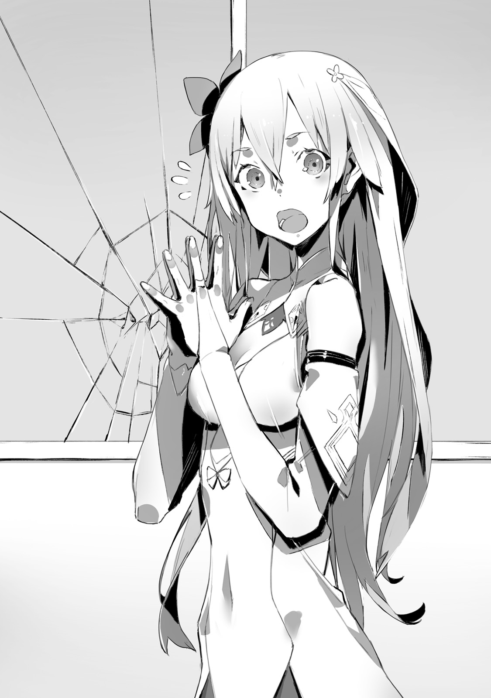
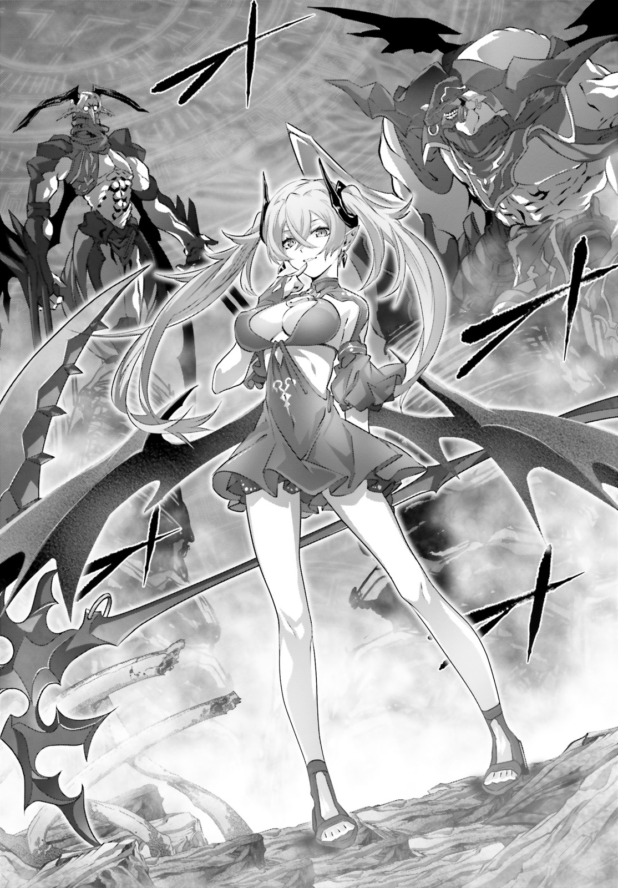

"Kai...Kai, Kai, where are you!?"

Government Palace.
In heart of vast Urza Federation, stood twin tower, which was symbol of capital.
There on first floor, could be heard lovely female voice.

"Kai...?"

"You don't need to shout so much, I'm here."

There, in front of elevator on first floor, which hasn't been used for last 30 years, was young man who was working on cleaning it out of dust and fixing cables.
Stopping his repairs, Kai wiped sweat from his forehead with his hand.
His name was Kai Sakuravent.
It was 17 years old young man whose hair and eyes had colour of dark ultramarine.
He was wearing MDA uniform, which was mass-produced uniform for anti four races activities.
Results of daily training were clearly visible on his body.

"What is it, Rinne?"

"! Ah, you're here Kai...!"

Seeing him, blond hair girl expression immediately became brighter.
Her name was Rinne.
She had pair of jade green eyes, and her pale golden hair shook as she run.
Her flustered cheeks added even more charm to her lovely features.
Although she was quite slender, her chest gave off feminine allure.
And her waist curves were clearly visible in these thing clothes.
From her outward appearance she looked like 16 years old girl.
But her actual age wasn't known even to Rinne herself.
This young lady had mixed blood of all other races.
And now this girl, raised overhead the towel that she supposed to use to wipe windows.

"Kai, big trouble! Really big trouble!"

"Eh? I'm certain you were only asked to help with some cleaning."

"Yeah, that's right! Come, come here!"

Rinne pulled her hand with towel behind.
And there Kai could see cracks on window.
Total of four cracks looked like a spider web.

"Oh, is it broken? How strange, I'm pretty sure we replaced it with new."

"It is already been broken when I was planning to wipe it clean."

"...I see."

Kai looked at towel that Rinne was holding, and then at cracked window.

"It seems there are drops of water on glass, as if left by towel."

"Ah!?"

Blond girl made small scream and put behind the towel.

"It-t is not me, you know? I'm not the one who broke glass."

"...So you put too much force when you tried to wipe window?"

Rinne was mixed of multiple races.
Thanks to her dragon and beast ancestry, despite her delicate appearance, she had so much physical strength, that one would wonder just from where these slender arms could draw it.
And since she is not used to the job, it is quite possible for her to break glass by mistake.
While Kai was thinking so...

"N-no..."

Rinne shook her head horizontally over and over again.

"When I came here it is already been broke.
I'm sure that culprit is someone among Resistance soldiers.
These humans, cleaning there, are likely to be the one at fault."

"Got it, I believe you, Rinne."

"Kai! Thank you!"

"By the way, Rinne, when glass broke it didn't injury you?
It would be bad if some fragments would sunk in."

"It is all right, instance it broke, I pulled my hand away... Ah..."

"I see, so you broke it."

Before Kai who was nodding, Rinne smile instantly froze.

"Rinne."

"..."

She just looked at him with upturned eyes, as if wanting to say something.
But in the middle of it she swallowed her breath.
And finally she replied.

"...I'm sorry."

"As long as you understand."

"...Hey, Kai? You're angry?"

"Hm... Let's see."

"...A-after all you're angry, right?"

"Since you honestly apologized, this time I'm not."

"! As expected, I like you Kai!"

Kai made strained smile seeing Rinne jumping from happiness.
Losing window like that is certainly wasteful, but he couldn't bring himself to seriously scold her.
Thanks to Kai and Rinne they were able to retake Government Palace from demons.
Seven days ago...
Here was fight against demons in order to take it back, and deadly battle against Dark Empress Vanessa.
If it wouldn't be for Rinne's strength, they'd be unlikely to accomplish their goals

"I'm going to tell Jeanne. Pretty sure we should have some spare glass for window."

"Jeannya?"

"It is Jeanne. Rinne, wanna come with me?"

"Nope, don't wanna.
In that conference room is too many humans.
Here first floor is big so it is less crowded with humans.
I'm fine here."

Rinne was frowning.
Being different from other races, she had past of being oppressed by all races, including humans.
Other than Kai, who was special to her as he saved her, she had hard time dealing with humans.
She had wings that was mix of angel's and demon's.
Under her golder hair pointy elven ears were hidden.
Even though she could hide her wings under clothes, if someone aside from Kai would see it, that would cause uproar.

"Got it, I'll go find Jeanne, you can rest here."

"Yes!"

"While I'm away I prohibit you to break stuff."

"Yup, if Kai says so, I'm not going to."

One could only wonder what would happen if he didn't say so.
And while Kai imagined what would happen, Rinne smiled and just looked at him.
But against her lovely and pure smile, Kai had no chance to win.

"Have a nice trip."

"I'll be back soon."

Kai turned away from Rinne.
He decided to use elevator, which he just fixed, and go to 10th floor.

"It works...
But, well, after all I cannot get used to it.
Am I just happy that a single elevator finally works?
The world I'm in right now..."

While riding elevator, Kai leaned against cold wall and was looking at ceiling.

"...I'm going to return make it as the world I remember.
In your place, Sid."

One day, World [Overwrite] happened.
Before <ruby>young man<rt>Kai</rt></ruby> eyes the world history has been overwritten by [World Reincarnation]
Just like abound hundred years ago, the history of Kai's world repeats itself in deadly conflict for hegemony among five races.
Five Races Great War.
In this war hero Sid led humanity to victory.
As four other races were crushed, humanity sealed them away in remote regions.
Or at least that's what supposed to be.

Hero [Dark Empress] Vanessa who leads, demon race, wielders of powerful magic.

Hero [Heaven Lord] Alfreya who leads foreign gods, composed of angels and elfs.

Hero [Spirit Sovereign] Rokugen Kyouko who leads spirits, very peculiar creatures like ghosts.

Hero [Fag King] Rath=IE who leads cryptids, gigantic and ferocious beasts.

But...
This history vanished.
Instead it is now history with reverse ending:
World has been overwritten with different history of [Humanity being defeated in Great War].
And Kai was the sole human who remembered the instance when [World Reincarnation] happened.

_Only me and Rinne remembers actual history._

_And no one else remembers true history._

The humanity hero Sid, who lead humanity, no longer exists in this different world.
And therefore humanity lost to four other races.
This is current situation of this world.

"What I'm saying, after all first of all I need take care about my own situation,
I'm not the one to say how awful humanity as the whole situation."

_TL Note:_ This one is a bit hard for me to understand `なんて。俺だってホントは自分のことで精一杯で、人類全体の状況がどうかなんて大それたこと言える身じゃないんだろうけどさ`

Young man who has been forgotten by world...
Just like <ruby>hero<rt>Sid</rt></ruby> in this overwritten world, Kai no longer existed.
Whereabouts of both his parents and relatives were unclear.
And both old colleagues and higher-ups no longer remember Kai.
If there would be one positive thing to say about current situation - it is that Kai and Rinne helped to take back capital from demons
As result, it earned trust of local Urza Resistance soldiers.
And above all it brought him opportunity to be in contact with their leader Jeanne.

"Still how strange it is...
In this world the girl, with whom I played since early childhood, is treated as saviour of this federation."

"...Kai?"

Elevator stopped.
As doors opened, before his eyes was knight in silver armour, who disguised herself as man.
Leader of Urza Resistance Army Jeanne.
Graceful and gallant facial features gave strong androgynous charm.

"What is it, Kai? It is quite unusual for you to come to 10th floor."

"Good, Jeanne, I have a talk, or maybe request or apology to make."

"To me?"

Behind here were two people.
Both were captains and strong-looking, and stopped alongside Jeanne before the elevator.

"We broke window on first floor. Sorry about that."

"...Again?"

"Again?"

"It is anyway Rinne fault again, not yours, right?
Didn't you hear how angry was one of the captains due to broken lighting in hall?"

"No... First time hearing about it..."

The only thing that Kai knew, is that Rinne was supposed to help with changing ceiling lights.
He didn't hear about any problems.

"That Rinne... She doesn't like scolding from me, so she hid the fact."

"She seems to reflect after being scolded by the captain.
If you're going to scold her, do it in moderation.
She is key figure in defeating <ruby>Dark Empress<rt>Vanessa</rt></ruby> after all.
Would be bad if she'd start sulking."

Seeing Jeanne's faint smile, reminded him...

"Kai, you're the only one who played with me since our childhood. And even now you're walking by my side."

"Could it be... Can I have high hopes then?"

It suddenly overlapped with the image of her he saw last time.
At the time when they were shopping and walking across road intersection.
And that instance world has been overwritten by World Reincarnation.
Current Jeanne no longer remembers her childhood friend.

"Kai?"

"Ah, sorry, I hear you."

Hearing his name, made Kai come back to his senses.
Right now Jeanne is leader of Resistance Army and dress like a man knight who is praised by Urza Federation citizens as [Paladin]

_Using tanning make-up, she adds more masculine look._

_And with that armour she hides her figure._

She strains her throat to make a more boyish voice, and since her hair is too long for man, she ties it behind.
From point of view of Kai her disguise was perfect.
Image of young man as beautiful as girl, suited well for her commanding role.

_TL Note:_ There is general trend among japanese devs/writers to make girls fair skinned, while guys are all tanned. Especially in VN.

"Anyway, about glass which was broken by Rinne."

"We'll replace it later.
Today and tomorrow my and my subordinates are already busy.
You should keep company to Rinne and do not take off your eyes from her."

"Got it. We should prevent further victims among glasses."

"I'll be relying on you.
In any case..."

Jeanne directs her gaze toward window.
Out there was clear sky.
Just seven days before this blue sky was covered by winged demons.

"We finally took back capital.
I want to finish relocation of our headquarters as soon as possible.
And make this Government Palace new base of Urza Resistance."

"People are going to migrate here too I guess?"

"...It would be pre-mature."

Husky voice could be heard together with sound of footsteps.
Stopping to bow before Jeanne, female staff gracefully turned towards him.
Security chief, Fairin, who also follows Jeanne as her bodyguard.
Her age is in mid twenties.
Her beautiful face featured pair of cold grey eyes.
Being on par with man's height, her whole body looked well trained.
Despite that she didn't looked even a bit sluggish, which made her look like a female leopard.

"People of this Federation lost their land at hands of demon forces.
Since then they escaped to live underground or in ruins."

"...Yeah."

While Fairin was stating obvious thing, for Kai this was quite abnormal [common sense].
In this Urza Federation humans lost in Great War against demons.
And since then they hid in so-called Human Cities in order to live.

_And this is world-wide phenomena._

_Not only demons, but also foreign gods, cryptids and even spirits took away human cities._

But with defeat of demon hero Vanessa situation changed.
Now, demons are escaping from this capital.

"Defeating <ruby>Dark Empress<rt>Vanessa</rt></ruby> is immeasurable feat for sure.
But demon numbers are enormous."

"...Right."

It is said that demon population is largest after humans.
And being wary of possible retaliation is quite valid concern.

"Demons withdrawal is confirmed only here?"

"Right. And migration here would be also difficult for people.
As you could see, most of buildings are in ruins."

Female bodyguard points at window.
The standing buildings are for the most party heavily damaged.
Since the time when demon attacked 30 years ago, its remained like that.

"Besides it is been only week."

Fairin shrugged her shoulders.

"So there are many who in doubts about demon withdrawal.
And what's more for last 30 years, they grew fond of their Human cities."

"Ah, I see..."

Such idea, growing attached to these places, seemed unthinkable to Kai.
In true world, living in city was only natural.
Yet here in this world as far as most people were concerned, Human cities were enough.

_TL Note:_ I avoided using term Human City/Human Ward because it sounds weird, but this is what author uses when refering
to underground cities where humans hide.
jp. 人類特区, firugana: ヒユーマンシテイ

"Unless demons will not be completely eliminated from Urza Federation, humanity cannot return back to surface.
And thus Jeanne-sama..."

Fairin made signal with her eyes.

"It is time for meeting. We should head to council room."

"Yes, I was heading there."

Together with Fairin Jeanne headed there.
But, as if some idea suddenly came to her, she turned back.

"Kai, could make sure to have free time at evening. Together with Rinne."

"Is it about expedition?"

"Yeah, as we're dealing with relocation of headquarters, we're discussing it with Fairin.
I'd like to hear your opinion too."

Together with Fairin and two captains, Jeanne headed out.

"...Well, I guess I'll keep company to Rinne."

He headed for first floor via elevator again.
Most likely she would waiting at lobby, or so he thought.
But when door opened, there was no sign of Rinne.

"Huh, hey, Rinne?"

He walked around first floor.
Around were only Resistance soldiers.
But it wasn't easy to just talk with them because they were busy with headquarters relocation, and carried equipment and luggage.

"Did she get tired of waiting and decided to hide?
In such big building I will not find her even after spending the whole day.
Hey, Rinne, where are you?"

Despite calling her name there was no response.
Normally she would come running after few seconds, but now that she not it felt very strange.

"If she just went to take a nap somewhere then it is fine."

She always said that she'll be together with him...
And now that she is nowhere to be found, he was worried.

"Rinne? Rinne!"

"..."

"Oh, so you've been here?"

Entrance to Urza Government Palace.
As he step out of steel doors, he saw Rinne there.

Her light golden hair was waving under winds, and she was gazing towards group of building.
And as Kai came out...

"I smell it in air."

As her profile became visible, Rinne muttered.

"Listen, Kai, I feel like this small is different."

"Hm? Did you want to have a fresh air outside?
Air inside of building might be bad."

"Nope."

Rinne pointed at shadow that lie deep in ruins.

"I felt demons, its smell even reached this building, so I came outside."

"...What?"

Few days after demons left capital, Urza Resistance soldiers stopped their patrols and only Kai with Rinne were checking surroundings.

_She felt demons?_

_And it is even close to Government Palace!?_

Just seven days ago this place belonged to Dark Empress Vanessa.
The only reason he could think of was revenge.
Vanessa's subordinates could be creeping around in order to re-take Government Palace.

"Rinne, do you know their numbers?"

"I'm not sure exactly, but it is quite weak smell so I don't think there is many."

"If not many..."

"About four or five. Definitely not even close to 10."

"Then they are scouts."

The attack at Neo Vishal started with demon scouts stumbling upon its entrance after all.
So it could be similar scout party of demons.

"Well as one would expect we cannot just leave it as it is.
What are we going to do, Rinne?
We could talk with Resistance soldiers..."

"Nope, no need."

She gave immediate response.
Her reply might be too blunt, but it was within Kai's expectations.

"I'm strong, if Kai is with me, then everything will be fine."

_TL Note:_ I had deja vu just now.

"...Got it, I trust you."

Being chaos kin, there was no doubt that she is strong
According to her [it would be difficult to fight four heroes], but she can fight any other opponent.
And Kai was able to ascertain it after fight with Dark Empress Vanessa.

"Kai, it is coming from direction of that building."

"Wait a bit, if I'll not report it before, Jeanne will be angry later on."

He took communication device out of his pocket.
It wasn't the one he got from MDA in true world, instead he borrowed one from Urza Resistance.

"Ashlan."

[...Ah, Kai? What is it?]

"Where are you now?"

[I'm still at the same place since morning.
Cleaning up storehouse at third floor.
Since it hasn't been used for 30 years, it gathered quite a lot of dust.
Yuck, there is even spiders...!]

On the line was Ashlan Highrol.
He is young man who was his comrade in true world.
In this world he forgot Kai, but as Ashlan is quite easy-going,
it didn't took long for them to become friends.

[You're been busy there?
If something happened, you can ask, I can spare some time.]

"Twenty seconds would be enough."

He exchanged glances with Rinne.

"At seven o'clock from the palace, we spotted demons scouts."

[Ah, ok, do your best...! Hey, W-wait...!]

"If we'll bring too many people, we'll get spotted. So Rinne and me will check it out."

[Heeeeeeeeeeeeeey!?]

He cut off power.
With that Ashlan no longer will be able to contact him.
As he is going to approach demons, it might be possible that device would ring with sound.

"That building? The one with its upper half broken."

"Yup, on its other side."

Rinne walked on cracked road.
In past when demon attacked they damaged lots of roads, and now weed was coming out of cracks.
There was hole in road which became swamp, with a lots of unknown insects flying around.
This is current capital, result of demon dominance.

_I suspect it is not the only place._

_Other cities which were taken by other races most likely would end up in similar state._

As Kai was walking side by side with Rinne, he took out bayonet out of his metal case on shoulder.
It was general purpose assault bayonet [Drake Nail]
Developed as anti four races weapon with cryptids motif.

"Hey, Kai, can I stop hiding my wings?"

"Be patient for now.
Who knows who among Resistance could be looking here."

"Magic too?"

"Even if we find demons, keep it until last moment."

They need to determine the reason why demons hid in capital.
If they were preparing for attack, then he would need to notify Jeanne in order for Resistance Army to start preparations.
But even still, deep inside he had some questions.

[It is worthy of a praise.]

[This is my loss. I give you my <ruby>domain<rt>Urza</rt></ruby>.]

These were Dark Empress Vanessa words towards Kai.
These words were stating her defeat and will to leave capital.
Despite that.
Could it be that these demons faked following Vanessa's order.

"Rinne, we did look around here yesterday, right?"

"Yup, yesterday it didn't reek of demons, I did check it."

Rinne was quietly jumping over rubble around.
This agility she displayed was like that of cat beastman, which was most likely cryptids heritage.
As they reached the building where from demon smell was coming, Rinne stopped and started looking around.

"...The smell disappeared."

"Is it wind?"

"Nope, it is not like that... This is weird!"

Rinne picked her pace and went to other side of building.
Surrounding buildings was shadowing the building, and then he looked upwards.

"...!"

Immediately, tenma wings jumped out of her back.
At their roots, these wings were jet-black like crow feather.
But closer to edges it was pure white.
And these wings, which was mix of both angel and demon, were fully expanded.
Kai immediately understood the meaning of it.
She was preparing for battle.
And it also shown that the battle will require her full strength.

"...There is strong magic power! It is bad, don't come here, that's a trap!"

"What!?"

From crack in ground dark coloured light arose.
With the sound of heavy run, the black dome covers the whole building.
It was barrier.
Dark dome completely closed off, before Kai and Rinne could even escape.

"That's demon's barrier!"

It was thin wall of dark light.
From within nothing could be seen, and even sunlight couldn't reach this place.
It was like the whole place became a different dimension.

"Such barrier..."

"Rinne, stop!"

As soon as Rinne hand reaches the barrier, the instance her delicate fingers reaches it.
Light, resembling lighting, like a snake strikes Rinne.
Repelling light.
Her fingers were burnt, and from her hands blood was flowing.

"It is painful..."

With a grimace full of pain, winged girl looked up.
There on building were calmly standing three figures.
She clenched her teeth.

"Oh, what a scare face. But now you can partly understand it."

_TL Note:_ From manga

The sound of spreading wings could be heard.
With a calm smile, single succubus descended from building.
Outside she looked like 15 or 16 years old girl.
She had golden pupils and her hair had azure colour.
She had slim, but very bewitching figure, fitting to a succubus.
And her light dress exposed a lot of it.
Then her smile instantly turned into fury.

"I found you, human! YOU...The one who took down Vanessa-nee-sama!"

Succubus whole body was emitting black aura.
It was fierce torrent of power.
As she went down, the road itself was lifted, and wreckage around was smashed into pieces.
At the same time cold sweat run through Kai's body.
He knew this fierce bloodlust.

_This magic power!?_

_How is this possible... that's unsual power!_

This was the same pressure as he felt when he fought Vanessa.
And this succubus sprung into action towards them.

"I will butcher you, human!!!!!!!!!!!!"

"Code Holder!"

He called hero Sid's sword.
And in response to Kai's word, his Drake Nail transformed into shining sword in the blink of eye.
It was his trump against Vanessa.
His instincts were telling him that hesitation would lead to his death, so he summoned the sword immediately.

"Human!!!!!"

"Come!"

"...Just kidding!"

_TL Note:_ Didn't see that coming!

All of the sudden she folded her wings.
The magic power that was overflowing out of her bewitching body calmed down.
And it took only a few seconds for situation within barrier to calm down.

"Oh, could you not make such scary face, human?"

"...What is meaning of this?"

"I'm meaning to self-introduce myself."

Her lips, which were covered by black lipstick, formed a smile.

"I'm succubus Hinemarill, I heard that some human defeated Vanessa-onee-sama, so I was curious to see what kind of human you're."

"..."

"Do you understand what I mean?"

"...I understand for the most part."

She appeared to introduce herself to the one, who defeated Vanessa without a hint of hesitation.
And that magic power clearly made it obvious.

"You're number two among demons?"

"Right, humans often like to call me with [Hero rank], but personally I prefer the name Succubus Queen.
Isn't it cool?"

Hero rank.
From succubus mouth came the name of [danger index], which were assigned to other races by humans.
Generally speaking, the longer they live, the more dangerous people of other races become.
There were four ranks.
And in case of demons, these were:

- Decade rank - these were usually loitering around ruins. For trained soldier it was feasible target.
- Century rank - these could be taken down with squad, though casualties were likely.
- Millennium rank - possessed peerless might, even if humans would throw everything they got, their defeat was still possible.
- Hero rank - Dark Empress Vanessa, or some particularly special individuals. Not many known.

"Ah, and two above are the same."

Succubus pointed at two shadows, standing on top of the building.
Although Kai couldn't properly see them due to dark barrier, but they seem to look quite bigger than Hinemarill.

_Hero rank demons._

_They are monsters close to Vanessa in power, and there are three of them?_

"Since onee-san is not with us at present moment, we, three representatives, came here.
You should be honoured, you know?
So, this chaos kin..."

Demoness was looking at Rinne, in front of Succubus Queen, Rinne had her tenma wings spread and was glaring at building rooftop.

"What a crude fellow, follow our talk."

"...Kai?"

He exchanged glances with Rinne.
The succubus by name Hinemarill mentioned [self-introduction].
Now that she folded her wings, he no longer felt any will to fight from her.

"Understood, if you do not intend to fight, then let's hear your story."

He stabbed Code Holder into ground.
Seeing that as sign of non aggression, succubus cheerfully nods.

"You've been called Kai just now, is that your name?"

"That's right."

"Then I'll be calling you that.
I don't usually feel like remembering human names, but since you defeated Vanessa-onee-sama, I'll give you special treatment.
Though I'm  likely to forget it eventually."

Behind her was standing single remaining boulder, which was able to survive her storm of magic power.
Using it as replacement to chair, she sat down on it.

"This sword is quite unique, isn't it?
But it seem to hold, different from magic, power.
I don't understand the origin of its shining, but it is definitely not something made by humans."

Succubus Queen was looking at Sid's sword.

"So this is the sword that defeated onee-sama."

"..."

Kai remained silent.
And mighty demoness only shrugged in response with chuckle.

"It is good decision to remain silent, but..."

It was cold voice, the voice hold enough power to just freeze humans.

"Don't get carried away.
Altough it was miracle piled on another miracle that you were able to defeat onee-sama,
If three of us would remain here at capital, you'd have no chance of winning."

At the time when he was fighting Dark Empress, these three hero ranked demons never showed themself.
Just where they were...?

"Were you staying at Urza border?"

"Yes, three of us were standing on guard against other three races.
But who would think that humans would attack capital?
In all-out war onee-sama would never lose, that's why when report came, I was surprised."

"If that's the case, then what is your goal coming here?
To avenge Vanessa?"

"Ahaha, certainly no."

Succubus laughed, and her voluptuous breasts were shaking.

"I love my onee-sama, but while she is away I'm the number one.
I should instead thank you."

"...While she is away?"

"I have no obligation to answer this question."

Demoness exchanged her crossed legs.
Despite her buttocks being completely exposed, she doesn't seem to mind.
Rather than that, demoness seem enjoying herself.

"Since onee-sama has been defeated, we gave you capital.
But don't think this is our complete defeat."

Arrogant human - was what her cold way of speaking indicating.
This was not declaration of defeat, but rather warning.
The surprise attack will work only once, next time if they'll try the same thing, then all three hero ranked demons will completely annihilate humans.

"You do realize that the number of demons on country borders is fairly different from that in capital?"

"...I know it."

He imagined it to be like that.
Considering that they relied on this fact to re-take capital.

[I think there are not many demons in capital itself.]

[Why you think so?]

[From the beginning humans are not real opponent for demons.
For demons three other races are enemies who dominate in south, east and western parts of continent.
Spirits, Foreign Gods and Cryptids.]

Kai's prediction was surprisingly on spot.
But never he imagined that such powerful demons would remain, and neither Resistance would expect it.

_It is not just a threat._

_There is truth in her words._

30 years ago unless Dark Empress Vanessa would stop, the whole capital would be destroyed.
These three gathered here not to destroy Government Palace overnight - but it show that they can do it.
That's why this succubus is here.

"Capital has been handed over to humans, but you don't plan to hand anything else, right?"

"That's right."

"I understand you, but you have some misunderstanding here.
I'm not representative of humans from this land.
Resistance Army representative is someone else."

"Whatever, I'm only talking with Kai.
Other humans are of no interest to me."

"Then I'll talk with that guy myself, you don't mind?"

"Yeah, do your best to convey it."

Succubus narrowed down her eyes as if delighted.

"Ah, right right, just wanted to instigate you a bit: we'd welcome you fighting against other 3 races.
In fact, I'd say we even support you."

"With foreign gods, cryptids and spirits...?"

"You are anyway planning to do so, right?
Humans here only took away one small capital.
I certainly do not see satisfaction on your face."

"So now you intend to see through my thoughts?" _TL Note:_ Yes, it is phrased like that `それで心を読んだつもりか？`

"I'm succubus after all.
My eyes can see far more than yours humans."

Was she playing with him?
Succubus just gave suggestive wink.

"I love strong humans.
And I love how you don't even lose your vigilance in front of me.
But I've tempting you for a while now, it would be fine to relax a bit."

"Your way of talking is quite similar to Vanessa."

"That's succubus for you."

Succubus Hinemarill slowly stood up from her improvised chair.

"We're going to hide ourself until we'll be ready.
So for now we can be in non-interference relationships.
Does it bring you a relief?"

"For now you say, but how long exactly?"

"It depends on you."

Succubus spread her wings.
Her blue hair was waiving under wind, and her small body started to ascend into air.

"The only one I'm wary about is you alone.
As soon as I see that you're not worthy to be afraid, there will be no need to be careful around humans.
Who knows, pretty soon I might come to take capital back."

"...Is this your way to declare war?"

"I'm just being friendly.
I said it before, didn't I?
So you know, how about this chaos kin would stop glaring at me?"

"Don't wanna."

Rinne was glaring at succubus with great hostility.
Being able to stand her ground in front of demon rank demon was admirable,
but deep inside Kai was worrying that this way Rinne was rubbing succubus wrong way.
And this was stirring things even more.
Soon enough it could turn for worse, into full blown war between humans and demons.

"Kai will defend me, so I'm not going to stop glaring."

"How admirable, despite not being human, you're sure is precious to this human."

She said with delighted voice and flew into the air.
Then she looked down at them with her golden eyes.

"Kai, you're getting far more attention from demons than you imagine.
That's why I want you to promise me, since you took down onee-sama, you cannot die so easily.
Do not tarnish onee-sama reputation."

"Of course, but I'm not doing it for demons sake."

"Hmm?"

"I have something to accomplish, so that's why I'll survive.
That's all I want to say."

He wasn't doing it for someone's sake.
His determination come from last exchange with demon hero.

[The world has changed.  Sid called it _World Reincarnation_.]

[And there is someone who tampered with the world. Look for him!]

_I have to fight remaining heroes?_

_Even if she didn't say it, I wouldn't rest untill I'd find ringleader._

"Hinemarill, I'd like something to ask too."

"Depending on your question."

"Do you know Prophet Sid?"

"Who is that?"

"...Does [World Reincarnation] ring a bell?"

"That's second question now, but oh well as I special treat, I'll answer.
No, I never heard it."

Succubus looked serious.
Even without looking at her face, one could hear from her tone alone that she didn't lie.

_Even her trusted subordinates do not know._

_Only Vanessa knew about Sid and World Reincarnation._

The question remained why demon hero was the only who remembered Sid.
But thinking about it here would not bring any answer.
After all, crucial Dark Empress disappeared after rasterrizer monster attack.

"Understood, thank you for answering my questions."

"How about a single kiss for a thank you?"

"I refuse."

"How dull.
Even though humans are so delighted by opportunity of a kiss with succubus...
Well, it is fine, one day I'll just take it by force."

Demoness ascended to rooftop with her wings.

"But since you picked my interested I'll give you advice.
If you're going to foreign gods dominion, then beware of Heaven Lord Alfreya.
I heard that guy was behaving weirdly recently."

"...What do you mean?"

"That's for you to find out.
After all I was only watching the border."

She only shrugged her shoulders.
For the second time giving him a wink, she disappeared from the rooftop.

"<ruby>Succubus<rt>I</rt></ruby> like strong man.
If you feel like it, let's meet again?"

And then as voice of beautiful girl melted and dissolved in air, the dark barrier, that surrounded building, disappeared like loosen string.

-------------------------------------------------------------------------------

