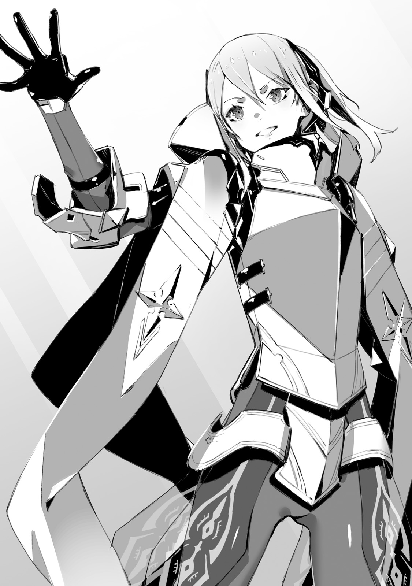

South part of Io, [Strange Marsh]
It was covered by deep blue glass.
The sound of engine was reverberating through these muddy lands.
Through dirt and glass, Urza Resistance military car was going towards the forest.

"I wonder why they call this place is called [Strange Marsh]?
It is just quiet marsh.
And there are no big monsters.
Even our car can pass through it without a problem."

"Beyond this point is..."

"Likely because you can see elven forest on other side of it."

Kai, who was sitting on passenger seat, and Saki, who was sitting in back, both started saying in response to their driver's grumbling.

"There are elven traps, guarding beasts of fairies and dwarf's guardian statues.
Even Io Resistance wasn't able carefreely explore this place."

"Putting aside this marsh, even I know about elven forest."

Three cars were moving together and Ashlan was driving the leading one.

"Anyway, so <ruby>emperor<rt>Dante</rt></ruby>-dono dashed into such dangerous place?
I don't get the way of thinking of these great people.
But this time it totally has no meaning."

Young man, who was tightly grasping wheel, furrowed his brows.

"They contacted us early morning, but since then there was no more contact with them.
No idea whether they were annihilated or captured, but they definitely should be able to predict it before even going."

"Right, besides both staff officer and commander's aide were with them..."

Saki's tone was heavy one.
Commander Dante suddenly took both of his trusted men and dashed into elven forest.
After that all contact with them was lost.
One would only suspect it as a joke.
Was it <ruby>Commander<rt>Dante</rt></ruby>'s own decision?
Or was it someone's else idea?
Soldiers, that were left behind at Resistance stronghold, were shocked by it.

"So, we're the one who is going to clean after him?"

Quite heavy sigh could be heard from Ashlan.

"Io's commander has been long lost, and we, who is going to search for him, are going to be missing too..."

"Aaa...Stop it, Ashlan! Don't wanna hear it."

Saki covered her ears and screamed.

"Hey, Rinne, you think so too, right?"

"...M?"

"Oh, are you not feeling well? As one would expect.
Jeanne-sama put a lot of effort to setup joint front with Io Resistance,
and that self-important Commander flushed it all in toilet.
Cannot believe it, you think so too right?"

"Yeah, as one would expect this time..."

Kai responded instead of Rinne.

"We just have to confirm it on spot."

If Commander Dante alongside his staff officer and soldiers were annihilated, then damage to the Io Resistance would be immeasurable.
And majority of people, like Saki and Ashlan, were thinking that <ruby>emperor<rt>Dante</rt></ruby> rush actions were the reason.

_It is troublesome, we cannot blame Dante alone._

_It is hightly likely that there was someone behind putting this idea into his mind._

This was suspicion shared by only four people.
Kai and Rinne here, and Fairin and Jeanne who were riding car behind.

"I'm sorry, Kai."

Rinne leaned over towards him, from back seat.

"I wish I could notice it earlier..."

"Rinne, you did nothing wrong. Just telling us about it was more than enough."

"Hm? Oi, oi, what's wrong, Rinne-chan?"

"It is all right, Ashlan.
Rinne is just worried  about current situation in her own way.
You better look in front of you instead.
There is swamp all over the place."

There was bottomless swamp, which was difficult to see under all of this grass.
If car would stuck there, it would be quite difficult to get out.

"You worry too much, we already can see it."

[Lead car, go to the right.]

Jeanne said over communication device.
And as per the instruction, Ashlan moved wheel to the right.
From the front window, they could see sea of tress that filled the horizon.
Ancient [Elven forest].
Since the dawn of history, it was unexplored territory for humanity.

"! Hey, look there!"

Saki's shrill voice could be heard.
She stood up and pointed towards where were four cars being parked.

[...These are Io's transports.]

Tension could be felt in Jeanne's voice.
Yesterday at early morning, <ruby>emperor<rt>Dante</rt></ruby>'s party stopped here and went into forest.

[We're getting off here.
Radio unit, notify our base.
We discovered what we presume to be Commander Dante's group transport. And...]

All three cars stopped.

[Now we commence the search.]

 
 

There were gigantic and ancient trees, which age was several hundred years.
Its roots were so deep that would be on par with height of adult.
And its trunk were so big that would fully cover your field of vision at short distance.
Trunk itself looked old: dry and cracked, and tree's roots were starting to wither at their ends.
Despite that leafs looked freshly and vividly green even now.
The reason was that these ancient trees were homes to foreign gods since ancient times.

"Elfs and angels are always emitting small amount of magic power.
And since it continued like that for many hundred years, these trees grew big like that.
Well, it is mostly what people say..."

In front of forest that goes by name Elven Forest, was knight, who was leading group of people, turned around.
At front lined up Urza's elite forces, and behind them were Io's garrisoned forces.
These were soldiers who is going to carry out search within the forest.

"Captain Franz, Commander Dante passed through here?"

"Yes, early morning yesterday, Commander departed to the forest without any prior notice."

Captain, who had hollow cheeks, advanced further in with grim look on his face.
He already had 5 years experience of exploring the forest.
And a few days ago, he decided to help Jeanne's with search through the forest.

"Commander brought staff officer and his aide, together with dozens of our elite forces, and entered the forest..."

"As the one who has deep knowledge about this forest you suggested against, but your suggestion was denied."

"I'm very sorry..."

"I only confirmed the fact, there is no need to apologise."

Jeanne fixed her gaze on a animal trail.
Towards the road, in between enormous trees that stood like a wall, which was entangled by ancient tree's roots.
And there were Fairin and Rinne, who already stepped onto the road.

"Kai, here, here! Come quickly!"

"Yeah, but wait a bit, I need to prepare."

General purpose assault bayonet [Drake Nail]
Elven and Drake bullets.
Kai was loading in both kind of bullets and after confirming it being loaded, put on black bayonet.
Behind him were Saki and Ashlan, who were holding machine guns with grim look on their faces.

"Sorry for making you wait, Jeanne-sama...!"

"Corporal Saki, Corporal Ashlan, both are ready."

"Good."

In response to their salute, Commander gave short reply.

"Inform our comrades from Io Resistance.
Six of us will enter the forest in pursuit of Commander Dante with whom we loss all communication...
But, that's not a rescue operation. First we'll have to confirm his current situation."

_TL Note:_ You know, I think there is no need to save some retard like Dante...

There can be no rescue operation until <ruby>emperor's<rt>Dante</rt></ruby> condition will determined.
Whether he lost in forest, or have been caught by foreign gods, or maybe killed together with all of his people.
There were a lot possible scenarios to consider.
So their first goal was to confirm what happened.

"Corporal Saki will be reporting on hourly intervals.
Then as planned, Captain Franz, you should proceed to constructing the base.
This place is vital to our operation.
It shall become a line that connects us and hundreds of our soldiers at the headquarters.
You are not to abandon this place."

"Yes, sir!"

"And then you are to defend the base."

"Understood."

Jeanne's elite forces, who were accompanying them until now, saluted.

"Fairin-sama, we're leaving Jeanne-sama to you."

"It is just a simple walk.
It is nothing like our operation during capital's re-take...
Well then, Jeanne-sama, let us proceed."

Female bodyguard pointed towards inside of forest, and then started walked towards it.

"I'll be taking a lead.
Following me, Kai, Jeanne-sama, Rinne, corporal Saki, and then corporal Ashlan.
You should not be apart from the person ahead more than 3 meters."

"Understood."

Carrying his Drake Nail, he followed her.

 

They were in ancient forest, and sunlight could be seen through trees.
The ground was painted by colours of fallen leafs and flowers, young greenery were sprouting.
And breeze here felt pleasant.
Comparing to the ruins of the capital, the view here wasn't so bad with all these enormous ancient trees lined up in distance.

_It should be easy to spot wild animals._

_What we should be careful about are elven and dwarven traps._

Elven traps would be magical, while dwarven traps tends to be more physical devices like poisoned arrows or pitfalls.
But, that was a talk for when they'll be deep in the forest.

"We're going to advance for about 1 hour.
It should be safe as long as we take the road I took three days ago."

"Understood."

Fairin, who was holding her shamshir in the right hand, responded.

"Corporal Ashlan, Corporal Saki, how is our rear?"

"N-nothing out of order."

"We'll put our lives into ensuring safety...!"

Both responded with tension in their voices.
Commander Dante's party was already lost.
So if they'd be careless, the same fate would await them.
Understanding that, both were quite tensed.

"You should proceed with confidence.
After all you were part of unit that was responsible for assault on <ruby>dark empress<rt>Vanessa</rt></ruby>.
I trust you.
You're among few that I can rely on with certainty."

Jeanne shown a faint smile.
At Resistance headquarters, soldiers were obviously shaken.
Rather than by <ruby>emperor's<rt>Dante</rt></ruby> disappearance, they were more shaken by loss of contact with the de-facto commander Tsekhman.

"Rather than leaving it to them, I ought to move myself.
Besides...
There might someone else who sneaked their way into Io Resistance."

These words were said so that both of them, who were so vigilant, wouldn't hear.

"We need to confirm Qubiley's identity, so I haven't notified Io Resistance about Commander's aide."

"Yup, I'm not sure myself too."

Rinne, who was behind Jeanne, quickly responded.
All the while carefully looking at ancient trees.

"Still it is quite strange, she looks exactly like human."

There was single question that they had about Commander's aide Qubiley - does she belong to foreign gods races?
When Rinne saw Qubiley first time, she had some suspicions.
Elven feature was their long ears, and angels could be recognized by their wings.
Dwarf's skin is like a solid rock.
And fairies had bluish skin colour with childish bodies.
But as for her, there were no signs of such characteristics.
So it was a wonder why she was suspicious (to Rinne).
I.e. why she had peculiar smell and faint magic power.

"I felt she smell differently, but it is really only small difference.
There are lot of people around, so I wasn't not very confident."

"One more thing, Rinne, you said that you felt magic power from Commander's aide?"

"Yup, very weak magic power.
But foreign gods should have holders of far superior magic power, so I think she's the weakest among elfs."

Was <ruby>commander's aide<rt>Qubiley</rt></ruby> a elf?
Cutting own ears, and disguising both her smell and skin.

"...For angels their wings are the organ that produce magic power so she wouldn't cut it.
And for both dwarfs and fairies disguising as human would be a very difficult task.
Therefore she is likely to be elf in disguise."

Jeanne muttered almost like whispering.
Though it was Kai's conjecture since when he heard Rinne's story day before yesterday.

[It is quite suspicious. You know... She doesn't smell like human.]

"<ruby>Emperor<rt>Dante</rt></ruby> might be arrogant, but he is not reckless.
This time it is not his own decision, but rather third's party instigation.
While it is certainly his own fault, I feel pity for him."

Said Jeanne who carried on through the road full of fallen leafs.

"And Rinne, thank you for providing us with such valuable information."

"Yup!"

_TL Note:_ You know what is strange, I wonder why Jeanne is not surprised at all by Rinne.
I mean sure Fairin has suspicion about Rinne, but I'm pretty sure Jeanne has no idea,
so it is actually kinda weird that she accepts the fact that Rinne can easily spot non-human and magic.

Rinne raised her voice, most likely out of happiness for being praised.

_It makes me worried though._

_I wonder if Jeanne hasn't noticed Rinne's true nature already._

Deep inside Kai already had cold sweat.
Humans are not able to sense magic.
Kai was racking his brain about how to explain the fact that Rinne could sense magic.
But the explanation was that Rinne received special training in true world.
And since there was special weapon like drake nail, so such special training wouldn't be all that surprising.

"Rinne, it might be absurd but I'd like to ask you one more thing."

Jeanne turned towards Rinne who was tagging along behind

"You were able to sense Qubiley magic power at Io's headquarters, so can you sense it here in forest?
Ideally would  be if you understand her current location."

"...That would a bit difficult, I think."

With serious face Rinne started to look around as if to show what she mean.

"You know this forest is completely filled with weak magic power.
Most likely it belongs to elfs, drawfs and fairies.
So what I mean is that I can only understand that there are foreign gods."

"Finding someone in particular will be difficult?"

Listening to this conversion reminded Kai about another possible way to use [magic perception].

"Rinne, I'd like to ask you one thing, too. If you don't mind."

"Yup, what is it?"

"Can you sense elven's traps?
Most likely there should be lots of magic traps set across the forest."

Even if they couldn't sense Qubiley.
Their search would be much easier, if they could detect all these traps in the forest.

"You don't even need to detect precise location. Just [here is suspicions place] would be enough."

"Very well, I'll try my best!"

This time Rinne gave strong reply.

"Elven traps are quite ingenious so dealing with all of them would be impossible, but...
Kai, here, look."

Blond girl went towards road's side.
As he was thinking that she was going around the ancient tree, half of her body popped from tree's tree trunk side, beckoning him.

_TL Note:_ A bit unsure how to phrase it better, she basically went behind tree and then beckoned him to take a look

"See this tree. Ah, but be careful not to touch it."

"!?"

He stood put and held his breath.
There was magic circle.
On the tree's trunk was floating magic circle, which was shining with faint white light.

_Demons magic had purple colour._

_So this white belongs to foreign gods._

Magic circle was flashing again and again.
Regardless how long they waited, it wouldn't activate.
Which confirmed that it was attached to the tree itself.

"Elven trap was in such place?
Three days ago when we passed through here, neither me or Io soldiers noticed it."

"Jeanne, it would be better not to get too close to it."

Kai said towards knight who was staring at the trap.

"This kind of magic activates upon touch.
For insects or small animals like lizard it would be ok, but if human will touch it is definitely will get activated."

"...I'm curious what kind of trap is it, but I guess it would be better to not activate it?"

Jeanne had serious look on her face.
Behind were Saki and Ashlan timidly avoided looking at trap's shining.
And female bodyguard was walking around alone.
She was intensely looking at the ground, and then moved brushes aside with her shamshir.

"...It seems I found it."

She extended her hand and picked a single pistol out of the brush.

"Jeanne-sama, I think this is standard equipment of Io Resistance.
And there are no traces of it to be exposed to nature for a long time.
Most likely it has been dropped here very recently."

"So you mean Dante's group were...?"

"They activated the trap and were killed. Or perhaps captured?"

Jeanne receive the gun from Fairin.
After taking a look at it, knight pulled out the magazine.
Dropping the remaining bullets out of it, she looked at their number.

"All bullets are in place.
So they weren't attacked by elven forces in the forest.
Did they just carelessly walked into the trap?
...But to me it seems that it wouldn't be difficult to avoid such trap."

"No."

Kai, who stood besides Jeanne, pointed above their heads.

"Not this one, I bet it is the one above our heads."

He pointed at branches and leaves through which was flowing sunlight.
Jeanne, who looked there, opened her eyes wide and held breath.

"...This is real deal!"

On over hundreds of tree's leaves were floating circles.
Rather than one big magic circle, like on the ancient tree's trunk, small magic circles were stuck on each and every leaf.
And what's more troublesome is that together with sunlight filtering through trees, it was difficult to notice these circles light.

"Quite clever: hiding light of magic circles in sunlight filtering through trees."

Fairin took a breath with mix of surprise and admiration.

"I [see] now that it is been pointed out, but otherwise it would be nearly impossible to spot.
...Jeanne-sama, it seems emperor's group were done by it."

The trap, that was carved onto big tree, was but a decoy.

"Damn... That's really bad taste. Every leaf has the magic trap on it."

"Hey, Kai, will we be ok looking at it?
I hope we ain't going to be blown away by it all of the sudden?" _TL Note:_ Saki

"Well, I don't know that much, but just in case, Saki, Ashlan, you better to move away."

Both backed away in hurry.
And even more far behind, Rinne carefully stepped back.

"Kai, that's cool. I didn't notice it too."

"It was a pure luck.
I only remembered that elven magic traps tend to be multi layered."

In MDA's records it was stated that Elfs tend to place double or threefold layered traps.
And most likely it wasn't for humans, but rather demons, cryptids and spirits.

_That's why I've been looking nearby for it._

_I'm too was close to carelessly pass by it._

Cold sweat was followed along his cheeks.
If Kai wouldn't remember battle records from the true world, then Dante's situation would repeat itself.

"Ah, Kai, I think I found something."

Rinne beckoned him.

"Here, smell is strong."

"...Smell?"

"Most likely it is elven path."

Blond girl pushed aside brushes and there it was.
Not even 10 meters away from the animal trail, which Jeanne shown, there was thin road with many twists.

"There was such road? And even so close, to the road we took..."

"It is well hidden behind brushes and trees.
So it is not surprise that Jeanne-sama didn't notice it, and the same about Io soldiers."

Fairin looked back at the road.

"I see, they are observing humans from there?
It would seem Io Resistance scouting was exposed."

"They are formidable enemies in completely different sense than demons...
Rinne, are there any traps on this road?"

"Hm, I think none."

Rinne followed road, entangled by trees roots.
The sweet scent of forest was so strong that it was almost chocking.
Ground and hundreds of various plants completely covered the area, but Rinne's sense of smell would still be able to spot foreign gods.

"Ah."

And then she stopped at the place where roots started to disappear.
There was a clearing within the forest.
On the naked from grass ground was drawn a big magic circle.
With multiple complex patterns it looked like beautiful work of art.

He remembered it.
Comparing to previous trap, its size was much bigger.
And complexity of its patterns was on entirely different level.
As soon as he saw it, Kai remembered something similar from MDA's records.

"[Judgement door].
It is teleportation device of foreign gods...!"

"I remember it from Urza.
Demons were using teleportation.
This magic is different from a trap.
Even if human would touch it, it is not going to activate."

Jeanne held her hand over the light circle.
And then she carefully placed  her foot on it, but nothing changed in the light circle.

_TL Note:_ I'm not sure it is actually good idea to test it yourself, Jeanne...

"As I thought it is only usable by foreign gods.
Most likely it leads to elven den, so it would be great if we were able to activate it."

Jeanne sighed.
Under her foot the circle's light started to become brighter.
And then all of the sudden it risen in the middle of air.

"What!?"

"Jeanne-sama, please move away, it is starting!"

Fairin rushed towards her master.
But both were already wrapped into the light.
And then it expanded towards Kai and Rinne.
Up until it covered even Saki and Ashlan.

_What is meaning of this? It is supposed to be activated by foreign gods only._

_There are none here and yet... Ah I see!_

It was Rinne.
He met a gaze of confused Rinne.
Her body has foreign gods factor.
But who would expect that it would catch even Rinne by surprise.

"Kai!"

"Rinne! Can you..."

Stop activation of this magic?
Is what he tried  to say, but soon enough his vision became pure white light.

-------------------------------------------------------------------------------

