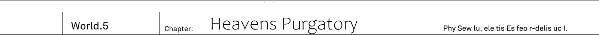

Depths of elven forest.
Animal trail, which was illuminated by deep green sunlight.
Fairin, who stopped on the road, turned off radio.

"Jeanne-sama, I've finished contacting our unit at the forest's entrance."

"How is it?"

"While it is now hard to get through due to distance, but I was able to report that we're safe.
I also requested Io communication unit to work on bettering communications."

"...We'd have to report our triumph after all."

Jeanne tightened her lips.
Their report this morning was to ensure that it wouldn't be their last call.
They had to complete their end of deal with elves, retrieve Dante alongside his subordinates and return bakc.

"Is rest already over?"

Elven shrine maiden Reiren, who was sitting on ancient tree's root, asked.

"Then let us proceed. We are almost upon our destination."

"...We've been walking for over 1 hour but, are we really so close?"

Kai called out her, who was about to turn her back to them.
His hand, on which shoulder he was carrying Drake Nail, was already sweating quite a lot.
They've been following through serpentine animal trails, thick areas filled with ancient trees and even crossing river within the forest.
Yet they still hadn't reached their destination.

"I think we should see angel palace now."

"I see it. Look."

Elven girl pointed above their heads.
The view was obstructed for the most part by branches of towering ancient tree,
and sky could be hardly seen from within a forest.

"Angel palace is up there.
The floating fortress on top of the ancient tree.
It is finest work of elves, dwarves and fairies.
Which we already told thee."

"...Above there?"

Shadow covered them from above.
He thought it was shadow of ancient tree, but he didn't expect it to be a shadow of angel palace.

"It is not the only floating fortress of angels.
However only this one is called angel palace.
Because Alfreya-dono is residing there...
Now, here it is."

Elven girl tore off leaf out of ancient tree.
And there was magical circle.
As she touched it, a huge magic circle of bright light have risen from the ground.
It was magic with double trigger.
Before one could activate the teleportation gate, they had to activate small hidden magic circle on tree's trunk.

"It might be a weird thing to ask for me, but is such complicated device is countermeasure against humans?"

"Well that's quite a question, isn't?
We are enemies." _TL Note:_ I feel like I didn't express Reiren here well enough, but to be honest it is kinda difficult to get her meaning here `よくもまあ堂々と聞くものじゃ。ワシらは敵じゃぞ`

Girl, who stood on ancient tree's roots, turned towards him with bewildered look.
She answered with a faint smile.

"The answer is [Nay]. We hold no fear towards humans.
The only one we regard as dangerous are demons and cryptids, then spirits."

"Demons were the same, completely ignored humans."

"...Kai, I see what thee meant by this question.
If angels are not regarding humans as danger, then it is likely that inside palace there will not be many guards?"

"Yeah, besides angels are, too, placing majority of their floating fortress alongside Io national border."

The same attitude as that of Urza's demons.
They are focusing their power on borders as they are wary of invasion from other races.

_Then we have more than enough chances to return alive._

_After all the number of angels is definitely not big inside palace._

After securing elven elder, they would just escape before angels would come rushing in from other floating fortress.

"So thee shall return back alive?"

"Even you think the same, right?"

"But of course. As long as we are not discovered by Alfreya-dono.
I wouldn't take such measures otherwise.
Like this."

Elven girl used hood of her travelling attire to conceal her face.
Her figure was concealed by mantle.
As under it she had her seventh layered spirit garments it was quite big, but with such appearance it was difficult to recognize her as a elf.

She used special perfume to mask elven odour as that of human.
And put on necklace that suppressed her magic powers.

She erased all elven traces in her appearance.
And right now she looked just like human girl in travelling outfit.

"How is it?
With this even if angels would see me, they'd never think it is [elf who is guiding humans]."

"Yeah, then only humans are going to fight with angels.
And you'll remain neutral."

"That's right, we shall not assist angels and neither will look for opportunity to strike thee.
Elves will keep their promise."

Teleportation magic circle.
Elven girl stepped into light of so-called gate.

"Come, Kai, thee are first after all."

"Of course."

With Drake Nail in his hand, Kai lined up with the elf.

_If it is trap, then stepping in with everyone would meen our complete annihilation._

_I alone will confirm if it safe, and then others will come along._

It was decision they made last night.
If Drake Nail is loaded with elven bullets then it is capable of erasing magic power.
Moreover with Code Holder as his trump card, even if Kai would be surrounded by angels, he still would be able to fight against them.
That's why the scouting duty fell onto him.

"Hey, Kai, wouldn't it be fine for me to go first?" - asked Rinne with uneasiness in her voice - "I'm strong, so even if I surrounded..."

"If only Rinne would remember how to use radio...
Not being able to contact us after going in, would make it meaningless."

Putting his hands on her shoulders, Kai responded with a joke.

"...I'm leaving you a dangerous role. I'll be praying for your safety."

"Once I'll confirm it is safe, I'll call you."

Responding with these words to Jeanne, Kai stepped into light of magic circle.

_TL Note_: Text on picture `イオ連邦　古代樹海南端ー秘境「天使宮殿ゲシュタル ロア」`.
Translation: `Io Federation Southen tip of ancient forest - Unexplored region [Angel palace Gestalt Roa]`

-------------------------------------------------------------------------------

Sky...
Before his eyes, ears and all other senses, it was his skin that felt it.
He felt wind, that was fluttering his hair, with his whole body.
Kai looked around.

He was far in the skies.
Looking down he could see elven village among sea of ancient trees.
He was so high, that he could overlook the horizon.
That was where Kai stood.

"...This is angel's floating fortress?"

He was astonished by current altitude.
And the feeling that it gave.
Standing here he could overlook the whole ground down below.
Which made him feel almost like he climbed the top point of the world.

"See, we made it without troubles."

Elven girl, who was hiding her face behind hood, sighed as she put her hand on waist.

"There are no angels waiting to ambush, and no danger of thee to be entrapped."

"...This place is?"

"We are just behind the palace.
Right about when shadow should cover the place, so it is good spot to remain hidden."

There was dome like gigantic structure.
As Reiren told Kai has been transferred behind the palace itself.
Looking carefully around he didn't see any sign of angles.
But...

"Smoke?"

"No... Wait, what is this smell."

Kai and elf voices overlapped.
As strong wind, which was raging at top, changed its direction towards back of the palace, both of them felt bitter smell.
It was smell of something burning.
And even though it was hampered by the strong wind, they could hear some noise in direction of the palace.

"Kai, hold on calling thy friends here, something is wrong."

Elven girl put out her hand gesturing to hold on.
She went towards the palace's front alongside the white wall, which was made out of unknown metal.

"...This is... Just what happened here!?"

Shrine maiden was looking courtyard in front of the palace entrance.
[Angel Garden] was there occupying more than half of the space.
It was a beautiful vibrant and lushful paradise, full of greenery and flowers, but now it was painted by deep bright red colour.
Angel Garden was set ablaze.

This was a floating fortress that wasn't supposed to be invaded.
Yet now, it became gruesome place akin to a purgatory, with blazing fire raging.
It was abnormal.
But regardless it was obviously not a trap of elves and angels.
Because Kai could see multiple bodies of angels lying down across the wide courtyard.

[Kai, what's going on!? Report...!]

He heard Jeanne's voice from the radio.
They might feel something is wrong since Kai and Reiren already climbed to Angel Palace, but had yet to contact them.

[Kai, hey Kai!? What's happened!]

Rinne cut in.

"...It is all right. Both me and Reiren are safe, and there is no traps also."

There were blazing flame and fallen angels.
And glancing at bewildered by this scenery elven girl, Kai mustered his voice:

"Anyway you should get up here.
We definitely have abnormal situation here."

I have no idea what's going on - Kai reported with husky voice and tightly grasped the radio device.

-------------------------------------------------------------------------------

"They are still breathing, so whoever did it had no plans to kill them.
But there are signs of torture.
They were attacked in a way to inflect utmost pain."

Angles who fell face down, all were wearing so called heavenly garments, which was special kind of spirit garments, common among angels.
And the attacks that they received were strong enough to knock them out even through the spirit garment.

"As their comrade, it pains me to leave them as it is, but this is our chance."

Reiren sighed after looking at them for a while.

"It it perfect time to sneak into the palace.
Moreover, looking at how violently was destroyed the courtyard, I cannot imagine it is safe inside...
We must not delay, follow me!"

She quickly put back her hood and run.
And she was fast.
Despite her small build, her legs, which stomped the grass, strength wasn't inferior to human soldier.

"How many hundred years thee think I've been running through our forest?
It might not look like that, but I've been training."

_TL  Note:_ `こう見えて鍛えておるわ` I think author shortened last sentence quite a bit? But correct me if I'm wrong.

Elf said with a smug.
Even though she was speaking, her speed never dropped down as they were crossing angel palace main gate.
Then foreign gods girl jumped into opened window in palace wall.
The window had no glass to it.
Most likely it was just a [hole] to let in wind and sunlight.

"Inside palace may be passages, but there was no floors, right?"

"That's right.
For angels who have wings, floor would something akin to bird perch.
There are only few such places in entire palace."

Elf asserted in response to Jeanne, who was running in parallel with her.
Only angels, who have wings, were coming into the palace.
So to say it was one big pitfall via which anyone without wings would fall down to the forest.
It is likely also measures against demons, cryptids and spirits.

_TL Notes:_ Seems a strange countermeasure to be honest, but that's is written by author...

"But then we'd be troubled. Dwarves, fairies and elves do not possess wings."

Among foreign gods were their comrades who walked ground.
For their sake Heaven Lord Alfreya prepared special pathway.
And right now through exactly such pathway Reiren was running.

"Jeanne-sama, it is a fortunate for us." - Fairin whispered - "Without elven guidance it would be extremely difficult for us to storm this floating fortress."

"Looking back it might be thanks to Dante."

_TL Note:_ `元を返せば` is used here which kinda similar to `裏を返せば`

"Quite hasty, do not forget that human life is in my grasp."

Said elven girl who was running through empty corridor.
Walls, floor and ceiling.
Everything was made of transparently white metal.
Being polished like that it looked just like marble, but as he could feel elasticity through his boots.
It was marvellous metal that was both sold and soft.

"Rinne, is that light in ceiling due to magic?"

"Yup, but I do not find it unpleasant so I don't think it is a trap.
Since there is no need to use magic to light the place during daytime, it might belong to divination system."

Said Rinne who looked up at the magical pattern on surface of ceiling.
It blinked at the same time as they passed under it.

"It is barrier.
Which would seems to shine as soon as someone other than angels would enter.
It shined all the same when we with elder passed through."

"Then we are trespassing here?"

"Guards would notice, but they are not going to come here.
Remember the time at courtyard."

_TL Note:_ I don't get this one `ほれ、あの中庭で倒れておったうちの二体じゃ`, need to complete it

For a short while it became quiet.
Heavy footsteps were echoing through the corridor.
Each and every of them fell into silence and were looking for words -
Such silence wrapped the angel palace.

_There were more than dozen defeated angels in courtyard._

_Just who was this guy who came before us and defeated all of them._

Someone from other races?
But if that would be the case, then as soon as someone would cross Io national border, he would be discovered by angels floating fortress nearby borders.
And elves would notice any suspicious person in the ancient forest.
So this time it wasn't the case.

"I can think of two possible scenarios."

The one who broke the silence was female warrior, who was running behind Jeanne.

"First is that captured elven elder broke out on his own."

"That's not the case.
Thee should understand that if he'd done it, then it would result in war with angels."

"Then the second possibility..."

"Let us hear it."

"It is possible Heaven Lord Alfreya himself punished these angels in courtyard."

"Yes!?"

"W-what do you mean, Fairin-sama!?"

Elven shrine maiden remained silent.
And the one who shouted in surprise were Saki and Ashlan, who were in the end of their formation.

"It is just process of elimination.
This fortress is highly difficult to invade from outside.
Only their comrades foreign gods can enter: elves, dwarves, fairies.
And if they are not perpetrators, then the only possible answer is angels themself."

"..."

They followed the path which suddenly took turn to the right.
There was a door, which is likely locked by magic.
Elf remained silent as she crossed past gigantic 4 meters tall door and continued running.

_TL Note:_ I'm a bit unsure what author means by `大きく右に曲がる通路` to be honest

"Alfreya required submission out of others among foreign gods, right?"

"...That's right."

"But that was only Alfreya demand alone.
Difficult to image that all other angels agreed with his idea.
There should be some who objected for sure."

Alfreya punished his disobedient subordinates.
That was her speculation about felled angels in courtyard.

"Argument?" _TL Note:_ I'm a bit confused here. Because `異論` means argument/difference of opinion, but the flow of conversation also allows for it to be her asking for basis of the Fairin's theory.
Especially since Fairin responds with `ない`, but it feels weird?

"Yes, and if we're talking about possible scenarios, we cannot deny that it is the most likely scenario."

To that elven girl replied:

"I'm no longer capable of comprehending Alfreya-dono.
Otherwise I wouldn't disguise myself as human in order to save our comrade."

Elf slightly shook her head.

"...We're already here.
Going through a teleportation gate beyond there we should be able to reach underground level."

The corridor was ending here.
Elven shrine maiden put her hand on tightly shut door and light patterns enveloped her body.

"Reiren!?"

"There is no need for a worry.
This door requires magic power in order to be operated.
See, it is opened."

This bulky metallic door, which looked like hundred kilograms heavy, was wide open.
His first thought was that it is a place of prayer.
In the big round hall was standing altar of brass colour.
Both walls and ceiling had many windows, and bright light shined throughout the wide room.
This light...

"Battle axe - Hundred wind sonatas." _TL Note:_ Ok, I have no idea what to make out of it `戦斧・五百箇の風破`.

It blown off in front of light that shined through the ceiling.
It's white surface collapsed.
And from there massive winds down poured onto altar, smashing it into pieces.
Remaining strength of wind scattered against all surrounding walls.
It affected not only Kai and other humans, but even Reiren who was supposed to belong to foreign gods.

"Argh...!"

Elven girl received incoming pebbles with her whole body.
As her hood was lifted, both her face and beautiful hair were exposed.

"Oh dear? My my, My my." _TL Note:_ It is ara-ara type of girl.

From broken ceiling, winged foreign god has descended.
It was angel with four wings.
Beautiful female angel with cold grey eyes and wavy hair of flax colour.
In her hand was battle axe, clearly not suitable for such delicate arms.

"I was wondering just who brought filthy smell to our sacred palace.
After all it was you.
Elven shrine maiden Reiren Leil Racheliel" _TL Note_: Full name `レーレーン・レイル・レーチェリエル`, don't think it is going to be used often.

"...Battle Angle Vicious" _TL Note:_ Name tells everything you need to know about this angel, sensei is really kind here, comparing to Reiren full name.

Elven girls wiped blood from her mouth by a back of her hand.

"Thee... What did you say just now...?"

"Are your ears just for decoration?
Even though they are so big.
After all surface creatures are the same.
Just animals that crawl on the ground."

"...Even thee."

On elf's face wasn't displayed anger, but rather sadness and astonishment.
She was standing there in shock, not believing into betrayal of old friend.

"Were thee depraved by thirst for power!?"

"Depraved? What are you saying."

Said female angle with battle axe in single hand. _TL Note:_ This one is actually weird for me `戦斧を片手に浮遊する女天使`

"I'm but a servant of Heaven Lord Alfreya-sama.
Everything I'm doing is for the sake of that person."

"..."

"Ah, right, let me tell you something very good.
Shrine maiden Reiren, you appeared at quite good time."

Angel with very beautiful face made a distorted smile.

"We shall start execution of elven elder immediately.
And it will be done by Alfreya-sama himself."

"...!?"

(Reiren) screamed without voice.
With her fair skin, her expression looked deadly pale as if she loosed all blood.

"Wh...what is meaning of this!?"

"This will be a lesson.
Even elves would learn own place once your elder will be dead.
And of course the same goes for dwarves and fairies."

"This would troubling."

Instead of elven shrine maiden Reiren, it was silver haired knight who stepped forward.

"I'm Commander Jeanne.
Not planning to explain the whole situation here, but elder is under our protection."

"A human? Shrine maiden Reiren, to bring humans into this palace, you're already sinner beyond salvation.
After all there was no mistake to Alfreya-sama's judgement."

Angel, with battle axe in her hands, flapped her wings.

"Angles stand atop of foreign gods.
Every other race are nothing more but a slave.
If you're going to defy us...
Then I shall eliminate you with my own hands!"

She raised above her head battle axe of mercury colour.
It was magic tool - once it receives angels magical power, this weapon could materialize paranormal phenomena in the world just like magic.

"O, axe clad in storms, tear apart these people."

She didn't meant to use axe's blade to strike.
Angel, who was clad in winds that were just like small storm, dived in from the broken roof.
And she swung down her axe towards Jeanne and elven girl who stood just behind her.

"Fairin."

"...Surge" _TL Note:_ Not sure how to translate  it `迸れ`

Bright red pillar of fire appeared.
From below came slashing attack which deflected her battle axe.
Moreover from the floor itself fire arose and followed towards angel, clad in winds.

"My attack!?"

Vicious was now enveloped by fire.

"Tch, what a impudent human, to go against me...!"

"I've been told it many times. By both demons and cryptids. But it is first time from angel."

Female warrior, who responded to her with sarcasm, carried crimson shamshir.
From the sword's point were coming out fire, almost like a lava.
And the blade itself wasn't work of humans, but [Drake's Tooth].
It was fang left by drake in land where cryptids were rampaging.
It's impact was creating violent burst of fire.
And that fire surged forward toward Vicious.

"Fire."

Gun shots could be heard.
Behind Saki and Ashlan readied their guns and started firing.
And despite having strong divine protection, Vicious stepped back to avoid being shot.

"Jeanne-sama, please go ahead."

She pointed with pair of her shamshirs towards back of the altar.
There was door leading to another room.

"This angel's magic tool has wind attribute.
And my dragon tooth has the best affinity with it.
With two of our subordinates we should be able to deal with her."

"For humans thee are quite good."

Elven shrine maiden Reiren placed her hands on the door.
As with the entrance here as soon as the door received her magic power, it started to open.

"I will not let you!"

"Hey, we'll be your opponents!"

Ashlan, who was firing barrage from his machine gun, was keeping angel pinned down.
Angel's body wasn't much different from that of humans and elves.
She couldn't avoid injuries if she'd be shot, so Vicious had no choice but to focus keeping her divine protection.

"Go, Kai! We have Fairin-sama so we'll manage somehow!"

"Thanks. Jeanne, Rinne!"

Together with both of them behind him, Kai followed after elven girl with all of his strength.
They could hear echoes of gunshots and blazing fire.
And as raging winds sound disappeared - chapel's doors were closed.

"Angel's leader, just how low did you fell!"

Elven girl took off her travelling clothes.
There was no longer any meaning in pretending to be human.
If she'd continue hesitating here, it would mean getting elven elder executed.

They were in one long and big pathway.
Both on left and right they could see nine columns.
Total 18 columns were lined up along their way in this passage.

Reiren was taking a lead.
Following by Kai, Rinne and Jeanne.
The lighted passage had not even a bit of dust floating around.
Atmosphere was completely stagnant and no sound of insects or animals could be heard.

_It is too quiet._

_This silence is just omnious._

They run while carefully observing columns of 2 meters diameter.
It wouldn't be strange for angels to hide themself behind these gigantic pillars.

"Reiren, are there any other angels we should be aware?"

"If thee are asking about angels who are loyal to Alfreya, then the answer is [all].
Among angels in angel palace everyone hold respect for Alfreya."

On other hand, foreign god already inflicted punishment upon such subordinates.
And cruelly thrown them out into courtyard.

"If among these who we still haven't saw, then that would be archangel Raphael."

"..."

Rinne suddenly stop.
As if searching for something she looked at ceiling and then started looking among 18 pillars.

"Hey, Kai, I'd like to rest here."

"Eh?"

"W-what are thee saying, little girl!?
Just a bit more... There we shall reach that Alfreya.
Look, there is light magic formation, once we'll cross it, we'll be there."

_TL Note:_ I'm a bit unsure what author means here `光の方陣`

Shrine maiden turned towards her with mix of anger in her expression.
Even Jeanne behind her was taken aback.

"What are you going to do if other angels would appear!
Even though it is just a little more and we're there."

"Nah, I'm resting."

"This girl....!?"

"Shut up, stop talking.
Hey, Kai, I'm going to take a rest but it is ok for you to continue going."

He had a sense of deja vu.

[...It is all right. I'll be ok so.]

[Go, Kai. If you'll remain with me, they'll continue chasing you.
Go up and wait for me.]

It was during their operation in Urza's capital.
On the girl said, he left her behind surrounded by demons and climbed to the top floor of government palace.
Only Kai and Rinne knew about it.

"Rinne, are you really..."

"It is nothing really."

She replied with extremely bright smile on her face.

"Go ahead. After I'll rest I'll catch up with you."

"...Understood."

He added more strength to his hand on which shoulder was his Drake Nail.
And placing his hand on shoulder of elven girl, who was still fussing, Kai pointed to the end of passage.
There was formation of ascending lights, just like water fountain.
Many many light circles were appearing out of it and ascending up.

"We just have to go there, right?"

"Yes, no doubt about it.
I entered through it once."

"Got it, Jeanne are you ok too?"

"Of course."

Tightly grasped her silver sword, commander of Urza Resistance stepped forward.

"Let us challenge the foreign gods hero."

"...Who would think it would come to this."

Elven girl started climbing the stairs
As she reached 13 step and touched the formation, her delicate body started slowly floating.

"Hey now, thee should follow already."

"Kai, one thing."

While he was in the middle of climbing the stairs.

"I'm really sorry for leaving you the most dangerous fight with Vanessa.
I wanted to say it always..."

"Jeanne?"

"This time I'm going to fight together with you."

Knight, who dressed like a man, exhaled.
Tightening her lips, she made last step on the stairs together with Kai.
And then towards light magic formation...

-------------------------------------------------------------------------------

Angel palace.
Highest floor - Sky hall [Azure True Heaven] _TL Note:_ `蒼き真天` another weird one, need to think of a proper name?

There were infinite blue skies, without ceiling or walls.
With only solid floor under their foot.
Other than that it was place fully exposed to skies.
It was on the same latitude as clouds and there was no obstacles to winds that washed away enormous clouds.
Their hair and clothes were fluttering by the wind.
It felt as if they were standing on top of many thousands meters tall enormous spire, or maybe they were [in the middle of skies]
And then...

"Heavens are overflown with anger."

There was standing arrogant looking angel with six wings, right in the center of an altar.
It was tall figure of floating angel.
With similar to Vicious flax hair and awe-inspiring look.
Amber eyes reflected strong will and wisdom, and angel's body was well built.
There was standing foreign god's hero, wearing blue heavenly garments in addition to white one.

"You who are wingless, you who crawl the ground, you who looks up at the heaven.
Why cannot you obey?
Like healing rain falling onto ground from the skies.
Like apple falling down from air.
Everything given to earth is blessing from heaven.
Why cannot you comprehend this providence?"

Said angel who was looking up at the skies.

"This is why we are standing at the top."

Behind was a cross, stuck to the floor.
These enormous things, that could fit entire human, would be rather coffins in the shape of the cross.
In this red semi-transparent cross...
Inside could be seen locked up struggling figure.

"Now we shall commence execution."

Without any emotion.
Just like child observing insects under his foot, angel proclaimed emotionlessly.

"Execution of elven elder." _TL Note:_ I'm a bit unsure if author meant that Alfreya didn't finish the sentence here... `エルフの大長老の処刑をな`

The elf, locked in the cross shaped coffins, was alive.
And was trying to yell something, yet coffins let no sound to escape.

"Alfreya....!"

Elven girl roared.

"Scum like you has no qualifications to lead foreign gods.
Neither elves, dwarves, fairies or angles.
And now I'll be the one to deliver thy ending."

"W-wait, Reiren!"

"Don't stop me, human!"

Elf shook off Kai's attempt to restrain her and stomped the floor.
Without doubt her eyes reflected a fury.
Heaven Lord Alfreya tightly grasped something in hand.
And then this angel said, with cruel smile:

"Let's deliver heaven's justice."

In angel's hands was brass coloured baton.
Which then angel pointed at approaching elven girl.
Magnificat [O, Sacred star, descend upon the earth]

Large and sinister sword flew in.
It was only a sword, named [Sacred star], and it's blade was bright red.
Having neither guard or hilt, it was sword consisting of only blazingly red blade.
It was magical sword with blade's length over 10 meters,
and capable of easily cutting in halves the elf's whole body.

Reiren was yet to notice it's approach as it was coming from her blind spot above.
And what's more, it's speed was just too fast.

_TL Note:_ Need to check these two lines: `彼女が走ってからの発動じゃない。この場に俺たちが来た時から用意してたのか`

_As Reiren is running she cannot cast_

_Was it prepared for us since we came here?_

There was no intention to discuss things any longer.
Heaven lord Alfreya had no intent other than killing them here.

"Reiren!"

"...!"

Feeling that something is wrong Jeanne's voice she looked up in the sky, but it was already late.
Blazing sword was already before elven girl eyes.

_Can I cut it!?_

_It cut through demons magic. But there is yet example of it working against angels magic tools._

This hesitation of his stopped just about when it was becoming too late.
There was no time to waver.

"Code Holder!"

Sid's sword.
As Kai called the name, his Drake Nail transformed into divine sword in the blink of eye.
Black steeled bayonet became a transparent sword of sunlight colour.

"Down, Reiren!"

[Code holder severs the _Fate_. Now, cut fate of meaningless deaths out of the world.]

Aiming at flying in red sword, he raised overhead his sword of sunlight colour.
Both clashed.
At the moment when blazingly red and sunlight touched each other, red sword broke together with big explosion.
It became myriad of small fires and disappeared.

"...Wha!?"

Elven shrine maiden turned back.
And she wasn't alone.
Even elven elder, who was sealed inside the cross, became astonished.
They wondered: did human's sword destroyed Heaven Lord Alfreya's magic tool?
It wasn't a regular sword, yet it wasn't elven magic weapon too, they understood it at first glance.
Then their question was: just what is this sword in Kai's hands?
Moreover...

"Human protected elf?"

Floating angel squinted at him.

"Protecting the elf. Such act is beyond my comprehension.
Are you really human?
Or could it be a elf that pretends to be one?"

"No, I'm full fledged human."

He stepped forward in front of dumbfounded Reiren.

"There is nothing strange about it.
If by tiny chance elves will hold grudge for her loss, it makes sense for us to help her."

"It is just not balancing out. Own life against life of this insignificant elf."

The angel stared at Reiren with disdain.

"There might be some secret to your sword, but
a tiny misstep is going to turn you together with that elf into dust.
Staking own life is just not worth it."

"I'm confident enough, well not absolutely though."

They exchanged gazes.
Standing right in front of descending angel, he meet angel's judgemental gaze.

"This is a sword that could stand against demon hero's magic.
Challenging you with it is not impossible."

"..."

While remaining silent, angel's shoulders jolted a bit.

"I heard such rumours.
About demon hero being defeated by human.
I surely thought it is something impossible, but...
Huh, I see, I see it now!"

Angel shook his shoulders greatly.

"That filthy demon, just how foolish she was to be defeated by a mere human."

"I wonder about that."

"What? Are you conceited this much?"

"That's not what I meant.
What I want to say: are really in position to call Vanessa [fool] yourself?"

Demon hero Vanessa is humans enemy.
The one who destroyed capital and enslaved humans.
She hold no remorse towards wronged humans.
But...

"At least she didn't start punishing own subordinates."

"This is what I have decided."

The angel sneered.

"I'm standing highest in heavens.
Most noble and brightest star.
I have not even a tiny bit of desire to call these, who goes against me, my subordinates."

_TL Note:_ damn this guy ego

"This what we call narrow minded.
Cancel disguise - [Moon Bow]"

From Jeanne's sword appeared light.
As the light wrapped sword completely, the sword, that knight hold, started to transform.
Becoming extremely beautiful bow with many gems engraved in.

"Pierce."

Bow creaked, letting arrow loose and distorting air itself.

"Is this a elven bow!?"

Heaven Lord Alfreya turned mid-air.
The moment when arrow pierced through wind and passed through, angel's left eye became slightly strained.
His left cheek was slightly cut.
Jeanne's arrow was able to penetrate angel's powerful divine protection.

"Human, do you understand what it means to use elven magic weapon with your body?"

"Easy, it consumes my life."

The knight answered as if it was something obvious, but...

"...Jeanne!?"

Kai heard about elven magic equipment.
The origin of her Light Knight title comes from spirit garments and elven bow.
And in special case even people without magic power are able to use it.

_But using own life?_

_I haven't hear a single of word about it._

So it made him wonder if it means that the price was her own body for using elven magic tools.

"Jeanne, that..."

"We'll talk later. First we have to beat down this angel."

Said the Knight while preparing the second arrow.

"And I'm also curious about your sword.
We win and after that we can properly talk!"

"Disrespectful people."

Angel's six wings became opened.
And then swung down silver, like fluttering wings.

Magnificat [Heavenly Zhen Lighting]

Lighting surged.
In the blink of eye, in front of Kai's eyes light went through Jeanne's whole body.

"...Miracle Light!"

While being struck by lighting, the knight shouts out with hoarse voice.
Under her armour Jeanne's thin silk dress lightens up and weakens continuous lighting attack.

"These are elven spirit garments.
With extraordinary resistance against magic.
Angel should know know it well."

Lighting disappearing.
Although she fell to her knees, the knight gritted her teeth to keep her consciousness.

"Foreign gods hero uses magic as source of power.
And it makes this spirit garments the counter measure against angels." _TL Note:_ I simplified second sentence a bit `それを法具によって発動している以上、この霊装が天使への反撃手段になる` Might need re-work

Since this equipment belongs to foreign gods, angels took no measures against it.
As originally it was impossible to think of angels and elves competing against each other.

"Weakling, to whom you say it."

Angel started humming.

Magnificat [Look, at the glorious light of judgement]

Lighting attack, that was directly coming from skies, towards multiple fluttering feathers in air, and in that moment they split into hundreds light threads.

"Wha!?"

No longer it was single lighting attack, now it became a rain of lighting.
Blue sky became dyed in white/yellow colours of lighting.
Soon after, lighting strikes down onto the ground, but now it downpours from every direction.
One after another lighting strikes at Jeanne's spirit garments.
More and more lightings were increasing in their number, and aimed towards Jeanne, who was in front of Kai.
And it was coming from all directions.
This number wasn't something that you could cut with Code Holder.

"Seven ladies defence formation! Three ladies, come fourth!" _TL Note:_ she says`姫` so even if it sounds weird, I cannot help.

Her seventh layered spirit garments fluttered like mantle.
Elven girl who took off her seven layered garments, threw three of of these layers.
In air these silk layers started to emit faint light and loosen up,
and its threads formed a light pattern in the middle of empty space.

It was wide range protective barrier.

This circle became like parasol above Kai, Jeanne and Reiren heads.
And started to reflect back downpouring lighting

"...Reiren?"

"I'm but returning a favour.
Sorry, but I have no plans to be in debt to humans."

The girl, who now had her white shoulders exposed, turned away in embarrassment.

"Still Heaven lord Alfreya magic tools power has no bounds.
Even I have a little confidence to defend against all of it.
Therefore to overcome this..."

"How about making it four on one?"

"That's right. For a human thee got good head on shoulders. Come along!"

Elven girl started to run.
Not delaying for a second, Kai run straight ahead through this windy place almost immediately.
Towards the bloody cross.
If they could release elven elder from these sealing coffins, this battle would become four against one.

"Is that so?"

But Heaven Lord's expression didn't change at all.
In angel's hand appeared a trident.
Angel threw it at elven girl, with it's silver three silver points aiming at her.

"Tch, the same thing!"

Reiren used one silk layer of her garments to defend.
But, silver trident easily pierced through it's defences.

"...Impossible!?"

Elven shrine maiden Reiren spirit garments [Seven ladies defensive formation].
Being knitted from ancient tree leafs and Reiren own hair, the magic tool was able to defend against up to seventh offensive magic attacks by absorbing it.
It could defend even against demons hell fire, and yet it is been torn apart...

"Spear of God's wrath.
This is a magic tool was created in order to pierce through magical defence."

As the trident was about to touch elf's chest...

"You underestimate humans too much, angel!"

Kai's Code Holder knocked down at it's point.
And the trident rolled down with strong noise.
It was now a Jeanne's turn to fire at the angel with her arrow.
And as the angel fended off it with the wing, Reiren finally reached the cross.
Execution casket.
Inside the semi-transparent and reddish coffin was struggling elf.

"Just wait, elder!"

Reiren gripped in her hand knife, which shined with colour of full moon.
It was likely a similar to spear of God's wrath magic tool that could break through magic defence.
Holding it tightly with both hands, she swung it down.

It broke.
Fragments of the silver knife danced in the air, spilling over her shoulders.
These were fragments of the broken knife.

"...Impossible..."

She was certain that it would be able to pierce through.
With a mix of despair and disbelief, she looked down at knife remnants in her hands.

"This our greatest treasure! Why..."

"The gap between mine and your powers is like between heaven and earth."

"Alfreya..."

Elven miko turned over while clenching her teeth.

"What is meaning of this! This is but too weird.
Thee, just where did thee acquired this power!"

"Reiren? What do you mean?"

"I mean captured elder.
In human terms he would be a [hero rank] and the elder's power is close to that of Alfreya.
So I mean the power that would be required to lock up the elder is enormous.
In all actually this casket would deplete a lot of this bastard magic power."

Otherwise it would be destroyed.
So sealing elven elder should consume a lot of magic power, and yet heaven lord continued to fight.

"Yet, despite that, that guy used four magic tools in addition to this casket!"

Blazingly red sword, brass baton.
Silver rod that could summon lighting rain.
Besides that, in addition to silver trident that could destroy magic defence, Alfreya wore a heaven garments.

_Certainly it seems absurd._

_Just how much magic power this angel holds to carry one like that_

For foreign gods the organ, that produces magic power, is not capable of invoking magic directly.
Therefore they have to make magic tools to serve as their weapons, that are capable of creating pseudo magic spells.

"The efficiency of magic tools is hardly high.
Thou magic powers might be great, but definitely not to this extent!"

"..."

"Answer me, Alfreya. Is this power the reason for thou sudden change!?"

"Sudden change?"

Floating in air angel started to descend.
As the angel's feet touched the floor, all of the sudden there appeared strange black hole.

"It is different.
My newly acquired subordinates brought me a great joy in replacing you."

Something started to crawl out from within the black hole.
It was bizarre and alien creature that was mix of different races.
Seeing it's appearance Jeanne swallowed her breath, while Reiren took step back.

"!?"

"Wh-what is this monster...!"

The one who appeared was the girl whose body was partly destroyed.
While her appearance was that of human girl, on her right shoulder was tentacle which looked like snake's body.
On it's back was skeleton wings and it had two heads.
This was...

"That rasterrizer!?"

_TL Note:_ If I remember correctly even Vanessa mentioned Alfreya name when she got attacked by that thing, so not sure if Kai has to be surprised here.

He remembered encounter at the graveyard.
It was the same specimen as the one who appeared in the place where Rinne had been sealed.
One could only wonder if this thing chased them up to Io.

"Rasterrizer? You mean the one that appeared during your fight with Vanessa!?"

"Jeanne, you must not approach it. The same goes for you, Reiren!"

Once again his whole body was filled with dread.
It was giving off a abnormal sense of discomfort.
Regardless how much he would see it, the creature was bizarre.

"Oh-ho? Human, you know my subordinate?"

The angel's brow raised in pleasant surprise.

"Then we can omit introductions."

"Hero Alfreya, if this is indeed your subordinate, then I have something I want to ask."

Towards angel who wore a smile of derision.

"Are you the one who behind all of it? The world reincarnation."

Once the rasterrizer appeared to keep Vanessa, who started to regain her memories, shut.
And surely since this monster is subordinate, that angel must know something about world reincarnation that Vanessa tried to speak of.
Or maybe that angel was indeed the ringleader, whom Vanessa mentioned, behind it.

"What are you talking about?"

In response foreign gods hero returned a dubious look.

"This is my new power. And world reincarnation? What is it?"

"!? I was wrong, you're not ringleader behind it, and know nothing about world reincarnation!?
Then what about Sid?
Do you know nothing about prophet Sid!?"

"...Sid."

Angel furrowed his brows.
Then as the angel put the hand on forehead, his expression seemed distressed now.

"Sid... Prophet Sid. I guided."

"Eh!?"

"...I... Guided, that human."

Suddenly, angel fell to knees.
In that instant, Kai witnessed something even more strange.

 
 

Angel palace, corridor with 18 pillars.
It was filled with light.
This was the passage among blue skies that led to heaven lord Alfreya.
There single pillar has collapsed.

Roaring sound and dust filled the place.
Rinne's magic completely destroyed the pillar from it's center to ground and sky.
Under the dancing clouds of dust, enormous pile of rubble arose.

"...How terrific, it even broke through my divine protection?"

From under hundred kilograms pile of rubble crept up figure of giant angel.
His height was about three meters.
And each of his bulky hands were thick as Rinne herself and swelling with muscles.
That was archangel Raphael.
The angel who introduced himself as such was checking his heavenly garments,
his whole body had marks of great battle.

"What a unexpected menace you are.
Trespasser, who are you?"

"..."

On Rinne's back were tenma wings.
Archangel already understood that Rinne body hold factors of multiple races, including foreign gods and demons.

"Archangel Raphael."

She looked at the giant from air.

"Liar."

Rinne said, as if spitting.

"My attack didn't work all that well. I know it."

"Fumu?"

"I hate this composure of yours.
All angels are the same with your condescending attitude."

Angels defensive powers.
In contrast to demons who specialized in releasing their magic outside, angels, who were unable to do so, used their magic power to strengthen their bodies.
Was it like steel?
No, it even more powerful.
Neither Rinne's dragon strength or magic could fatally wound him.
Moreover the only wound, that she was able to inflict, was already healing.

"Like moving fortress."

As a guarding to this sacred pillared road, he was close aide of Heaven lord Alfreya.
If Rinne who was aware of this angel presence, wouldn't be left behind, Kai and others wouldn't be able to take even a single step.
Which would give enough time to complete elven elder's execution.

"And what about you? Is this really all of your strength?"

"..."

"Nature of your chaotic magic power.
Then these wings.
I also feel strength of cryptids in you.
Just what is your true nature and the source of your power?"

"I don't know and don't even want to know."

She continued living without knowing it.
As long as Kai was with her, she didn't even think about wanting more.
Once she'd discover... Instinctively she knew that her life will become more difficult.

"Mysterious creature, you shall not pass here."

Archangel Raphael war hammer.
Using enormous amount of magic power, it's single attack could create invisible wave of destruction that could turn opponents into dust without even touching them.

"...I hate it."

The pillar behind Rinne.
Aftermath of previous attack completely crushed it as if it was just paper thin.
Despite her talk, this scenery gave her sense of crisis.

"Since you're strong I no longer going to go easy on you.
And I don't care what will happen after that."

"Come already, chaotic one." _TL Note:_ I'm still unsure how to translate `混沌種`

Angel raised his hammer overhead.
Rinne started creating god-like lightings from her tenma wings.

Magic tool VS magic spell.
Against magic tool, which was casting pure white light, multi-coloured chaotic lighting attacks roared within this big passage.
And then they clashed.
Both Archangel Raphael and Rinned bounced off into air and crashed into pillars.

"...kh, it hurts..."

While staggering, winged girl stood up.

"How dare you to do it my wings."

Receiving attack from the war hammer, she wasn't able to walk straight, she frowned as she was staggering along the wall.

"Liar."

Said with anger Rinne, who glanced at giant who fell down on his back.

"Even if you pretend to fell down, I'm not going to fall for that."

"...Why you think so?"

"If you're so beaten that you cannot move, then how come you didn't let go of your war hammer?"

Rinne glared at angel's magic tool.
Even now archangel Raphael was still tightly holding his war hammer.
He still had strength to spare, so it wasn't clear when he would be rising.

"Sadly, I have no idea what you're complaining about.
You, trespasser, defeated me.
That's why you can go ahead already."

"!"

"Further ahead. If you do not hurry, the elder might be executed.
Hurry on."

"...You?"

"I understood your strength well.
There is also Reiren, so if you join forces, it might be possible for you to free the elder."

"Did you let yourself to be defeated on purpose? Even though you're Alfreya's subordinate."

"Who knows... This is not something I can tell you by myself."

Archangel Raphael real goal was a [test].
Whether there is someone who holds strength to go against angel's leader who suddenly changed.
And then Rinne displayed even more than required strength.

"Alfreya-sama... changed. Everything started at that time..."

"That time?"

"I mean that monster called rasterrizer.
As soon as this monster appeared, our leader suddenly changed.
And so we, battle angles, had to put up with it.
Waiting for opportunity."

-------------------------------------------------------------------------------

"Elven elder is our old friend.
Why would we wish for his execution?"

As a sign of truce, she dropped down her battle axe.
Battle angle Vicious who sat down along the wall had look, full of sorrow.

"Human, this much is enough I'll pretend to not notice you, so go ahead." _TL Note:_ I'm not sure how to understand `この場限りにおいて`

"You're quite careful."

Fairin didn't relax her stance.

"I fought against invaders and suffered humiliated defeat...
While on surface I might be loyal to my master, behind the scenes I was trying to devise plans to rescue our allied races."

Still Vicious wasn't planning to withdraw so easily.
At least once she seriously attacked intruders.
Fairin whole body felt it as there were countless small wounds from battle axe winds.

The same could be said about Saki and Ashlan.
Both were trying to hide themself in corridor, and were still out of breath from difficult battle.
They were nervously staring at the angel.

"Really!? You are not planning to attack us as soon as we'll turn our backs to you!?"

"..."

Angel finger traced her battle axe
Then big weapon disappeared right in front of Ashlan.
She completely let go of her weapon.
With this, her ability for surprise attack disappeared too.

"I-it is ok now, right? Ashlan?"

"Y-yeah, what should we do now, Fairin-sama?"

"I'm bodyguard of Jeanne-sama."

They could only go ahead, while she was preparing to answer, she didn't took her eyes from angel.

"I fought and lost. That is all."

"Which means you let us go.
And what if as result, foreign gods hero will be defeated?"

"..."

At Fairin's provocation, angels eyes were lighted with anger.
But that was only for a moment.

"I doubt it is possible for humans.
...But, even if by some miracle it will happen, it will result of Alfreya-sama own will."

For foreign gods alliance to collapse due to internal strife would be the worst possible scenario.
Comparing to that, even if Heaven lord Alfreya would fall, there will be hope to revive their races alliance.
This was bitter result of discussion among close aides of Alfreya.

"Our plan doesn't change.
Saving elven elder is our utmost priority.
It will be up to Jeanne-sama how battle with Alfreya will end.
Let's go."

Giving a signal with eyes to both of her subordinates she started walking.
Just before that.

Angel's cries of agony, shook the angel palace.

"Alfreya-sama!?... N...no... What was that... This magic power...!"

Vicious, who was sitting down, jumped.
Beautiful female angel fixed her gaze above at the ceiling with fear in her eyes.

-------------------------------------------------------------------------------

[Unforeseen state of 'shock' is detected in foreign gods hero.
Estimated to be effect of prohibited word 'Sid'.]

[Executing 'Zero Code']

[Hero Alfreya 'code' to be erased from the world.]

Angel screamed...
It was scream due to attack of the creature that angel called [subordinate].

"...You bastard!?"

At roots of their wings was organ that produced magic power.
And the monster crushed this vital place of angel with it's hand, forcing him down onto floor.
Even though heaven lord Alfreya boasted great physical strength, rasterrizer monster was able to overpower the angel.

"Are you rebelling against me!?'

"Wha-what is meaning of this? That thing is not the ally?"

Both elf and knight were petrified.
And then before Kai, who was holding Code Holder, the angel became surrounded by black whirlpool.
As it appeared, at once it started to close in on angel.

[Zero code]

Erasure.
As soon as black whirlpool touched part of the body, it started to disappear as letters disappearing by eraser.

"...!?"

Under great pains angel was agonizing.
Being completely defenceless and unable to attack back until the very end when angel's body completely disappeared.
It took only several seconds to end.
And then with falling down noise, only angel's magic tool which was in his grasp until the very end, remained rolling on the floor.

"...I...What am I looking at right now?"

Elf's whole body was shaking.
Jeanne, who was nearby, and elder, still sealed in coffin, both became pale.
Among them only Kai alone kept looking at this tragedy while clenching his teeth.

_It is the same._

_The same as with Vanessa._

The only difference was the result.
Even while being taken by surprise, Vanessa was able to strike back.
But Alfreya was different.
Thinking of rasterrizer as the subordinate, angel response was too late.
And due to that lost any chance to attack back.

[...]

At last the ragged doll figure sinks into bottomless, like a swamp, black hole and disappears.
As foreign gods hero disappeared.

_Alfreya vanished._

_This... can it be even called our victory?"_

Looking at results, they at least were able to survive.
While it was certainty bizarre event, their first priority was freeing elven elder.
That was what everyone thought.

-------------------------------------------------------------------------------

Splash...

From within black hole in the floor, something started crawling out.

[...]

There was six winged angel.
While his heaven garments were somewhat rugged, most likely due to Zero Code, the unchanged figure of great hero started to crawl out of the black hole.

"Survived!?"

"Wait, Reiren!"

Angel looked strange.
Jeanne, who noticed strangeness in foreign god hero, stopped elf.

"Look at his wings.
It looks to me like the feathers are falling over..."

Little by little, feathers of all six wings completely fell off.
Even when spreading the wings, feathers would remain in the air, it was obvious proof that something was off.
Its lost all strength.
Just like leafs falling from the tree.
Just like muscles disappears from the strong body.
Wings, which lost all feathers, which were beautifully white faded...

[I'm Alfreya reincarnation. Now resuming the role of foreign gods hero.]

In angel's eyes there was no longer any light of conciseness.
Wings, from which came out feathers, became a mere shadow of itself.
Dark circles appeared under his eyes, his cheeks lost some weight and even his steps weekend.
Despite that...

"What is this? This bizarre magic power...!"

At root of his wings was light, even more brilliant than before.
It's god-like shine made even Kai to be awed in fear.

[I'm Alfreya. It's avatar.]

Angel who lost his wings continued the monologue.
It wasn't Heaven Lord.
Now there was no trace of angel left, instead it was appearance of fallen angel.

[Only I alone am sacred.
Only I belong to heavens.]

Fallen angel Alfreya.
It no longer could be described by a mere change to a character.
It was complete overwrite.
After witnessing this transformation, that was Kai's only impression.

_Is this a same phenomena as the one that over-written the world?_

_The hero has been over-written. Is that it!?_

[Now I see.]

He spread both of his hands and looked up.
He used his hands as if to replace no longer moving wings.

[Everything except me.
First I ought burn down all foreign gods who pollute the earth.]

It was declaration of war.
It was announcement of complete [genocide] of all foreign gods from fallen angel Alfreya.
