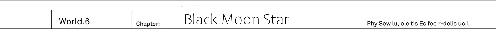

_TL Note:_ Morning Star is more literal translation of Lucifer's name, the first fallen angel. Also the latin for Venus.

Io's largest unexplored region - The Angel Palace.
In [Azure True Heaven] hall, on highest floor of it, was standing altar exposed to winds without walls and ceiling.
In the place where in every direction you could see only blue skies...

"Stop already, Alfreya!"

The elven girl screamed with hoarse voice.

"Thee... I cannot bear to see thee so empty!
Thee has been only deceived by the monster.
Come back to thy senses!"

It was plea full of grieve.
Being swept by winds, her words melted into nothingness.

"Right now there is still time.
We still can do it over.
That's why..."

"Get away, Reiren!"

Grabbing her by the nape of the neck, Jeanne jumped to the side.

Magnificat [The Lord crushes your wings and you fall to the ground, lamenting one.]

_TL Note:_ re-check `轟ッ、と耳をつんざく大気の軋み`, `轟ッ` is actually  `轟々` I think, considering furigana `ごう`

Piercing creak echoed.
The floor exploded.
The white metal floor broke into small pieces, and started falling down towards sea of ancient trees far down below.
If Jeanne would be late even for an instant, then elven girl would fall down together with these debris.

"...Alfreya. What is meaning of this?"

Instead of elven girl, who was kneeling on the floor, Kai cleared his throat and mustered words:

"You, what was just now?"

[...] _TL Note_: _This_ Alfreya dialogues are in brackets.

"Where is your magic tool?
Why angel like you can use magic without magic tool!?"

That was indeed the case.
The angel, when receiving _Zero Code_, let go of all of his magic tools:

The brass baton, capable of summoning blazing red sword.

The silver baton, capable of calling fourth rain of lighting.

The trident, capable of destroying barriers.

All of them were rolled on the floor.
Moreover, once attacked by Zero Code, his heavenly garments were torn into pieces.
And then the fallen angel Alfreya only swung down his left hand towards the Reiren.

[This is your answer.]

They heard the sound of metal crushing.
The angel crushed rolling under his foot baton.

[By heaven's will, this is mine, the shining morning star, power...]

"No!" - the shrine maiden shouted.

"Awaken from your delusion, Alfreya!
Look at thy wings on the back.
Don't thee see that thy wings are crying?!"

The elven girl pointed at angel's wings.
Majestic and beautiful six pure white wings faded, dried and withered.
They were no longer being able to fly him in the skies.
And there was a reason for that.

"Just by looking at how much weight thy cheeks lost, I can tell.
Thy power didn't increase.
Just _borrows it in advance_.
Probably, thee is consuming tremendous amount of magic power..."

_TL Note:_ I'm a bit unsure about `前借り`

Right the fallen angel was burning his magic power beyond any limit.
If it was car's engine, it would be overheating.
And not being to withstand it, wings, which are closest to magic power producing organ, are degrading.

"Thee is leaking magic power through these wounded wings.
Isn't that the reason why thee can use magic without assist of magic tools?"

[...]

"Angels, elves and dwarves are all the same.
Fairies might be somewhat different case, but you couldn't forget the reason why we're united together(into single race)?"

Although their bodies have organ that can produce magic power, they have no means to release it.
Therefore they cannot use magic.
In this regard foreign gods are similar to humans.
Due to that, they created magic tools to assist themself in manipulating magic powers.

"Magic tool is what started foreign gods.
There is nothing to be ashamed about the magic tool, instead we should be proud of it!
Forgetting that, and being happy about using magic without assistance of magic tool.
Isn't that what a true disgrace to foreign gods!"

[Silence.]

Winds started to gather into storm.
Clouds among blue skies started to relentlessly whirling, condensing, and beneath dark clouds something started to shine.

_Lighting._

_Is this a lighting attack like before!?_

Powerful lighting tears through the cloud.
Without assistance of magic tool, he is able to display power beyond the limit.
This alone certainly made fallen angel to transcend the angel as the race.

"It might be threatening, but single spell is not enough to scare me!"

Elven girl put out seventh layered protective garments.
Faintly shining silk garment receives the lighting attack, aiming at her head.
Regardless how wide would be the scale of lighting, Reiren's spirit garments are able to absorb seven magic attacks.

"Reiren, move back. Don't go out at front!"

"...Eh?"

There was sound of tearing clothes.
These spirit garments, the most prized treasure of elves.
Right in front of her eyes, the seventh coloured garment, which she was holding, was cut into halves.

Magnificat [O my lord, my humble self is the Lord's proxy and judge.] _TL Note:_ Too high level `我が王よ、汝は汝の主たる天の代行者にして審判者` and I'm not sure I can make sense out of it, because `汝` is usually  `you`, and here it makes a little sense?

[Lord Sword Divine Gift.]

It was flamberge, whose blade looked like a imitation of wing.
One could only wonder just when it has manifested.
In fallen angel's hand was tightly grasped dark coloured sword, it's colour made it look like it is soaked in blood.

Lighting attack was only a distraction.
By distracting the elven shrine maiden with enormous light, he was able to quickly approach her.
And then cut her magic tool with the sword.

"...I-impossible. For magic sword... to pierce through my spirit garments...!"

Elf's shoulder was cut.
Fallen angel's sword was already able to cut elven girl skin, covered by protective garments.
Before their eyes was terrible scene of emerald blood flowing from girl's shoulder.

"Reiren!?"

Jeanne reflexively caught in her arms falling down elven girl.

_TL TODO:_ I'm a bit unsure what author means with next `それが仇`, `仇` reads as _ada_ and can mean various things like: ill intent, grudge or harm.

[So foolish.]

Jeanne screamed.
While holding the elf, she was attacked by fallen angel's sword.
The knight's armour was cut like a thin paper, from her back to the side.

[Do you wish to be cut down while protecting this elf?]

"...!"

Both elf and human fell to their knees.
Both girls, unable to muster a single word, were facing down the floor.

[Disappear.]

"Alfreya!"

Towards the angel with dark bloody flamberge, that wounded both girls, Kai sent vertical slash with his own sword.

[Hou? Your sword...]

While deflecting the sword, fallen angel laughed.

[I see now.]

"I get it, you flamberge...!"

Both human and fallen angel understood at the same time.
The moment their swords crossed, they both caught the glimpse of each other swords power.

_His sword is without mistake a magic._

_But why it was able to pierce through Reiren protective garment?_

Seventh coloured garment served barrier.
And was able to withstand up to 7 simultaneous magic attacks.
Taking into consideration that it could even defend against area wide magic, it's defensive was even above Code Holder.
So it made him wonder how these spirit garments would get torn.

"Since it is magic sword, it can be restored always!"

[This is heavens work.]

Fallen Angel raised his sword high above his head.
Lord Sword Divine Gift - Reiren protective garment functioned as usual, and was able to receive up to 7 blades.
And each of the these 7 times Alfreya's sword was destroyed.
And then of the these 7 times he restored the sword.
The eighth sword pierced through spirit garment.

_TL Note:_ Literally cheat. Well, Kai got own cheat.

[Human. Just what is your sword?]

"..."

[The moment our blades crossed, my sword was destroyed hundred times.]

As Code Holder and fallen angel sword crossed, even though only for a moment, the same phenomena repeated itself hundred times.
Kai's Code Holder [cut fate].
In order to remove fatal fate for Kai, Code Holder destroyed fallen angel sword.
But the fallen angel, who noticed it, immediately restored the sword.
It happened hundreds times.
Fallen angel was overflowing with magic power -
It was possible feat for him, precisely because he was burning through all of this magic power, to extent that both his body and six wings withered.

"Alfreya."

Aiming at fallen angel he stomped the floor.
Kai pressed on the angel who recklessly overpowered himself beyond any limit.

"Reiren was really respecting you."

[Obviously.]

"No, real you would never say something like [obviously], am I not right?.
Right now you are not real you, but simple avatar!"

[Nothing has changed. At least for humans!]

They were locked into sword fight.
Both swords were flashing at enormous speed.
It continued for five minutes.
While Alfreya had advantage of height and strength, Kai was able to push back against him with his leg work.

[...Are you on equals with me? Just how much strength in your thin arms.]

"Naturally. You might triumph in air, but fighting on the ground is not for you!."

Losing focus would immediately mean to be pushed back here.
Gritting his teeth, he repelled angel's sword with Code Holder.

_As I thought._

_Even if your opponent is angel, if it is sword fight, I can do it._

In first place for angel it is unheard of to swing sword on the ground.
But that was fallen angel's own choice.
In order to wield enormous and powerful magic, he sacrificed own wings.

"In first place such fight would be impossible.
If you'd fly into skies and started firing off with your magic tools one-sidedly,
I would have no means to oppose."

[...]

"But now is my chance.
In place of Io's humans and all of foreign gods I challenge you.
With all of my spirit!"

[Huh!]

He scorned.

[All of foreign gods? I have no need for such weaklings!]

Magic power started making noise in air.
Fallen angel sword, that clashing with Code Holder, started getting even more supply of magic power.
Flamberge became a Zweihender.
And to this blade...

"Slow."

Kai's blade of sunlight colour, made vertical slashed towards towards upper air.

_TL Note:_ `はるか上空へと斬り上げた` A bit unsure how exactly it supposed to look

[Impossible...]

"You have never swung something like sword before."

[...What?]

"And the proof is that you thought that bigger sword make it stronger."

By increasing the length of blade, you can also somewhat increase attack range.
But larger sword like Zweihender required certain ability to be properly handled.

_If it would be something like familiar magic tool..._

_Like that trident on the ground, it would be certainly a different story._

_TL Note:_ Next line is kinda hard to get right, I'm not sure about it's meaning `カイは、不慣れな武器に遅れをとるような半端な修練はしていない。`

Kai never fooled around when it come to drills to avoid falling behind with unfamiliar weapon.
This was difference between talent and training alongside enthusiasm.
For that reason he hold a pride for not being defeated against four races heroes.

[...]

Fallen angel expression was strained.
Having superior sword skills and Code Holder, capable of cutting off magic, Kai hold advantage.
As he was burning through surplus of magic power, prolonged battle left Alfreya at disadvantage.

[It seems it is time to judge this life.]

"What?"

[Collapse.]

Fallen angel said a single word.
And his voice started spreading through the place...

Angle Palace shook.

The floor, on which Kai was standing, started to tremble.
He was wondering if ground was rumbling.
But they were high above in skies.
Even though tied to the top of ancient tree, it shouldn't be possible for earth vibrations to reach this place.

[To destroy this life. The Angel Palace shall collapse.]

Under his feet - portion of floor fallen down.
Kai lost his balance.

[All of you useless bunch shall fall down to ground.]

"...Gu!?" _TL Note_: `ぐっ!?` voice of struggle

With his balance lost, Code Holder, that was unable to deflect fallen angel sword, fell down.
Back of his hand was cut and blood was flowing from his right hand.
Nevertheless he extended his left hand to try to reach Code Holder, which fallen angel trampled with his foot.

_To go this far..._

_For just me alone, he seriously planning to collapse angel palace._

[Disappear, human.]

Roaring lighting strikes out of whirling dark clouds.
For Kai who let go of Code Holder, there was no way to defend against incoming lighting from the sky.
The fallen angel believed it to be so.

[Become a dust.]

But.
The lighting strike from heaven didn't reach Kai in the end.

"...What, Vicious?"

There was Reiren, floating in sky.
She was being held by battle angel Vicious, who attacked them down below.

"Isn't it a bit late to come back to thy senses?"

"...Alfreya-sama."

Subordinate angel saw it.
How her master changed.
Choosing wicked power and sacrificing own wings.
And then, for the sake of defeating single human, this fallen angle chosen to even collapse angel palace.
Therefore she came to conclusion, who to aid.

"Seven ladies... Come fourth!"

Elven shrine maiden Reiren put up the torn spirit garments.
Seventh coloured garment absorbs and dissolves lighting attack.
Moreover, in torn pieces steed, wings of battle angel, who carried Reiren, supported.

[You! Bastards...]

"Where are you looking."

The chest of fallen angel, who was glaring at Reiren, was pierced by shining arrow.

"...Do not underestimate... Our stubbornness!"

Said knight Jeanne who was kneeling down on one knee.
Behind was her bodyguard Fairin, who was supporting her.
And knight fired the arrow with all of her strength.

[Tch.]

Fallen angel Alfreya was taken aback.
If it would be heaven lord Alfreya's barrier at full power, then attack just now wouldn't be able to injure him.
This was his price for devoting himself fully to magic attack power.

[Think I'm done, inferior species!?]

He roared.
Overpowered angel was yet to fall.

He was transforming all of his life force into magic power.
In fact he was using so much power that his wings were completely withered, yet as he received Jeanne's attack his killing intent was only rising more.
But, fallen angel didn't notice.
No, he completely forgot about it.

"Yeah, it is the end."

The existence of human that was closest to him.
Alfreya was trampling over Code Holder under his feet.
And in Kai's hand was no sword, not to mention gun or knife.

[You...?]

Worthless human.

_TL Note:_ This part is kinda weird `それでも瞬時に油断をぬぐい去ったのは`, I wish author would choose some better wording, because it is just misleading in it's sense.

Nevertheless, likely due to angel Alfreya natural strength, he completely disregarded any notion of carefulness.
He smashed in full force, with his mysterious sword.

[You do not know when to give up. Just disappear!]

Fallen angel sword slashed air.
Kai bended over on the floor and narrowly avoided bloody dark blade.
Like he has been told, right in front of fallen angel Alfreya eyes, it looked like Kai completely disappeared.

"Fallen angel. Now I'll turn your world upside down" _TL Note:_ Needs more accurate translation `お前の天地をひっくり返す`

[...What!?]

"You have no way to defend against it."

In order to challenge four races, human created this technique.
Empty handed.
In true world, as Kai belonged to MDA, it was his duty to work on learning presumably anti four races martial arts.

He made a kick attack.
Putting all strength into the kick and using edge of the foot, he knocked both legs of fallen angel Alfreya at the same time.
Tripping, angel fell down on the back of his head.
Of course with such sturdy body he had no injuries.
But experiencing something like that for the first time was shocking for angel.

It was unthinkable for him.
He couldn't comprehend just what caused him to fall down.

_Normally such technique wouldn't work against heaven lord Alfreya._

_After all angels have wings._

Once tripped, they could just remain afloat in air.
But...

For angel who lost his wings in exchange for power, he lost skies.

[...]

For angel, who is closest to skies, being turned upside down like that was something unknown and Alfreya wasn't able to react.
He couldn't yet comprehend the shock of falling down on his back.
And then, as his back knocked against floor, there was vital organ of angels, that produced magic power.

"Choosing to fall was mistake that led you to defeat. Alfreya..."

Kai strikes down with his fist.
Receiving the fist by his breast, the shock goes through his spine, reaching magic producing organ.
Six winged angel fell into silence.
It was the end.

The organ, that was producing magic power, was already close to it's limit.
And with this attack it completely stopped functioning.
He couldn't move.

There was lying down motionless angel, facing up with open eyes.
And then all of the sudden he burst out blood with intense coughing.

"Alfreya-sama!?"

Battle angel Vicious dived in from above.
Toward the subordinate that was trying to rush over to her master's place...

"...Go away... Vicious!"

It was restrained voice. _TL note:_ I'm not sure how author means it here `制止の声`

"...Do not... approach... you must not!"

It was voice of none other than angel's leader himself.
Facing up on his back, he no longer could move.
His body already exhausted magic power completely.
With wings completely withered, his magic producing organ was falling apart.
But even then, his voice hold certain strength.

"I, like that... no longer... hold any qualification to earn your respect..."

His words held strong will.

"And forgive me, my friend... I... lost my mind..."

The Cross shattered.
Bloody coffin broke apart and completely disappeared, releasing elven elder.

"This place is already collapsing. Everyone, you must escape.. Make haste!"

The floor shook.
Foundation of this hall already collapsed and fell down into sea of ancient trees down below.

"Alfreya-sama!?"

Meanwhile, giant angel run straight ahead towards his master side.

"My lord...!"

"Archangel Raphael. I put you into quite a predicament...
In my steed, I leave our comrades in your hands.
Not only angels.
Elves...
Dwarves and fairies...
Our alliance..."

Snap, it was sound of something breaking.
Heaven lord Alfreya petrified, and it was sound of him starting to break.

"Alfreya-sama!?"

"This is all result of my own fault.
It is not fault of these humans.
Everyone, should know."

Elven elder, and then battle angel and archangel.
They turned their gaze one after another following shrine maiden Reiren, who crossed swords with him up until now.

_TL Note:_ Check again `さらに、今まで刃を交えていたエルフの巫女レーレーンを目線で順に追いかけて。`

"We ought to fight a different fight. And listen to me, human...!"

With already petrified throat, it was difficult for him to speak, yet angel mustered his voice.
To address Kai.

"The human, you've asked about.
I... know about him.
Even though I've been entrusted by Sid with this, what a mess it turned out to be."

"What do you mean! From Sid?"

It was the same as with Dark Empress Vanessa.
Just before change due to Zero Code leads to their death, other races heroes remembered about Sid.
It became somewhat common point now.

"Are you the same as Vanessa!? What do you know about world reincarnation!"

"..It should exist. No, [it is supposed to exist]. So Sid said."

The only question was what.
What was this thing that [supposed to exist].

"Look for it!"

With his body crumbling, foreign gods hero looked over his subordinates and took short rest.

"As for World reincarnation, that rasterrizer is related to it.
Summoning this creature...
There is a ringleader behind it."

Still Angel gaze was fixed...
On Kai, not looking away at all.

"I ought to approve of you."

"Eh?"

"I... saw... Your readiness to die in order to protect Reiren and challenge me.
Even though you're enemies, you used your own body to to protect elf."

"!"

Elven shrine maiden swallowed her breath.
Human protected one of the foreign gods.
It was something that originally would be unthinkable.
But hearing Alfreya's words made her self-consciousness about it.

"Who would think that human will be the one to deliver our salvation...
But, this is the will of the world."

Foreign gods hero exhaled with certain vigour.

"All of us among foreign gods.
We never forget friends and foes, and never shall we forget a debt of our brethren.
Therefore, human, I can do nothing but to recognize you.
And that's why..."

He closed his eyes.
His strong body petrified, crumbling and turning into dust.

"I ask you, break the cycle of hatred in this world...!"

And then his body disappeared.
These were last words of foreign gods hero.

A hour later, Heaven Lord Alfreya fortress Angel Palace fell down and then disappeared.
