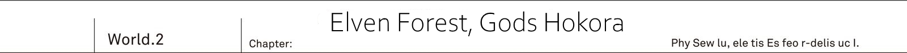
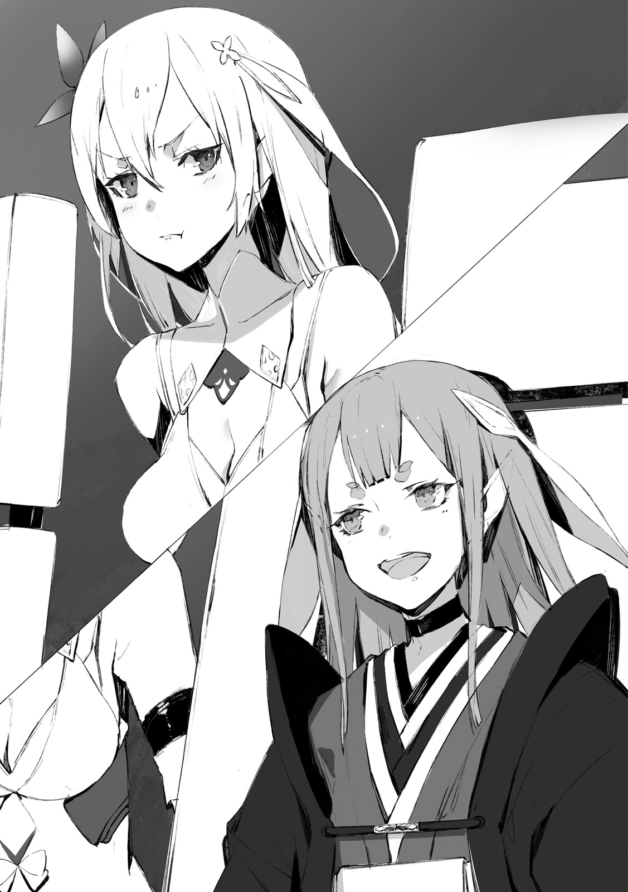
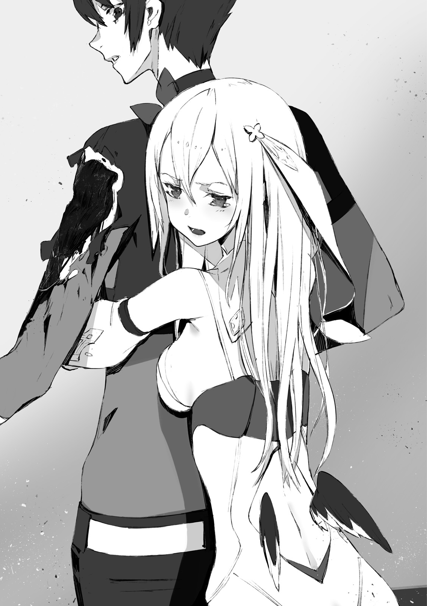
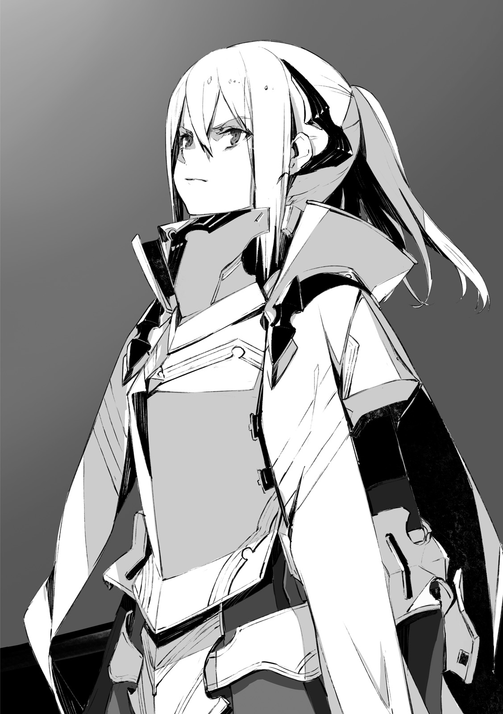

_TL Note:_ Hokora is a mini shinto shrine.

The green labyrinth [Ciel Mir Forest] - was a natural maze, with many trees, towering over the ground, being lined up in disarray.
Only a sparse amount of light could pass through the cover of densely growing leaves.

The ground was covered in muddy leaf mould.
Leaves blown by the wind were shaking and rustling with a pleasant sound.
The serenity of this land had likely been undisturbed for hundreds of years.
And now that...

"Kai, cannot thee run it more silently?
This thing thee call a car, is just too noisy.
It spoils the forest's serenity."

"I'm already doing my best here, you know?"

He had already lost count of how many times the Reiren sitting cross-legged complained from the passenger seat.

"It might not seem so, but our tires are low-noise. They are actually quite silent.
I explained it already, but we have around 30 cars lined up behind us."

"...Good grief."

"By the way, this road is quite narrow..."

"Indeed so. It shall not become any more narrower though, so these cars shall be able to pass."

The shrine maiden pointed towards the front window.
With Reiren showing them the way, the Urza Resistance Army, led by Jeanne, was crossing the unmapped forest.
...The largest forest in the world.

While looking up towards great trees completely filling their field of vision, 28 military cars were moving forward.
And Kai was driving the car leading them.
He was following Reiren's guidance, who was sitting on passenger seat.
Behind them was the regiment of vehicles.

"Kai, turn to the right here."

With these words, all of a sudden Reiren directed him to the right.

"Here?"

"We just passed by, it would seem."

"Couldn't you tell me 5 seconds earlier!?"

He quickly steered the wheel.
Towards the road entangled by roots of the ancient tree.
Because of the roots, the road was uneven, and their field of vision was also obscured.
But what helped them was that the road was as wide as the main road.

"This time it is quite a wide road, but..."

"An atractylodes purine has passed through here.
Look at these trees with their barks being peeled off.
These are the marks left by Atractylodes purine."

_TL Note:_ wtf is `オケラチュチュプリン`

"Atractylodes...?"

"It is massive hedgehog.
When it becomes round, its diameter can be around 10 meters."

Reiren nonchalantly answered.

"It rarely appears, but if it comes rolling over the car, there will be nothing left."

"Wait a sec...!?"

"Hey, wait a second!?"

From their back seats on left and right, Resistance soldiers Saki and Ashlan shouted.
Up until now they were completely bored, but now they reached out in confusion.

"Wait, wait, Reiren-chan!? You're our expert on this Elven forest, right?
What are we going to do if this thing appears!"

"That's right, are you sure it's a good idea to take this road!?"

"No need for worry."

Said the shrine maiden, who folded her arms with confidence.

"This forest is akin to my own garden.
It is fine, leave it to me."

She was their geographer, Reiren.
Right now in addition to her seven layered garments she wore a white robe, and her long ears were hidden under the hair.
Her background was a researcher from Io Resistance, who was going to lend her hand -
This was how Jeanne explained her presence to soldiers like Saki and Ashlan.

"Mu..."

Rinne was sulking from her seat at the back.

"I cannot agree with this arrangement.
Why this elf.... I mean Reiren, sitting together with Kai and enjoying herself?"

"I'm supposed to guide thee, am I not?
Human's maps have nothing on these woodlands after all."

Reiren glanced at Rinne behind.

"Well, I'm more talented than thee after all."

"That's not true...! You... damn flat elf!"

"What's wrong with being flat!"

"Please calm down, both of you."

The moment Rinne mentioned [elf] Kai was struck with utter terror, but it would seem neither Saki nor Ashlan showed signs of noticing it.
They were probably too busy to notice, while crossing forest unmapped by humans.

"Hey, Kai? I guess even you don't have a map of this place?"

Asked Saki, with a gun under her arm.

"Since you know about the true world and stuff, I thought you'd know everything."

"I'm not that knowledgeable, you know? Besides..."

But he didn't finish his sentence.
The elf who sat besides him could receive unimaginable shock if he had done so.
Thinking so, these words stuck in his throat.

In the true world, Ciel Mir forest doesn't exist.

It was burned down completely.
During the Great War majority of the forest was burned in battles.
Moreover, with the disappearance of the foreign gods who were managing the forest, the ecosystem had gotten wrecked.

In the true world there was no longer any forest.

_TL Note_: When referring to Ciel Mir, sensei is using `樹海` which could be literally translated as sea of trees, but I use just `forest`

_Humanity's triumph in the Great War belongs to the true history._

_But it is not all that good. For example this forest._

The forest, that remained flourishing in this world, made Kai to feel conflicted.
For the hundred of thousands species that were living in the largest forest in the world, the current world is much more desirable than one where humanity had won.

[All units, report: is everything in order?]

Jeanne radioed to all (cars) at once, from the cadillac, which was in the queue's center.

[This forest has thousands of animals and plants unknown to us.
There are poisonous flower meadows, and also butterflies that spread the poison.
Everyone, be sure to report if you feel unwell or uncomfortable.]

"...Good grief, what a great commander."

The elven shrine maiden said, while folding her arms.
Commander Jeanne never ended her communications with orders alone.
She would always end with words of appreciation for the work of her subordinates.
Her subtle consideration could not go unnoticed.

As they were proceeding deeper into the unfamiliar lands...
If they lost their way, it would be impossible to return.
She(Jeanne) understood the anxiety and fears of her subordinates, who were challenging such dangerous lands.

[Vanguard car, what is situation? Any changes?]

"Perfectly fine, as a matter of fact."

Reiren gave a prompt response.

"In the first place, if the forest were actually so dangerous, the foreign gods wouldn't even approach it.
But oh well, thee can leave it to me.
Even I have no desire to get myself killed after all.
So I'm going to choose the safest route."

[Please do so.]

They could hear Jeanne chuckle over the radio.

[Just want to check one thing.
Does this forest, Ciel Mir, go all the way until Yurun in the south?]

"Indeed so.
I had also made a direct trip on foot.
At that time it took me around 7 days."

Even for the elf, who was able to easily leap from branch to branch of the ancient trees, almost like flying, it took seven days.

It made him wonder just how big this maze of the forest was.
Hearing Reiren's answer astonished him.

[And at our current pace?]

"Ideally it should take us 3 days and 3 nights.
But along the way we should be able to find some fruits edible by humans.
No need to worry about provisions."

[Understood. I suppose we should be thankful to the Dante for supplying us with brand new batteries.]

Io Resistance's base was at Cassiopeia, which was an industrial city in the past.

If it weren't for plants that could supply their cars with new batteries, there would be no way for them to carry out their plan of traversing through this maze of a forest.

"At our current pace, we should be able to reach a stream abundant with spring water, within 2 hours."

[So you heard her, my friends.
Our next break...]

"Kai, what is that thing?"

Rinne, who stretched her neck from the rear, pointed towards the front glass.

She was pointing towards the clearance between two ancient trees.
As it was still far away, it wasn't very clearly visible.

"Hmm? Meaning?"

"There is something weird there.
Many trees have fallen down,
and even the ground is messy."

"...What!?"

Unintentionally, he put more force in his grip.
As they were running straight towards the direction Rinne pointed at, right then...

"Stop this thing!"

The elven shrine maiden grasped Kai's left hand and started pulling it. _TL Note:_ A bit of trivia: Japan is one of these countries where cars are right handed.

And as a stiff look appeared on her face...

"What is that thing...!"

"Jeanne, stop. There is something up ahead!"

All cars started to slow down at once.
Their wheels, stopping all of the sudden, blew up a pile of fallen laves, leaving them dancing in the air.

"Rinne, just what kind of eyesight thee have? Being able to discover that before me..."

"Humph! I'm more useful to Kai than you."

Reiren and Rinne jumped out of the car.

"Kai, what's wrong? Did something happen?"

Jeanne appeared from the cadillac behind them.
Besides her was the female bodyguard Farin, walking with her sword already unsheathed.

"Rinne and Reiren spotted something.
Jeanne, wait here.
You should be ready to give orders at any moment, if there really is something there."

The Urza Resistance forces were about 150 in number.
And as it was not yet clear what [was there], it was unwise to move all forces.

"Kai, it might be good idea to take that with you."

"Mm... Yeah, got it."

Rinne, who peered into the driver's window, pointed at his black bayonet.
It was a general purpose assault bayonet [Drake Nail].
Looking similar to Drake's claw, it was a weapon, developed by MDA based on records from the Great War.

_Rinne tells me to take my weapon..._

_Is it dangerous to such an extent?_

"You're going to get devoured there."

Ominous words escaped lips of the elven shrine maiden.

"Since I'm used to walking in the forest, I'll be leading the way.
Kai, Rinne, follow me."

The elf leaped towards the ancient tree's root.

And then from root to root, just like a locust, she easily repeated her jumps with ease.
In the blink of an eye, her figure started to disappear.

"Oi, Reiren, you're going too far ahead alone... Damn it."

He exchanged glances with Rinne.
And then grabbing the Drake Nail, he ran after.

The forest was filled with piles of fallen leaves.
Having no idea what could be hidden behind the ancient trees and brushes, Kai had to remain cautious while running.

"Kai, be careful, if thee step on this mushroom, thy foot is going to be swollen"

"Uo!?"

"Ah, and that tree bug too. Its bite can take off a finger."

"As I thought, this forest is just absurd..."

Compared to the forest surrounding the elven village, it was an extremely big and strange natural system.
Still, Kai wondered what would make the elf, who was supposed to be very knowledgeable, to regard something as unnatural.

"Kai, it's here."

Reiren was beckoning him from the ancient tree.

_TL Note:_ I'm not really sure how author means `害` here?

"I suspect the evil being is no longer here.
Still do not relax.
We don't know where it could be hiding."

"What do you mean...?!
This is...!?"

A shiver went down his spine.
It became clear to him once Kai circled behind the ancient tree.

The trees were mowed down and devoured...

Dozens of fallen trees had their bark and branches chewed off with terrific strength.
On the ground were footsteps that resembled giant holes.
These were absurdly large footprints.

_Magical beasts that we saw in the demon's den were certainly big, but..._

_This looks much worse than their rampage._

It looked as if a raging storm had passed through.

"Well then, I'm at a loss here.
Certainly I'm proud of being knowledgeable about the forest, but..."

Said the elven girl, who was surveying the traces of destruction with an awkward expression on her face.

"I cannot fathom what could cause such ruckus.
Being able to mow down these ancient trees?
Just what sort of monster could do it?
There is certainly no living being like that in this forest."

"To me it looks like a giant dragon raging though..."

"Huh? Wait a second, Kai, where do thee think we are?"

Elven shrine maiden spread her hands.

"This land belongs to foreign gods.
We're in the east of great continent, while cryptids like dragons reside in the west.
They are on completely opposite sides of the continent."

"Sure, I know.
But is there any other race that is capable of such a feat?"

"..."

Having enough strength to mow down the ancient trees.
And leave these gigantic footprints, smashing and destroying everything.
There was no other race possessing such a destructive nature.

"I'm with Kai on this."

"Mm?"

"There is some animal's scent."

This gigantic footprint is not easy to recognize because of muddy ground.
But as Rinne brought her face closer, she could feel traces of it.

"Feels like a cryptid.
Cannot say which kind, but I'm certain it is not a dragon."

"...Truly?"

The elf became speechless.
This meant that a giant cryptid was able to trespass onto their, foreign gods', territory.
It was analogous to what humans would call burglars breaking into their house.

"Then what about this cryptid's size!?
If such a thing were to cross the border, the angels would have definitely noticed it!"

Among the foreign gods who lived in the forest were elves, dwarves and fairies.
On the other hand angels, who lived in their sky palaces, watched over the Io territory from the sky.
For Reiren it was obvious to place faith in their watch.

"I might have an idea about it.
On our way from Urza, we met a cryptid.
But at that time it was just a wyvern."

It was at the time when they departed from the capital of Urza, on their way to the Io.
On the highway amidst snowy mountain range, they were suddenly attacked by it.

[...Kai, above! It is coming from the sky!]

[Wyvern!]

[What is meaning of it, isn't it supposed to be the demon's territory? What is a cryptid doing here!?]

"...In the northern country? So thee were attacked by cryptids there?"

"I doubted my own eyes.
At that time we lost two cars in the battle.
We were fortunate that it ended only with that."

Even now they were puzzled by the goal of that cryptid, stepping onto Urza territory.

"Soon after Vanessa's defeat, we had a wyvern intrude upon Urza borders.
And now after Alfreyja's defeat.
The timing is quite similar I think."

"If cryptids are trespassing the territories of other countries..."

Reiren made a grimace.
While the elven shrine maiden was lost in thought looking for words, Jeanne's voice came in from the radio.

[Kai, how is it?]

"We're doing all right here.
Jeanne, I think you can come here too.
It is just..."

The criminal behind the destruction had already left.
As Kai was watching the footprints which continued deeper into the forest, he tightly grasped the radio.

"We might have a hard time reaching the southern border."

-------------------------------------------------------------------------------

The green maze was repainted in a madder red colour.
Behind the thick leaves, the sun could be seen setting down to the horizon.
Before long, the night had arrived.

_TL Note:_ Author uses `生い茂る葉の上では` here, which is hard to get right for me so I re-phrased.
But probably I need to come back to it.

"Did I not tell that this forest's ecosystem is different during the day and night?"

"Lots more incests appear. Also big sized animals I think.
They rarely approach our village, but once night falls, the fairies are always laying down spells to repel animals."

They were in a clearing of the forest.
Assembling the tent, near the stream with spring water.
As Kai was working on setting up the tent, Reiren was observing with curiosity.

By the way, Rinne who was nearby, was sitting down, doing nothing.

"Hey, Kai? Is it done yet? It is so boring that I'm getting sleepy..."

"I'll finish soon."

She was like a kitten who wanted to play.
Compared to such Rinne, Reiren, who was looking with a great curiosity at the tents being set up by the humans, resembled a loyal dog.

"Come to think of it... Reiren, you seem calm now."

"What are thee talking about?"

"Well, there are lots of humans around.
Considering that you've been sent with us as a representative of the elven village, I expected you to be complaining a lot...
Really, thanks."

Rinne and Reiren.
Both looked like fair skinned beautiful maidens.
As long as neither Rinne's wing or Reiren's ears were discovered, no one would suspect a thing.

"If I were to be on guard all the time, it would only make me suspicious, don't you think?"

The elven shrine maiden didn't even bat an eye at a soldier who passed by her back just then.
In such a situation where she was surrounded by more than a hundred enemies.

_TL Note:_ Ehm... Technically they are in truce though?

_ED Note:_ Shrugs, Maybe the elf still have misgivings about Kai and his group?

"That's why I restrain myself.
In all reality I want to fuss and complain about it."

"Well, I understand..."

"Still, it is hard for me to tolerate getting stained by human smell.
I shall take a stroll in the forest."

But before the elven girl who stood up, turned her back towards them.

"Wait. Rinne, how about you tag along with her?"

"Me?"

"...Thee still has no trust in me?"

The elven shrine maiden, who stood beside a blankly blinking Rinne, frowned.

"Or do thee think I'll be up to no good the moment thy eyes are averted?"

"The reason is simple: we saw the destruction during the day, didn't we?"

"...Mu."

"I want you to take a look around the tents' surroundings.
If it's you two, then it should be fine, right?"

It wasn't a matter of trust.
It was the opposite.
Precisely because elven knowledge was so highly valuable, she has been asked to patrol the surroundings after sunset, which would be an extremely dangerous task for Resistance's soldiers otherwise.

_TL Note:_ The last sentence is re-phrased.

"That is to say, this place is quite far away from these footprints, right?"

"They can cover one thousand and five hundred kilometres per day."

"?"

"From the records I know: cryptids were able to perform assault of a city which was 1,500 kilometres away.
So these guys are able to traverse this much by just running over ground."

In the end cryptids are just enormous.
Therefore their sense of distance is different.
What would be like one kilometre for a human or elf, wouldn't feel more than few meters to them.

_From that place it takes 3 hours on car._

_Even if it is more than a 100 kilometres of straight path, we cannot be careless._

"It cannot hurt to be vigilant, don't you think?"

"I understand. Thee are that sort of a human, after all."

The elven shrine maiden squinted.
It looked as if she was amused by him.

"It would seem it was me who wasn't taking thee seriously...
Hey, Rinne, let us go now.
Time to patrol."

"Yup, Kai, I'll be back soon."

Just like that with light footsteps, the two girls headed into the darkness of the forest in front of Kai's eyes.

_TL Note:_ `軽やかに宙を舞う` This is a bit hard to phrase, because I'm pretty sure it is not dance, but more like walking posture that resembles dancing? But how to name it?

"...Well, I'll continue setting up the tents then."

He finished applying the anti-wind cover onto the tent.
But the moment he was about to move on the next one...

"Kai."

Jeanne, who appeared from behind, patted his shoulder.

"Did you see Reiren?"

"She went on lookout with Rinne, you wanted something from her?"

"No, it is fine then.
I was about to ask her to do the same thing actually.
And if Rinne is with her then she will not be able to pull any tricks that easily."

This was inevitable.
Jeanne's worry was also in line with Reiren's own words from a few moments ago.

[Foreign gods keep their promises.]

So they would abide by their one year truce agreement, and Reiren was sent to accompany them for that purpose.
This is what the elven elder told them, but Kai couldn't trust these words completely.

_From the foreign gods' point of view, humans are just inferior._

_So do they even intend to keep their promise with such humans... Jeanne's concern is natural._

There was no way to know when Reiren would just run away.
What made Jeanne's wariness even more stronger was her duty as the Commander over more than a hundred people, which was only natural.

"And, Kai, I'd like us to chat a bit."

"Us...?"

"Just us yes. It will be troublesome if my subordinates overhear us, so let's move away."

They moved towards the ancient tree, illuminated by a campfire.
Around there besides the bushes it wouldn't be too far from where they placed tents, but far enough so that no one could hear them.

"Here should be fine... Now that I think about it: We didn't have a chance to talk much about it."

She changed from her energetic male voice to a lovely and charming female one.
As she always kept herself disguised as a male commander she had to keep her voice low sounding.
But in front of Kai she could return back to using her natural voice.

"About your sword."

She pointed at the Drake Nail, which was holstered on his back.

"When we fought Alfreyja, it looked to me like it was emitting light and then changing its shape."

"Yeah, it wasn't your imagination."

"...I was wondering what sort of weapon is it?"

This weapon wasn't the work of humans.
It was pretty obvious to Jeanne's eyes.
And it was obviously different from a bayonet, which was indeed the human's invention.

Code Holder.

It was the sword, which he found in the [Demons' Graveyard] where he once found himself lost.

"Even I don't know about it. I only picked it up."

"Eh?"

"I told before: in the history known to me there was a human called Sid."

"...I heard so, yeah. Sid was the one who brought us victory in the great war.
In the history of your world that is."

"This Code Holder is said to be the sword that Sid wielded.
Although right now it is a bayonet, it can probably materialize in response to my voice.
How it works though is beyond me."

He always wondered how Sid's sword ended up in the graveyard.
And Kai's question was answered by demons' hero Vanessa.

[Sid foresaw that something strange is going to happen with the world.]

[Sid left this sword to me. In anticipation of this situation...]

Ability to severe the fate.
This was the power of this sword, and that was the only thing Kai knew about it.

"Doesn't sound reliable." _TL Note:_ I'm a bit uncertain what `危うい` is referring to.

The silver haired commander made a sullen face.

"I might be barking at the wrong tree after being helped by it, but I don't feel good about you using a weapon that we don't know all that well.
This thing, it is not made by humans, right?"

"I think it might be an elven magic tool or something similar."

It was indeed as Jeanne pointed out: a mystery.

"But in that case, I also want to give a piece of my mind."

"You mean this?"

Jeanne put her hand on the armour.
But she meant not the grey armour itself, but rather what was under it.

The thin silk that was covering her skin.
It was the elven battle attire - clothes which emitted faint light, which made Jeanne a [Light Knight]

_I knew that it was one of the greatest treasures that got stolen from foreign gods and holds resistance against magic._

_But I didn't really give it much thought actually._

Angels' bow and elven spirit garments.
These magic tools, that Jeanne had in her possession, could be used by angels and elves because they possessed magic power.
But it made him to wonder: why could a human without any magic power put them in action?

_TL Note:_ `そこに疑問を持つべきだった。` and line before is re-phrased.

These were burial clothes, whose shine was snatching away her life.

_TL Note:_ Author uses `体力` which can be interpreted in various ways.
I'm not exactly sure if Sazane-sensei means that it literally shortens her life or just affects her stamina.
I suspect first... :(

_ED Note:_ Given the development at the battle at Angel's palace, I'm pretty sure it means "life force". :(

Even as they were just talking, it continued to eat away at her life force.
If it was the true world, Kai would do his utmost to stop her from wearing these elven spirit garments.
To not allow her to do something that would be gradually snatching away her life.

But...
Right now Kai had no right to stop her, who continued to fight in this cruel world.

"No one coerced you into wearing this, right?"

"Of course, I decided to do so myself.
I was the only one who was fit for it."

With a firm smile, the silver haired girl shook her head.

"Want to tell me to take it off?"

"Even if I'd say, you wouldn't listen. I already knew it... Even from before."

Commander Jeanne, who took the name of the hope of mankind.
She herself might not remember it.
But in the world where mankind won the great war, Jeanne and Kai were childhood friends who lived next to each other and got along well.

"If I started saying anything, you wouldn't listen."

"By that... You mean the me in the world where you're from, Kai?
Where we've been childhood friends."

"It is different now."

"...I'm aware of it. Though I'm not planning to fix it." _TL Note:_ She means her stubbornness.

"I know that."

Kai only responded with one big shrug to Jeanne's serious response.
He thought back on how many times he had exchanges like that back in the true world.
Still, like this her firm character remained unchanged, which gave him a strange feeling of relief.

"We should be fine, right?. Just five more minutes."

"Mm?"

"Hey, I want to ask something."

Her eyes upturned, she asked with a mischievous smile:

"How was I in your true world, Kai?"

"How, you ask... Well you were been my neighbour."

"No, no, I mean my personality, how I behaved and things like that.
After the great war ended with mankind's triumph it must have been a peaceful world.
There was no Reistance, right?"

"Of course."

"I cannot even imagine it.
What sort of life I'd have, if I hadn't become Resistance's commander.
Likely I also didn't have to pretend to be a man, right?"

Fixing his gaze on her, Kai remained silent.
Wondering just what kind of girl Jeanne E Anise was in the true world.

_Will she remember once I tell her..._

_What I'm thinking... That would be just too good to be true._

The moment the hope crossed his mind, Kai shut down this thought.
After all, it was just his selfish wish.

What's more, remembering it right now was not necessary a desirable thing for Jeanne herself.

"Hey?"

"...You used to be quite popular."

Taking a big breath he continued.

"After the humans won in the great war, the other four races had been sealed in graveyards.
Both me and you, Jeanne, were a part of the troops responsible for safeguarding them."

"Could it be I was also a commander there?"

"No, no, but likely you were to become one in the near future."

Looking at her listen with such confidence, he smiled deep in his heart.

"With my low position I was just standing watch around the graveyard.
But you, Jeanne, were planning to head to the capital.
Youngest, and moreover the first woman, at that."

"Oh, so Kai, from your perspective, I didn't change much then?"

"...Well, I was surprised to see you dressed as a man."

When he first met her at Neo Vishal, he was really quite surprised at Jeanne's change.
Even now while seeing her in front of him, he felt the same.

"The Jeanne that I knew had her hair down and wore fashionable clothes."

"Me? Ahahah, then I've definitely changed."

She burst out into laughter.

"It has been a while since the last time I wore a skirt.
Not to mention make-up, I have never imagined myself becoming more feminine.
...But... Well, I see..."

For a short while she laughed.
But soon enough, his silver haired childhood friend's eyes showed sadness.

"I've forgotten already... When was the last time I yearned for such feminine things?"

"..."

"Hey Kai, can I ask you for something?" _TL Note:_ She says `我が儘` which could said to be unreasonable/selfish, but I don't feel it is right. Potla?

_ED Note:_ Yeah, the literal translation would be "Can you listen to my selfish request?", but that doesn't sound good in English. xD

"Mm?"

── Would you be my friend even in this world?

_TL Note:_ There is very interesting furigana `ボーイフレンド`, Jeanne should go for it!
But pretty sure it would be more literal male friend though.
Well, you guys know who I'm rooting for anyway.

_ED Note:_ Anybody not on board the Rinne train can spill coffee on their newest white shirt.

With her face dyed slightly red, his silver haired childhood friend said, almost whispering.

"...Me?"

"It is not something I can ask of my subordinates in the Resistance.
I'm their commander, so I cannot cross this line with them."

But that was different for Kai.

At most Kai is only an outside helper.
Together with Rinne, he is looking for a way to return back to the true world.
And their interests coincidentally aligned with the Urza Resistance, no more no less.

That's why...
The relationship between these two were not that of a boss and their subordinate.
They were just a boy and a girl of the same age.

"I don't mean to change anything, and it is not a request per se. Just...
Ehm, well, I miss... [friendship] quite a lot."

"..."

"N-not good...?"

"No. I'm just surprised that you've been thinking about such a thing." _TL TODO:_ Check how to make better `なんだそんな事かと思って`

"It is a serious matter, though!?"

Jeanne's voice rose.

"After I finally summoned enough courage to say it!"

"I understand. Well, of course I'm glad to hear it."

It reminded him...
Kai didn't remember her saying something like that in the true world.
He thought back to their past.
Since childhood they had been playing together, and there was no sense of [becoming friends].
Before he was even aware, they had been in such relationship already.

"Nothing has changed, but best regards."

"Y-yeah!"

Instantly Jeanne's face brightened up and she responded with big nod.
And immediately following that...

A long scream resonated echoed from the direction of the camp site.

"...!? What is going on!?"

Following it was an even louder scream.
Sounds of footsteps, which seemed as if belonging to a elephant, resonated throughout the forest.
They could hear dull sounds of tree branches being broken.
And then gunshots...

"Kai!"

Jeanne was quick to react.
She only shouted Kai's name and rushed towards the campsite.

_Could it be what we encountered during the day...?_

_Oh well, please let it be no more than a bad premonition!_

Pushing aside the bushes, he sprung out into the open.
Kai could see sparks from the scattered bonfire, smashed trees and then, dyed in the color of dusk, the head of a gigantic beast.

For a second he thought it was a lion, but then he couldn't comprehend what sort of a creature it was.
It had a mane, similar to that of lion, but that was the only similarity.
Its forefoot were very burly, even thicker than human body itself.

It was 4, or maybe even 5 meters tall.
As half of its body was hidden by bushes, it could likely span for over 15 meters.

"Is that the master of the forest!?"

"No. Jeanne, look at his forehead.
It might be hard to see now, but his vein is visible there.
So it is definitely a cryptid."

One could wonder if gigantic beasts like whales, who swim across great oceans, or elephants who traverse the plains, are classified as cryptids.
But the answer would be no.
No matter how big they are, to be called a cryptid, they must possess a certain organ, common to all cryptids.

It is called [Magic bloodline]. _TL Note_ `法力血界系` Maybe need a better name?

_ED Note:_ Please sensei, the Chuuni is overflowing day by day! :D

In their case, the magic producing organs also possessed by demons and foreign gods, were small blood veins.
And this was the most prominent feature of the cryptid race.

"There is a dull glitter from the red vein on his forehead."

"During the day...! Did it follow us?"

Jeanne clenched her fists.

"Everyone, scatter."

Her hoarse voice echoed throughout the site.
While soldiers with machine guns were moving away from the beast, Farin nudged forward toward it with shamshir in her hands.

"This cryptid..."

As she started saying, she narrowed one eye like a needle and continued. _TL Note:_ Don't ask me where it is coming from, Farin has this habit of closing one eye.

"Is it a Behemoth?"

[....!!!]

The cryptid roared.
Whether it was due to countless bullets firing at its body, or Farin's call, it responded.
It started to raise the forefoot.

_TL Note:_ Farin makes this `っと` sound which I has no idea how to translate

Farin stomped the ground with great strength and moved to the side.
The beast mowed down only upon the tents in the clearance as Farin slid under its nose.
The anchors that were holding the tents served little purpose against such force.
And wreckages of metal and cloth were blown far away.

"Hesitating here might get you killed". _TL Note:_ `迷いこんだ場所が徒となったな` I can think of different ways to interpret this phrase.

The cryptid was just too big for this forest.
Only half of the Behemoth's body could be seen from within the gap between two trees.
While the remaining half was still stuck there, unable to free itself.

Towards the beast which lost it's balance.
Farin attacked its shoulder with her shamshir in both hands.
But it wasn't a slash, instead she used all of her arm strength and weight to slam the creature with maximum impact.
But...

"Tch."

Her shamshir had been stopped by the Behemoth's skin.
Hardened by hundreds of years of life, its skin was able to stop the sword, leaving it without a single wound.
The same thing as with bullets just few moments ago.

"As one would expect, that's a grown up specimen..."

Kicking the Behemoth's shoulder, the female warrior escaped into the air.
Seeing everything from the very beginning, the Behemoth slowly moves its body towards Farin in the air, baring its fangs to crunch her.

"Look here, beast."

Right under it, Kai took an aim at the beast's left foot with his Drake Nail.
The impact from his attack felt like he was hitting a solid piece of rock.

_This thing is so sturdy! Is that really the skin of a living creature!?_

_And even the recoil alone makes my hand numb._

He couldn't even cut for a millimeter.
Though in all honesty, this blade was in the first place designed with strength in mind, rather than sharpness.
So it was at most a half-arsed attempt.

_This is precisesly made for such absurdly armoured beasts like you._

A spark appeared at the edge of Drake Nail, like a blooming red flower.
Then there was a blast. _TL Note:_ Sentence order is changed.

It was a simplified drake bullet.

At its core it was an explosive that was trying to match the power of fire breath of a real Drake.
As soon as Drake Nail's blade strikes, it explodes and pours all of its firepower onto the target in such a close proximity.
And this firepower was supposed to be enough to break through the cryptid's armour.

"No good, Kai! Move away!"

Straining her throat Jeanne shouted towards him.
With fires and smokes limiting visibility, if it weren't for the Commander's yell, Kai could end up torn apart.

"...How!?"

From within the fire Behemoth's forefoot appeared.
Including its toes, it looked like it wasn't even scratched.

"You gotta be kidding me!"

He crouched on the spot.
Leaving a few strands of his hair in the air.
If he had hesitated even for a split second, he would have been tore apart by the Behemoth's claw.

Drake bullet was ineffective.
One could wonder if it was due to the lack of firepower, or whether the blast from Kai's attack was just weak.
But most likely it was because this beast's skin was far more sturdy than anyone could predict.

_Drake Nail was made accordingly to records from the Great War._

_And of course information on Behemoth was present among the cryptids' data._

Which meant that comparing to the cryptid in records from the true world, this monster was a far more tougher enemy.
Likely belonging to a class similar to elder dragon.
And unless they had a canon, there was no way to shoot it down.

"How troublesome.
Jeanne-sama, please move to the rear together with the rest of the soldiers.
For this beast elven armour has no meaning" _TL Note:_ `この獣にはエルフの霊装が通じません` is a bit confusing.

Said Farin, who stood besides Kai.
The shamshir in her hands had been slowly heating up and turning red from impact.

"It is just too big.
If it were a dragon we could at least try to crush it down from sky, but that is not going to work for this guy.
Any suggestions?"

"I'm thinking...
If anything the forest helped us."

For the Behemoth with its enormous body, the trees around it became a cage.
Even now the trees blocked its way and prevented it from moving freely.
It can only slowly creep in.

"What would be prudent to do..."

While glaring at the large beast.

"Aim at its forehead. I think that's its weak point."

On the forehead was a blood vein.
It was the [Magic bloodline], a rudimentary magic organ.
And it was a vital point, commonly found among cryptids.

But of course even the Urza Resistance soldiers knew it.
That's why they were concentrating their fire on the forehead, but the Behemoth's skin was able to repel their bullets.
And therefore they were unable to pierce down below, where its vein was.

"Either me or you has to strike his forehead."

"Sound strategy. Putting aside if we can actually do it."

They had to consider whether Kai's Drake Nail's explosive blast or Farin's shamshir slash could seal the deal.
But...

"!"

"Move!"

In a few moments the ground was stomped upon.
The moment he felt chills from the wind pressure, the giant beast's foot already landed in the middle between Kai and Farin, who jumped to their respective sides.
Masses of sand and earth were flying around, together with fallen leaves.

_We shouldn't get too close to it._

_That beast might be slow, but once it aims for its prey, it gets so damn fast!_

Amidst constant gunshots and Behemoth's roars, something fell from the sky.

"Take cover!"

White smoke with strong smell enveloped the area, reducing visibility to zero.
Breathing it in was so hard, almost making one to choke, as if it was some sort of minereal dust.
In the blink of an eye, their campsite became fully covered with it.

One would think it was a tear-gas.
But in fact it affected neither eyes or nose, so...

"Reiren!"

"It is a mist mushroom.
Took me some time to gather."

Breaking though the smoke, the elf rushed forward with her vibrant seven layered robes on.

"...Cryptid, breaking into our forest with such audacity is going too far!"

The elven shrine maiden aimed her silver knife resembling a full moon at the beast's foot.
Splashing its venomous blood...

The beast roared in anger.
Reiren clicked her tongue with an unpleasant expression, stopped her attack and jumped back.

"Tch, even this magic blade unable to pierce it in the end..."

"...Kai!"

He heard a voice from above.
Amidst the white smoke, he could see the spread tenma wings of a girl who was descending.
With her blonde hair fluttering, she looked like a descending angel.

She looked otherworldly majestic.

"Hold onto me!"

He responded by grasping the girl's hand above his head.

"Going up!"

He felt the wind with his whole body.
Wind pressure created by Rinne's wings, together with magic power, very quickly moved Kai into air.

_I see now. This smoke wasn't for deceiving the Behemoth._

_It was to hide Rinne's wings!_

With this she could hide from the eyes of the soldiers who were gathered here.
Moreover, being concealed from the beast, together with winged girl he could fly up to the trees.
To get right above the beast itself...

And from there he could see the Behemoth's forehead.
Filled with magic power blood vein, slightly lit with red.

"We can do it now. Rinne, start descending now."

To strike down the weak point.

But Kai's resolve was drowned in the beast's breathing.
Right below the two of them, the Behemoth leaned its neck, looking straight in their direction.
With extraordinary speed, it twisted its neck and bared its fangs at them.

"It noticed!? Impossible, being able to sniff out among these spores..."

"Is it magic!?"

A similar thing had happened during the recapture of capital Urzak; numerous demons were pursuing Rinne by following her magic.

_Even though it is just a little, but cryptids do possess magic power._

_So it wouldn't be surprising for some individual to be able to spot the same magic._

The way it was going, Kai suspected it wouldn't end with the beast just spotting them.

"Rinne, let go of me!"

"Kai!? No way... It is dangerous!"

He brushed off the hand of girl, who was trying to grasp him.
He made a swoop aiming at the Behemoth amidst the white smoke.
Adding his left hand on top of the right hand gripping the Drake Nail, he raised it overhead.

_TL Note:_ Last sentence need improvement `右手に握る亜竜爪に左手を添えて、頭上へ振りあげる。`

Just below there was an enormous mouth that could chew off a human in single mouthful. _ED Note:_ Om nom!

"Kaiii!?"

Rinne screamed.
A human without wings, would only be bound by gravity to fall down.
Using this momentum, Kai swung down his black bayonet.

Behemoth's fang against the imitation of Drake's nail.
As Rinne gasped, two blades passed each other by a few centimeters.

"Explode!" _TL Note:_ I'm still unsure which word to choose for `爆ぜろ`

Then amidst the white smoke...
The explosion from Drake bullet burned and smashed the vital spot on the Behemoth's forehead.
As soon as Kai confirmed it with his own eyes, he dropped down.

_TL Note:_ `……ぴちゃっ` Just tell me what is this sound...

_ED Note:_ You know, the sound that your ketchup bottle makes when you try spreading it on your omelette... yummy!

Soon enough the ground was dyed red in blood.
Just as Kai's sword had reached it, the beast's fang had also reached Kai's shoulder, tearing off a piece of it.

_ED Note:_ Who wants a piece of shoulder meat? ... with extra ketchup?

"Ouch!"

Looking at the the human crawling on his knees, the beast, while staggering, raised it's forefoot preparing to trample over.
But the cryptid didn't notice at that moment.
While it was so focused on Kai, under the beast's foot were forming magic circles.

"Preparations complete."

_ED Note:_ Check if "Induction complete." makes any sense?

The elven shrine maiden placed both of her hands onto the trunk of a large tree.
There was a small magic circle, which could be used to activate a teleportation trap.

"Where does thou think it is?
This is the foreign gods' domain."

This was the elven trap which had entrapped emperor Dante before.
The magic circle under the Behemoth's feet, slowly started to emerge.

"I shall send you to the garden of crimson lotus.
Feel free to rage around to your heart's content over there."

Light erupted.
And the enormous Behemoth disappeared in front of Kai's eyes without even a shriek.

It was teleported towards the valley where purgatory flowers blossom...

 

"I gave it an invitation to the garden burning as hot as magma.
Though no idea whether it will be able to escape somehow or just get burned alive."

"...Guess one problem is solved."

He let go of Drake Nail and sat right there on the ground.

"That was quite reckless.
At that moment even I was struck with fear.
Still, as long as thee is safe, all is good, but really, that's quite the luck: evading the Behemoth's fang during such a suicide assault...
Kai!? That wound...!"

Kai silently took off his jacket.
Seeing the state of his left shoulder, Reiren's expression froze.
The elf who had only thought of it as a scratch, finally saw how bad it was.

They were taken aback.

Even meat was gouged out on his left shoulder, leaving pure white under the flowing blood.
The wound had reached his bones.
Twenty more centimeters.
And the beast's fang would have reached even his lungs.

And if it were to slide ten more, it would pierce his heart.

_I was really lucky that beast wasn't able to see me in the smoke._

_If not for that fact, I could end up being chewed by it._

"KAI!?"

Rinne, who returned from the skies, also became speechless at the sight of his bleeding wound.
But it continued only for few seconds, then she clung at him from behind, embracing him with both of her hands with all of her strength.

"... Don't... Do it."

He could hear her crying.
The body of the girl, who was clinging to him from behind and didn't wish to let go, started to tremble like a frightened puppy.

"...Why... such a reckless thing.
I don't want to see you... so badly wounded.
I hate seeing Kai in such pain..."

"We beat it, didn't we?"

"...No!"

Rinne's cry echoed throughout the whirlpool of white smoke.

"It was a really close call, you know?...
I... really didn't know what to do when Kai let go of my hand..."

"It is good that I was alone in that."

"Eh!?"

He took out pain killers from his pouch and took a few of the pills.

Using his right hand, which was in a far better shape than his completely immobile left hand, he placed his palm against onto the girl's hand.

"As long as it keeps you safe."

"!"

_TL TODO:_ I still have no idea how to go around Rinne's race `混沌種`

The moment she understood the meaning of his words, she gasped.

At that time...
The one, towards whom the enormous Behemoth had reacted wasn't Kai; it was Rinne after all.

_Since he turned towards us in response to magic power..._

_The one who it aimed for wasn't me, but Rinne._

She was the target of it's attempt to crunch.

At that moment Rinne was holding Kai while flying.
If the Behemoth would have sprung at them, Rinne wouldn't have been able to to escape up in time.

Carrying him would have made it impossible...
Therefore Kai left Rinne and was forced to face the enormous beast that aimed to get at Rinne.

Ideally he had hoped to finish it with one strike.
But even if it didn't work, Rinne could have enough time to fly up.
That was the truth of it.

"Ah, I don't mean that my wound is because of it.
It is my fault and lack of training..."

"Stop it."

The girl's hands were full of strength.

"Please... If you say any more... I'm just... going to cry..."

"..."

"...I don't really understand it myself.
I'm both happy and sad, which is confusing.
Seeing Kai caring about me so much makes me so happy...
But seeing Kai hurt makes me just sad as well..."

She said while shaking her head.

"If I'm gonna cry it is going to be very loud, you know...?
Even louder than that Behemoth."

"Please spare me."

With a faint smile, he took out a bottle of antiseptic and bandage to stop bleeding.
But as he couldn't move his left hand, there was no way he could apply treatment himself.

"Where is Kai! What about the Behemoth!?"

From within the smoke he could hear footsteps.
And it was around this time when Jeanne, accompanied by her soldiers, arrived with a tense look on her face.

Seeing Kai on the ground finally calmed her down for a moment.
But soon enough she saw both Kai's wound and blood under his feet, opening her eyes wide.

"Medic squad, ASAP!
We need to prepare for a surgery immediately!"

"My bad, Jeanne.
We met some unexpected troubles.
But in the end we were able to trick Behemoth into falling in the elven trap."

"Don't talk.
First we need to stop the bleeding, then talk."

With bandages that she took from Kai, she skillfully patched up his shoulder all over.

Without even batting an eye at getting her own hands covered in blood...

"...As a commander, I'm thankful for your efforts in battle.
But, do you know how it feels for me to get so worried right after we became friends?"

She said quietly, so that no one but Kai could hear her.

-------------------------------------------------------------------------------

The green labyrinth [Ciel Mir Forest].
This place, surrounded by ancient trees and bushes in all direction, covered by thick layer of leaf mold.
These fallen leaves were being fermented, adding to the forest a slight sour fragrance.

_TL TODO:_ Polta take a closer look here, we need a better phrasing `古代樹と茂みに囲まれた四方と、ぶあつく積もった腐葉土の層。地に落ちた葉が発酵し、わずかな酸味を感じる森の匂いとして熟成される`

When this rich soil was lightly stepped on, it would produce crunching sound of your feet sinking in.
Kai was carefully walking through the road, illuminated by morning sunlight filtering through trees.

"Hey, Kai. Are you sure it's fine for you to walk?"

"I'm good, right now painkillers are working after all."

Rinne, who quickly joined by his side, looked at Kai's left shoulder.
Last night they finished stitching it, and now it was completely covered by who knows how many layers of bandages.

It was obviously standing out, making it painful for Rinne to watch.

"Hey, flat board elf, how long are you planning to keep Kai walking?
Quickly show us the way already!"

"I told thou already: we're almost there."

Said Reiren, who was walking ten meters ahead of them.
Following right after her was Jeanne, and then guard Farin.

"Reiren, are there really ruins in this forest?"

Asked Commander, who wasn't looking very enthusiastic.

"Certainly we left my soldiers at our place, but..."

"Last night, wasn't thee the one who shown interest?
I only said that there were some ruins left by humans, in direction from where that giant beast came."

"Anyone would get interested when you say it like that."

Following the traces of devastation left by the cryptid...
Last night using it's footprints Reiren traced it's path and as result, she found nearby ruins which she believed to be belonged to humans.

"Difficult to imagine finding ruins left by humans so deep in the forest."

Said Farin who cut a vine in front with her shamshir.

"On what grounds you believe it to be human work?"

"Cause it is not our work.
Thus wouldn't be humans the only one who could make such building?
I cannot fathom when it was built though.
Well see for thyself."

Elf pushed aside leaves with both of her hands and pointed ahead with her chin.

There...
They could see a megalith.
These ruins were created from multiple blocks of processed rocks.

_TL Note:_ I think rather than megalith, it is more of a big stone building (akin to pyramids)

It's surface was completely covered by moss, various vines and flowers.
Kai thought it might be first time he saw building getting claimed by green to this degree

"...I'm surprised. Please look at it, Jeanne-sama."

Farin pointed towards the ruins.

"If you look at a tree, besides it, bending to a such degree alongside of outer wall of the ruins. This means..."

"Ruins were created first.
And it means that these trees grew afterwards."

Jeanne quietly watched the ruins in astonishment. _TL Note:_ I changed here a bit as it sounds weird to me, jp `遺跡を見つめるジャンヌも神妙な面持ちだ。`

These ruins existed since ancient times, far longer than ancient tree besides it that could be several hundred years old.

"Finding the megalith in such place, huh?"

"Mega...?"

Hearing Kai to murmur these words, Rinne tilted her head with curiosity.

"We don't know who made these buildings.
Several of these are found in the true world too."

In aftermath of the great war as humans started to reclaim territories, previously owned by four races, they discovered mysterious ruins, evidently man-made.

"In most cases scientists believed it to be a work of foreign gods and leftovers of curses.
Still, there are lot of unknown factors remain.
Rinne, you should know about it too."

"Know? Me?"

"Graveyard."

The giant black pyramids...

In the true world, these buildings were used to seal away four races.

But in this world it was a place where Code Holder was hidden.

"You should remember it as it is the place where I met you, Rinne.
Though in our case it was graveyard of Urza."

"...This is a similar place?"

"I'm not sure yet. It looks different from the graveyard."

While concealed by vines, he could see something looking like an entrance at the front, covered by moss.

"Reiren, were you able to enter there?"

"I was, albeit ain't much of interesting there.
There is just one big stone statue, that's all."

Hearing her mentioning statue surprised him and made he think that if they'd wanted, they could go in.

"Jeanne-sama, let us return."

Farin was the one to voice it.

"We are not archeology team.
Indeed we traced Behemoth's tracks near here, but there is no sign of cryptids remaining.
Since our people are awaiting us, rather than searching this place we ought to give priority to our expedition to Yurun."

"Yeah, that's true.
Not to mention these ruins are so old that you can never know when it is going to collapse."

Jeanne nodded in agreement and turned her back to the megalith.
Towards the road, illuminated by morning sunlight filtering through trees.

[Where are you going? Even though you finally discovered a heart of the world.]

It was well mannered and lady-like voice.
Full of warmth, affection and moreover overwhelming divinity, the voice echoed throughout the place.

[O, People chosen by the fate. I welcome your visit.]

It felt as the voice was communicating directly with Kai's soul itself...

_That voice just now..._

_I recognize this voice? ... Where... When... Could I hear it?_

Just as he was about to turn back, he saw both Jeanne and Farin similarly to him looking around.

But there was no sign of voice's owner.

"Hm? What is it, Kai? And Jeanne, Farin?"

Pulling her sleeves, elven shrine maiden titled her head with curiosity.

"We going back to tent site, ain't we?"

"Yes, indeed... But I think I heard someone's voice just now."

"Voice, you say?"

"Yeah."

When asked again, he was at loss.

"Just now it said: [Where are you going?]"

"What? Oi, Kai, could it be thy wound on shoulder is getting worse?
Think about it, you're day-dreaming."

"... There is just no way it is just that."

In all actuality both Jeanne and Farin stopped when they heard the voice.

Humans were hearing it, while foreign god were unable.

Which led to obvious question.
How about person with mix of human and foreign gods blood.
Could she hear that voice too...

"Rinne. Listen, did..."

"..."

Rinne walked towards ancient stone ruins, covered by moss.
Stopping in front of entrance, covered by vines, she beckoned him.

"That voice, coming from here."

"From within?... Reiren, stand watch please. We'll be back soon."

"What? H-hey, Kai?"

He followed Rinne into dark ruins.

"Jeanne-sama, please be careful. I feel something alarming about the voice just now."

Female bodyguard turned flashlight on.
She gestured towards her master to step behind more.

"Definitely some special wavelength.
It is strange that the elf, who has far better hearing than humans, cannot hear it."

"...You think this voice doesn't belong to human?"

"Yes. It is possible that someone of other races is luring us into a trap."

Like a spider into it's nest.

It is possible that something horrible is awaiting for a prey within the megalith.
Especially considering that they've been just attacked by the cryptid on previous evening.

"Rinne, it is ok to go ahead, but be careful, ok?"

"I feel it."

"...What?"

"String power. It is like magic, but not like magic too...
Similar to mine power..."

Saying that Rinne continued advancing further in.

It was a stone passage.
Made from single huge rock, cut into blocks of 1 meter square each and stacked on up. _TL Note:_ To me it is rather weird details, jp. `巨岩を加工して一メートル四方の正方形に切り出して、それを積み重ねて造られているのだろう`

_The way stone is cut and stacked..._

_It is more and more looking like the graveyard. This strange and delicate technique too._

Joints between stones were so thin that even razor thin blade wouldn't pass in.
This itself was a proof that these stones were cut with mechanical precision.

And to him it didn't look like a work of human.
Such precise stone cutting methods couldn't exist in ancient times.

"There is nothing, huh."

There was no candlesticks along the way and nothing special about passage itself.
Moreover the same could be said about living beings.
Completely opposite to outer wall covered by moss, once they entered inside they couldn't find even a single mosquito.

This is too was similar to interiors of the graveyard.

"Reiren said that there should be stone statue ahead, right?"

It was frustrating that his left hand was out of commission.
Nevertheless with the Drake Nail in his right hand, he carried one further down the narrow path.

There further ahead they could see a dim and faint light.

"There is a light?"

"No, Jeanne-sama, it is..."

The passage was leading to open room.
As if out of this world magically [azure] praying area appeared in front of Kai.

It was azure sanctuary.

The chapel, made of deep blue panes, from ground to ceiling.
But it wasn't the same azure colour, the chapel had gradation of colours from lighter to darker blue.
The ceiling was made of darkest blue.
There on it were white dots, likely to reflect night sky glittering.

Among known to Kai buildings, none could match godliness of this one.
This place was solemn and beautiful to a degree, where just standing here made you feel shivers.

[Well met, O, children loved by the fate.]

There was a pedestal, joined with walls and floor...
And as elven shrine maiden told, looking up Kai could see in front of him a single pure white gigantic statue.

It was made in image of human girl, covered completely in robes.
To his eye it looked over 10 meters tall.

_What's with this ridiculously large statue?_

_Not to mention, it doesn't look like composed of multiple stones.
Was it carved from single piece?_

Or rather, it looked more like [something] petrified alive, giving it's vivid vibe.

But question was whose voice is it.
From somewhere was coming this solemn and gentle female voice.

[There is nothing here.
Look up there, see I'm here.]

"...What??"

Jeanne carefully backed off.
They could only see gigantic statue amidst the sanctuary.
And then the same voice told us that owner is up there.

"Jeanne-sama, please step back.
This statue... We don't know mechanism behind the voice.
It could be some kind of magic that started on it's own once we came closer to it.

[Such vigilance is commendable.
Human, I give a praise to your conduct.]

"..."

[But I, as you can see, is powerless.
I have no strength to bring you any harm.]

"How curious, huh?"

Female bodyguard pointed edge of her shamshir.
Towards a head of hooded female image, far above.

"The stone doesn't speak.
If it does, then it is no longer the stone.
What are you?"

[I'm...]

The voice echoed throughout the sanctuary.

[I'm existence of the world, where the great war ended.]

"W-what?"

In that same instance, everyone turned towards the same direction.
Not towards the huge stone statue, both Jeanne and Farin turned towards Kai.
Rinne, who was besides him, too was looking at him with perplexity.

This was because before Kai gave a similar explanation to Jeanne and Farin before, at Urza's Resistance. _TL Note:_ Omitted mention of conference room, cuz it sounds weird.

[[In world that I know Great War ended hundred years ago]]

[[I'm from that world.]]

He thought that only Kai and Rinne had recollection of true world. _TL Note:_ Quite interestingly author refers to both as `humans`, but it is not exactly correct so I omit it.

Or so he thought...

[I was looking forward to it.
Finally, in this fresh new world, to be visited by eligible person who would succeed the Sid.]

_TL Note:_ Just saying, I have feeling that they shouldn't trust her.

"...Wait, please."

His throat was spasming and he couldn't properly articulate.

"Who are you exactly?
However I look, you're not just stone statue.
If that being the case, then show yourself."

[Oh my? But you ought to know me.]

She gently smiled. _TL Note:_ Statue? But it is kinda like that `穏やかな微笑`

[Olbia Soraka Cathedral.
Once this place was known by such name.]

"...Do you mean Olbia god of prophecy!?"

Kai exclaimed.
But as one would expected Rinne, and both Jeanne and Farin, who had no recollection of the true world, gave him puzzled looks.

"Kai, if you have a clue, then how about sharing it with me and Farin?"

"...We'll continue our previous talk. The one we had at Urza's Resistance."

In front of silent stone statue, Kai couldn't stop himself from trembling.
Assuming that identity of this stone statue...

"Me and Rinne are coming from so-called [true] world, where there was a hero known as prophet Sid.
Human who saved humanity from despair and reversed the stage completely."

"This much both me and Farin heard already. Carry on, please?"

"Jeanne, what do you think prophet means?"

With her mouth open wide Jeanne had blank reaction to this question.

"Prophet means a [person who have been given a word].
Which means that behind Sid's work was someone who was giving him advice."

_TL Note_ It is important to note that meaning is defined here by japanese word `預言` where `預` means "to give" and `言` is "word".
Still english world `prophet` is quite similar in that regards.
It is coming from greek `prophḗtēs` and means "one who speaks for a god".

A following question would be: who was the one who gave the Sid a prophecy?
From this point on the [story] would be no more than a joke or fairy tale to Kai.

[[Olbia god of prophecy...]]

[[Leading humans and defeating heroes of four races...
Accepting revelations from gods that rule over fate, Sid became the prophet.]]

It was a certain fact that human by the name Sid existed.
But the fact of him fighting and triumphing over heroes of four races had a little proof left remaining in the true world, which made it doubtful.
And...

The reason why Sid got a name of the prophet was due to him [receiving revelation from ancient god of prophecy], which Kai didn't believe.

_TL Note:_ Author uses here a weird way to say last part: `カイも信じていない逸話である` where `逸話` could be translated as an anecdote, but I decided to omit.

_God, you say? There is no way such thing exist._

_There are over several hundred millions living beings in this world. Yet no one saw such thing._

If going by strength alone they it would be four races.
With their extreme might angels and demons were often described as [god-like], but existence called god would be completely different matter.

[Asurasoroka. Being able to see through the future humans treated me as a _prayer god_]

"..."

He was at loss of words.
Besides Kai was Rinne, who was a girl of mixed race.
And there was also existence of monster called rasterizer, therefore Kai didn't plan to deny potential existence of race that is yet to know to this world.

But it made him to wonder what was this being.
Could it be really the god governing fate, that has been worshiped in ancient time?
Could such transcendental being really exist?

"I have never believed in things like gods."

[...]

"Do you say that you're such existence then?
Not a human, not someone of four races.
But quite different, a transcendental being."

[No, all I'm saying is that I'm a being that grants a prophecy.]

She didn't exactly answer the question.
And despite Kai lowering his voice to menacing tone, the female voice from stone statue remained with the same genteleness.

[All I'm capable of right now is to answer your request, and granting you meager power word.]

"...Other than that you can do nothing more?"

[I have no strength left.]

She said with a hint of regret in her voice.

[I had to muster all my strength in order to create Code Holder.]

The words echoed throughout the sanctuary over and over again.
Even after silence was about to return, Kai couldn't muster his voice immediately.

_Wait..._

_...What the statue said just now...?_

She mentioned the Code Holder.
Kai wondered if he heard her right.

[Far before the great war among five races came, humans prayed and worshiped me.
Therefore when the great war came, I was caught in dilemma on what would be the best way to aid humans in order to protect them.
And I created Code Holder which could serve as trump card against mighty four races.]

"..."

[Thus I entrusted Sid with it.
With this sword he was able to....]

"Wait a minute, please!"

Almost unintentionally Kai interrupted the stone statue.
His heart couldn't stop throbbing.

The sword of the prophet Sid.
Kai himself knew more than anyone that the sword held mysterious power of unknown origin.

_Certainly I never expected the sword to be created by humans..._

_And it was different from tools of elves and angles._

But he could never expect this.
That this blade would be created by the being, not belonging to five races.

"Really I suspected it.
But it is actually true!?
You are... The one who created the Code Holder!?"

[Really, it matters not, Kai, you heard my voice before, didn't you?]

It was in the demons' graveyard.
The moment when he mistakenly attacked Rinne, who was unconscious....

[[Code holder severs the _Fate_. Now, cut fate of meaningless death out of the world.]]

Out of nowhere he heard a female voice.
And now after refreshing these memories, he could see that the voice coming from the stone statue matched it exactly.
Voice, full of love, was coming from prayer god Asurasoroka.

[Did you remember?]

"...Yeah."

[It makes me happy to see that you were the one to discover the Code Holder in this world where Sid doesn't exist.
Please, treasure this sword.]

She said with unexpectedly lively and delightful voice.
But, soon enough she returned back to her previous calm demeanor.

[Returning back to your previous question: this is a reason for my current powerlessness.
With my body exhausted of all of my power, I wasn't able to resist the alternation of the world.]

"...Got it. I understand that you're completely incomprehensible to me."

Hoarse voice echoed through the sanctuary.
Giving a silent nod to the Jeanne, the female bodyguard stepped forward.

"Answer me straight: What is your goal?"

[I wish to entrust the fate of the world to you.
For that reason I give the prophecy.]

"...Be specific?"

[This world is a _fabrication_. This much you know, right?]

She said, not allowing any objection.
Almost like in a tone of mother, lecturing her children, her voice was giving awe to everyone, making them feel absolute pressure.

[This is unforgivable alternation of the fate.
With the world reincarnation, the existence of Sid has been erased and thus erasing history of humanity's triumph.
And then...]

"Wait!"

Silver haired girl exclaimed.
And after giving him a side glance for a moment she said.

"...I'm unable to believe it.
Me and my father fought for over ten years in Urza!
And you're saying this world is a fiction..."

[That's right. The history became like that after being over-written] _TL Note: Alternated original text a bit here_

"..."

Her expression at that time...
Kai would never be able to forget it.

"Mine and my father's, Farin's, and even my subordinates' efforts.
You want to say all of that is a lie...!"

It was first time when he saw Jeanne's emotions to a degree where even her shoulders were shaking.
Biting her lips, she was glaring at the gigantic statue with bloodshot eyes.
This look was so intensively beautiful that it mesmerized him to shivers.

It was indeed the image of Valkyrie fighting for the sake of humanity.
Rising objection to calling the history of their struggle as a lie.

Towards the appeal of commander who dressed her self as a man, she said:

[Rather it is opposite.]

"...Opposite, you say?"

_TL Note:_ In all honestly I don't think illustration expresses her emotions enough here...
But she is beautiful, isn't she? :)

[Light Knight Jeanne.
Precisely, because of yours and yours soldiers struggle, the world was able to escape fate of becoming a complete _lie_.]

Prayer god Asurasoroka.
Dubbed so by itself image of goddess said as if admonishing her own child.

[With the world reincarnation, the fate of the world was reversed.
Then, Jeanne, tell me what if history would be completely over-written?
What sort of world it would become?]

"Eh... That's..."

She remained silent for few seconds.
Then silver haired maiden answered timidly.

"... A world where humanity would be destroyed, right?"

[Indeed. But humanity is not destroyed, isn't it?]

A gentle laugh was mixed in her voice.

[Far from complete ruin, you struck back.]

"..."

[That's how it is.
Because of the world reincarnation the fate has been completely changed.
It wouldn't be surprising if humans would be wiped out from this world.
But, this nightmare was just barely unable to come to fruition, without doubt thanks to your worth-while struggle.]

It was logically sound.

_TL Note:_ Actually, no? Am I the only one who thinks it is rather weak logic?

If the fate would be completely reversed thanks to world reincarnation, then by the point when Kai would arrive to this world, humanity would be already sealed away in the graveyard.

With it not being so.
It meant that the world hadn't been completely over-written yet.

[Your struggle supported the world of humans.
Is this _answer_ acceptable for you?]

"...I understand. Hearing so makes me relieved."

Jeanne with ghastly expression takes a deep breath.

"The world being a lie... Honestly I'm still finding it hard to believe.
It just doesn't feel real...
But our struggle is not pointless, isn't it..."

[You shall correct the fate of this world.]

"...Eh?"

[Prophet Jeanne. In Sid's stead you shall become this world's hero.]

"What!? Wait, a second, what are you saying all of the sudden!?"

[I've seen this world.]

Jeanne was taken aback.
As if lecturing her, gentle voice continued.

[People who are qualified to replace Sid.
Among your group there are several candidates of this world.
And naturally, Kai, who defeated demons' hero is included too.]

"Me?" _TL Note:_ Says Kai

[But strong aptitude is but a one among many requirements.
Originally, you are existence that doesn't belong to this world.
Like me, and of course like her...]

"!"

Surprised Rinne as if frightened moved behind Kai's back.

_Rinne? Now that I think she remained silent all this time._

_Did something happen?_

He asked her with a glance, but Rinne just weakly shook her head.
This was a different reaction from what she had before when meeting formidable enemies.

[The one who shall become this world's hero, will be also a role model to the humans of this world.
Jeanne.
Exactly because of who you are, I judged you to be the most suitable candidate.]

"...What should I do then?"

[Nothing will change.
Lead your soldiers in the war.
Defeat heroes of four races, and then that rasterizer.
With that the world shall be restored.]

"...That monster?"

Jeanne was unsure.
Even if she is told to defeat the monster that caused sudden changes to Heaven Lord Alfreyja, they had no idea where would they encounter it.
It was akin asking to catch a cloud.

"I want to ask something.
That monster rasterizer is certainly suspicious even to us.
But do you know it's true colors?"

[No. As it doesn't existed in the original history, it is outside of my knowledge.]

"...As I thought it is something that didn't exist before."

[I feel this abnormal being is created by the power of world reincarnation.
It is unclear who is behind world reincarnation, but it would premature to conclude right now what kind of existence is that.]

Kai remained silent.
Even the god who could see through the fate was unable to grasp nature of that abnormal monster.
But what he knew is that these monsters were behind of Rinne's seal.

_Moreover they were monitoring both Dark Empress and Heaven Lord._

_What was their goal?_

But there was no doubt in Kai that these monsters, which held mysterious power, were beings that couldn't coexist with humans.

"One last thing. Let me ask you something too."

[But of course, Jeanne.
Humans prayed to me since the Sid's era.
And in order to correct this twisted fate, I'll spare no affection and wisdom.]

"I... If I'll defeat both four races' heroes and rasterizer, will the world be restored?"

[Most likely.]

"When that happens, what will become of this world?"

Her look was filled with tension.
It was a question that Kai intended to ask, if Jeanne wouldn't.
Comparing to the true world, this one was in quite different condition.
So they wondered which world it shall become.

[It depends on world reincarnation's erosion.]

"..."

[No one can measure to which degree the world has been over-written.
But, Jeanne, remember one thing.
World changes are always due to humans' will.]

"..."

[Your mission is to liberate mankind from oppression of four races.
It is enough to think about it for now.
Having doubts about future would dull your blade.]

If Jeanne loses, then humans will have no future either way.
In which case nothing would matter.

[Go then, Jeanne.
In order to become a new hero to the humanity.
And Kai...]

She unintentionally left out chuckle.
To him this atmosphere reminded him of someone, but before Kai could think of who it could be...

[I expect a lot from you.]

"...?"

[You're always welcome to visit.
You can find _my_ sanctuaries all over the world, after all.]

With these words, voice that was coming from the stone statue went silent.

 

"What took thee so long!"

They heard from outside of covered by moss temple.
Elf, who was glancing at Kai who just came back, immediately raised dissatisfied voice.

"What did four of thee were doing so long?
I've been waiting forever...
Or could it be there was something else aside from the stone statue?"

"It was just the statue."

He replied so to the elf, who was sitting on ancient tree's root while shaking his head.

_I guess it would be better not to talk with Reiren about what happened inside._

_Not a topic to discuss with other races._

Meeting one of the gods that govern the fate.
Reiren, who belonged to foreign gods, was unable to hear the voice that they heard from the statue.

Moreover, the content of what they just discussed wasn't something that one would find easily to believe.

Kai himself was still thinking what to make of it.
And about who was the being that he just talked with.

"Let's come back. Our people is awaiting us."

Jeanne led the way.
Although on surface she looked calm, Kai was sure that her walking pasture felt unusually strained.

_After such discussion it is expected._

_Even I feel so too._

To become a hero that lead humans of this world.
His childhood friend just received the direct command from the being that resembles god of ancient beliefs.
Kai couldn't imagine the pressure that she was feeling at that moment.

And then...

"Rinne, are you ok?"

"Yup... I'm fine. Nothing really happened though?"

Since they exited the sanctuary, Rinne, who was walking besides him, finally spoke.
Until then she was tightly glued to Kai's back and didn't step away.

Before she was on guard against Vanessa or Rasterizer, but this time it felt differently.

"Rinne, did hearing that voice make you remember something?"

"Nope. But it felt odd..."

"Odd, you say?"

"I dunno.
I wasn't sure if that odd voice was dangerous, so I was just looking at it carefully."

"That's why you were silent then."

The girl answered with a deep nod.

Having experience with incomprehensible, even to Rinne, being as Rasterizer, this time they were lucky that it didn't turn out to be enemy.

_God of fate that gave prophecy to Sid?
Prayer god Asurasoroka?_

_Is that really true?_

Prophet Sid was a mystery.

Even with Code Holder, it was a open question why he was able to defeat heroes of mighty four races.
It could be that one of the mysteries of true history has been answered.

But one question remained.
Assuming that Code Holder was given to him by prayer god Asurasoroka, why, after the great war, he hid it in demons' graveyard?

One would think that if all fighting would end, then it would be prudent to return it back to Asurasoroka.
And so one mystery remained: Why didn't Sid do so?

"Kai?"

"...Once four heroes and rasterizer are defeated, the world would be restored.
So she said..."

This matched the purpose of their expedition: Find the ringleader behind world reincarnation and defeat him.

"Next is south, huh?"

Towards the Yurun.
Country located beyond this vast elven forest.

Towards the domain of spirits, the most mysterious among mighty four races...
