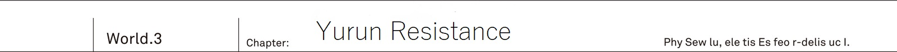
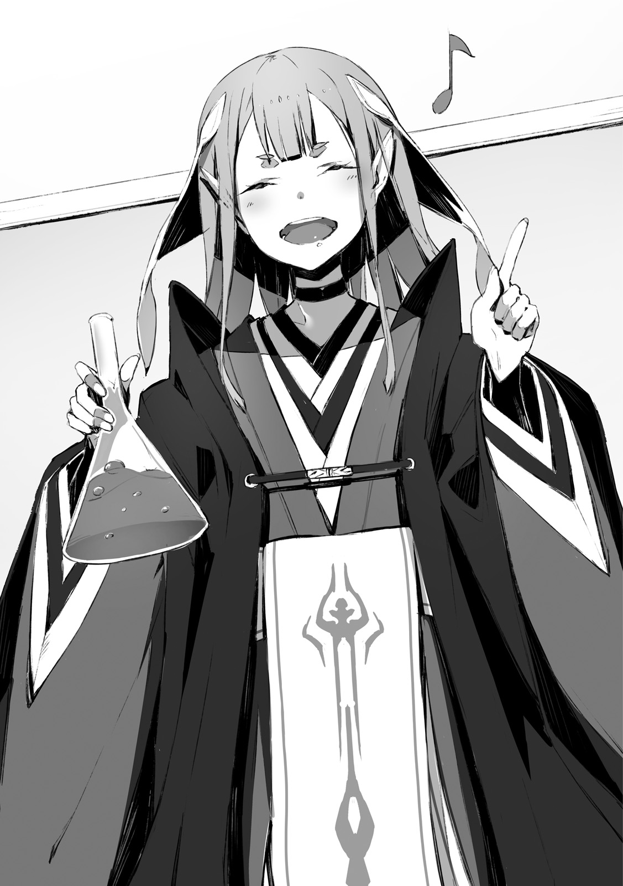
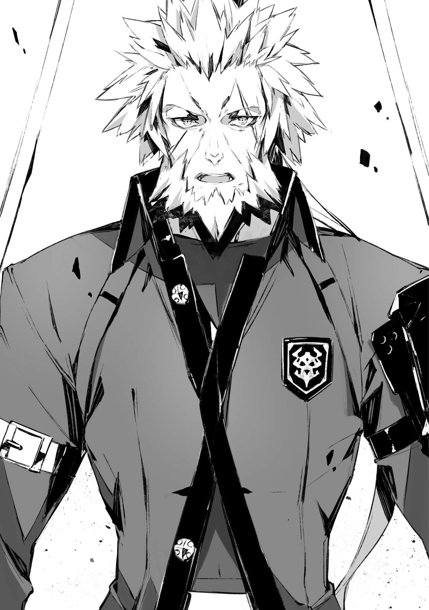

At the naturally created border...
It has been three days and nights since they had entered the forest, controlled by sidhes.
Finally, a vast plain of ocher colour appeared, where the national border that separated Io and Yurun was located.

"I'm able to guide thee only up to here."

Said the elven shrine maiden, who looked reluctant seeing off the fading away forest.

"Beyond these plains lies the Yurun country. Thee know this much, right?"

"That's right. Once again, quite a depressing scenery..."

Ashlan answered from the driver's seat.
As Kai's arm was wounded in the battle with the Behemoth, he had taken over the wheel for now.

"I thought the maze of big trees was getting tiresome, now it is just plains with weed all the way."

"Right so. Having nothing around instead makes it dubious, right..."

Sitting on the passenger seat, Saki was anxiously looking with her binoculars through the window.

"Talking about the border.
Aren't the four races supposed to watch over it normally?"

"It is but an exaggeration.
Only demons watch over the entire border.
As only they possess sufficient numbers."

Reiren said from the back seat on the right.

"By the way, Kai, how is thy wound on the left arm?"

"Hey, you!"

From the left came Rinne in order to 'restrain' her.

"I'm the one who is going to worry about Kai's arm.
Kai, is it ok?"

"Muu. Anyway there is nothing to do, might as well not mind some small talk."

Reiren was sitting to the right of Kai.
While Rinne was on the left.

Being surrounded on both sides, Kai leaned on the back of his seat.

_TL Note:_ `座席のシート` Ehm... Honestly sometimes I think I don't know japanese

"It is all right, but it would nice if you wouldn't cling to my arm so much..."

As his arm was fixed with a bandage, he was unable to move it.

But then Rinne was clinging to Kai with such an arm, not leaving his side.
Of course he appreciated her [I'm going to protect you] sentiment, but each time Rinne put in some strength,
Kai would feel impact through the whole arm up to the shoulder, making his wound ache and becoming the source of his worry.

"Hey, Saki. How long should we go?"

"Mmm, some more time I guess?
But well, even I've gotten tired of riding the car."

They've been on the road for three days and three nights.
By now Kai's party had traversed several hundred kilometers.
Consisting of 30 military cars closely following each other, their party was starting to run out of both provisions and battery power.

_TL note:_ Interestingly author always mentions batteries, but never oil, like cars don't need it there.

"Seems like it's going to take a bit more time to reach the human city...
But this map is like ten years old, so I'm not sure about its reliability."

Saki was continuing to stare at the map of the continent.

"Hey, isn't that the thing?"

Rinne, who was looking out of the window, pointed straight ahead at the horizon.

"The town of humans."

"Hm? Where is it, Rinne? I cannot see anything there.
Wait, wait, where are binoculars...
Ah, it is really there!
Looks like some sort of abandoned building...
Wait, ehh... What's that!?"

Saki raised her voice in surprise as she was looking through binoculars.

"...A little perilous."

Reiren who got up from the back seat, knitted her eyebrows.

"Kai, can thee contact Jeanne behind?
These ruins, these are not just simple buildings.
Making a detour might be wiser.
It is a nest of the spirits."

"Really!? Jeanne, this is the vanguard car, answer me!"

He tightly grasped the radio.
Without waiting for a reply, Kai continued his report to the commander's car, which was immediately behind them.

Rinne and Reiren, whose eyesight surpassed that of Kai, were already able see a scenery beyond the horizon.

"Ahead on our path are ruins, which have become a nest of spirits.
I suggest taking a detour!"

[I was about to contact you about it.]

He couldn't sense any worry in Jeanne's voice.

[We're receiving directions on the course to our destination from a radio corps of Yurun Resistance.
And we're told to head straight ahead as it is.]

"Then..."

[There is indeed the nest of spirits among that group of building.
However there are no signs of spirits themselves.
Apparently they moved to a another place around two years ago.]

_TL TODO:_ Second sentence refer to spirits as `肝心の聖霊族` and it is unclear how to interpret `肝心の`

"...Meaning it is completely empty, huh?"

It was similar to the migration of birds.

Spirits had a tendency to frequently migrate from their nests every dozen of years.
But the reason was unclear.

"But there is a chance that some still remain on lookout, right?"

[There will be few at most.
We've been requested to intercept them in case we have an encounter.
Put it simply: While Yurun Resistance welcomes us, they also intend to test us out at the same time.]

Just a few spirits.
If they'd went all out against the enemy, it wouldn't be a serious threat.

[For us it would be a welcoming experience.
Before a full blown confrontation with the spirits, I believe it would be valuable for us to gain experience fighting them right now]

"Therefore heading straight to it, huh..."

The shadow of the city could be spotted just beyond the horizon with the naked eye.

On these vast plains, illuminated by intense rays of sun, a queer scenery appeared in front of Kai's own eyes.

...Shining ruins.

Steel buildings were covered by something moss-like, emitting lights.

Was it spider threads or maybe <a href="https://en.wikipedia.org/wiki/Hypha">hyphae</a>?

It looked like a shining object d'art.
Once a human city, it had been transformed into a bizarre [nest].

_Demons just use human's cities as it is when they snatch it._

_Sidhes are not living in human cities at all and instead letting them get consumed by the forest._

But spirits were different.

They just transform city's buildings into completely different things.
One had to wonder just what kind of life form could make such a nest.

"Whew... That's gross.
The buildings are completely covered in something like bluish mold."

"Ashlan, turn a bit to the right now.
We don't really need to go through the center of these ruins.
Whenever possible we should go by the edge of the city."

As they were going through the ruins that became a nest to the spirits.
In order to pass this eerie building even a second faster, they started to raise the speed.

"Rinne, just to be sure, did you have to fight spirits before?"

"Mmm, just a bit?
But I really disliked it cuz I had no idea what spirits are thinking."

"...Undoubtedly they are not someone you can talk with."

Slimes. Ghosts. Lanterns.
Among the five races including humans, they were the only race that didn't use human language.
The reason for that was quite simple: they didn't posses intelligence to comprehend language.

Therefore any discussion was out of question.

"But spirits are well versed when it comes to creeping around.
They can hide from sight and completely eliminate any sound...
Who knows if our car is already in their sights or not."

"Please stop, Reiren!?"

Saki screamed while tightly gripping her hand grenade as if it was a precious talisman.

Guns were ineffective against the spirits.

While bullets could wound slimes, they would quickly restore themself up.
As for ghosts and lanterns, bullets would just pass through them.

They had to be completely destroyed by using flames or a blast.

[Preparing counter-measures against traits of each race is very bothersome.]

[There is a universal way to overcome such resistances regardless of race.
That is a _blast_.]

_TL Note:_ These are Vanessa's lines from V1C5

Seeing Saki holding the hand grenade so dearly made Kai remember Vanessa's words.

At that time...
Never would he ever have imagined himself doing something like coming to the spirits' land.

"Okay, we're already leaving the city."

"...Ah, nice. I thought my lifespan was about to shorten."

Kai's car passed the buildings.
Following them was the second car, then the third and so on, passing through the spirits' nest,
but there were no signs of anything threatening to attack them.

"Jeanne, how are things on your end?"

[We're passing through without troubles.
Though unfortunately it also means that we're not going to meet the Yurun's Resistance's expectations.]

From the other side of radio he heard the Commander's self-deprecating laugh.

[To all cars, follow the road straight ahead.
We're heading towards the Yurun's Resistance headquarters.
Their leader is a renowned commander named Balmnung-dono, also commonly known as _Lion King_.
Be mindful to not act impolite.]

-------------------------------------------------------------------------------

A stronghold among wilderness, Ruin S Fulham.
The red brick castle.
Once it was a land where a clan
that lost a fight for the crown of Yurun, had escaped.

And this stronghold, which was the last hope of mankind crushed by the spirits' invasion...
Was the headquarters of the Yurun's Resistance.

"Welcome to our Resistance.
Let us greet expedition of our fellow army!"

_TL Note:_ Original greeting: `ようこそ我らの人類反旗軍へ。貴軍らの遠征を歓迎するものである！`
First phrase is clear: he welcomes them at the HQ.
But the second is a bit more tricky as it kinda repeats a similar thing, but with a stronger emotional emphasis (due to `ものである`) and with their guest to be a subject
So I feel it is more like a command to his subordinates to greet guests?

With hundreds soldiers by his side...

The giant man with his golden hair and beard, befitting of a lion, loudly exclaimed.

His upper torso looked even greater than that of his subordinates.
But despite his fierce look that would make left any child crying, his voice didn't sound harsh.

He was the Lion King Balmnung.

_ED Note:_ Totally unrelated, but reading "resistance" too many times reminded me of [Road of Resistance](https://www.youtube.com/watch?v=zTEYUFgLveY).

_Exact opposite of the emperor Dante._

_Despite his large frame and fierce look, meeting him face to face doesn't feel so suffocating._

_TL Note:_ Let's be honest, Dante can only cause you to feel disgusted, I doubt his presence would pressure anyone.

In front of Kai, Light Knight Jeanne came forward and shared a firm handshake with Lion King Balmnung.

"Thank you for coming all this way.
Jeanne-dono, rumours of your great achievements have reached even this remote land.
I want to borrow your strength."

"It is nice to meet you, Balmnung-dono.
I thank you for your welcome."

Compared to the Lion King Balmnung's stature, Commander Jeanne, who was disguising as a man, looked like a child.
Despite their physique being like that of a child and an adult, Lion King didn't show any hint of disrespect.

"Balmnung-dono, are we going to gather for the meeting as it is?"

"While this is what I'd like to say, but your honorable army requires rest after such a long trip.
Not to mention your cars would also need some maintenance.
Allow my engineering squad to assist with that."

He pointed towards the stronghold's entrance.

"Jeanne-dono, we could go together to the office.
Well, nothing like a strategy meeting, just a small talk."

"Meaning?"

"The good news of you crushing the demons' hero and sidhes submitting to you.
I would be glad to hear about it in detail.
As I wish to spread these news among the seven cities of Yurun too."

"I understand, then by all means."

Lion King Balmnung walked with a long stride, and Jeanne joined him by the side.

"...This is quite different from our time in Io.
Looks like a decent commander."

"Really.
Dante seemed like a sly king, but here I can see a leader of soldiers.
Well, he looks scary though."

Saki and Ashlan were whispering to each other.

On the other hand, behind them was the elven shrine maiden Reiren, who was grumbling with a sullen look on her face:
[Sidhes submitting?
Huh, what a joke.
It is merely a cease fire.]

"Hey, Kai?"

Rinne tugged at Kai's right sleeve.

"What are we going to do now?
Jeannya already left though?."

"Yeah, let's see... ehm."

"For you it should be all for today.
I'll attend to Jeanne-sama, so you can go ahead and rest up."

As Farin was going after Jeanne, she whispered to him when passing by.

"This place has a trustworthy commander. He is different from the Dante."

"Could it be that you know him?"

"For about a year.
I just served here during my soldier's training."

She said with a profound smile.

Leaving it at that, the female guard disappeared inside the castle.

 
 

Human city Ruin S Quin.

It was located 30 meters under the stronghold Rin S Fulham...
The largest known underground city of Yurun, which could be reached by taking an elevator inside a solid bedrock.

Similar to Urza's Neo Vishal it utilized the underground railway system, but there was one main difference and that was the scale.

Neo Vishal was at most the size of a single shopping district.

While Ruin S Quin was said to almost completely replicate the townscape of Yurun's capital.

Thanks to the vast plains they benefited from wind and solar energies.
Due to that they were able to maintain all their production factories.

The cornerstone of it all was...
Thorough defense of the Ruin S Fulham stronghold.

"You're not Balmnung-dono's people, aren't you?"

Human city, Ruin S Quin, northern district...

Inside the hospital, which was also filled with piles of books and served as a library, the old head doctor was skillfully undoing Kai's bandages.

_TL Note:_ It doesn't said _inside_ in original text, but it sounds better this way

"I'm not versed in the nature of spirits.
They look for humans' ruins and make their nests out of them.
You'd think they'll make it their base, but a few years later they abandon the nest and start migrating."

"...They abandon their own territory?"

"There are cases when the destination of the said migration is humans' shelters too.
As they abandon old territory they start searching for new ones.
Almost like locust swarms."

He finished undoing the bandages covered in blood and dust.

"...Oh?"

The old doctor opened his eyes wide behind the lens of his glasses.
He fixated his gaze onto the wound left by Behemoth's fang gouging Kai's left shoulder.

"It even took some meat from your shoulder.
You're young, but did well to endure it.
Disinfecting also was quite painful, wasn't it?"

"Luckily, I had painkillers on me."

"Fool. It is not a minor wound.
Fortunately the wound itself didn't fester, but..."

Next old man's gaze shifted to Kai's face.

"Your face doesn't look like that of someone reckless.
This is in contrast with your appearance."

"...I've been told that I'm stubborn."

"For the forty years that I've been examining soldiers that come here, I cannot remember seeing such a gruesome wound.
I cannot imagine a fight with spirits causing such a wound though."

"I've been bitten by a slightly large beast..."

"Bitten, you say?
Meaning this wound on your shoulder is left by teeth?"

The hand of the old doctor, who was re-applying bandages, stopped.

"And what was the beast that could leave such large teeth marks?
Could it be that you've been attacked by a dragon?"

"Something like that."

"..."

The old doctor was speechless.

If it was a soldier or a civilian then they would just laugh it off as an [absurd joke],
but this old doctor could guess the size of monster from marks of the fang that left the wound on Kai's shoulder.

"It will be one of these two.
Either you'll die young or become a great warrior like Balmnung-dono...
Now then, the examination is over.
I'll prescribe you strong painkillers."

"Will it be ok to hold a gun?"

"Wouldn't recommend.
You'll be unable to use your left arm for the time being.
While painkillers will do their job, your grip will remain weak either way."

He was weakened.
While his face didn't show it, this was what he felt about the situation.

Jeanne and the Urza Resistance were going to participate in the fight against spirits.

In this situation where he couldn't use one of his hands, if he would for example end up fighting the spirits' hero then...

"What is it?"

"I was just thinking.
Have to do my best and use every possible trick.
To survive."

No soldier that protected the city had to pay money there...

Kai bowed to the old doctor who firmly refused to take any payment, leaving the infirmary behind.

 
 

Public cottage.
Normally soldiers were staying at the one of the seven Yurun's cities,
Once a month, they would gather at the stronghold Ruin S Fulham to hold large-scale councils of war.

This was one of the lodgings which they would use at those times.

"This is cool.
Since these lodgings are used by soldiers they got a conference room here,
and they mentioned something about lending us tools to look after our guns, right?"

"Moreover they completely lent them to us.
They are so welcoming that it is actually scaring me."

Saki and Ashlan were taking the baggage out of the car.

As he saw the two walking down the corridor with plenty of baggage...

"Hm?"

He heard an energetic voice from within the room allocated to him.

"It is completed!" _TL Note:_ Reiren

"Hey, hey, are you sure it is going to be ok?
It smells very awful..."

"Thee can leave it to me.
If thee would like, how about sampling it?"

"Mmm, I'd rather not."

These voices probably belonged to Rinne and Reiren.

He asked both of them to take care of their luggage while he was visiting the old doctor,
but surprisingly he could hear lively voices from the other side of the door.

"Hey, Rinne? Reiren?
...Eeww, what's this smell!?"

His nose was assaulted by a terrible smell.

As soon as he opened the door he was attacked by a bizarre mix of sweetness, like that of condensed milk, together
with a rotten smell that would make you cough when you inhale it.

"I'll open the window to ventilate..."

"What is thee saying? I'm just making a elixir. Look."

Elven shrine maiden pridefully showed off a flask.

Just as Kai brought his nose closer to the slowly boiling pink liquid, he was assaulted by an even stronger smell that already filled the room.

"What a terrible smell; is that an elven elixir...?"

It was said that elves and dwarves who were living in the forest would combine together various fruits and leaves that were natural remedies and create elixirs, which held mysterious powers.

_Potion that could cure ten thousand illnesses with a single drop._

_Sake that could tame any animal in the forest._

Then there was the thing that Reiren was holding in her hands.
To Kai it smelled like a juice squeezed out of food scraps.

"On thy wound, human medicine is unlikely to have much effect, isn't it?"

Reiren looked at his bandages.

"That said thee would be troubled fighting spirits in such a sorry state.
Therefore feeling generous,
I thought of trying to make this elixir that would cure your wound in half a day."

"Half a day!?"

"Umu. If thee drinks it this evening, tomorrow it shall be healed completely without leaving any single trace of the wound."

"Hearing you now makes me less inclined to try it though..."

"Well, I wouldn't mind two thousand massages as a reward too."

"Are you an old man!?
...Ah, well, I suppose you're older than human elderly."

_TL Note:_ No one would mind giving her such reward... aside from our hero ofc.
Ei, Kai, what are you doing!? Reiren is such good girl and you cannot even reward her properly!?

_ED Note:_ Two thousand though... I can feel his troubles.

As he received the flask from Reiren, he fixated his gaze inside.

That pink liquid.
Even though it wasn't burning hot, it continued to boil on its own.
And then there was this smell that would instantly force your eyes open.

It looked so suspicious that he wasn't even sure where to start with.

"What about this pink colour?"

"Umu. See, the finishing touch is a fruit of the winter mountain flower.
Boiling it and then drinking would greatly boost the body's metabolism...
Or so I'd like to say, but this herb grows only deep inside the elven forest,
therefore I had to substitute it with a different thing."

"Eh. But this is a human's town.
Would there be a replacement?"

For Reiren, who was part of the sidhes, this place was an enemy's den.

It was hard to imagine this elven shrine maiden, who wouldn't go out unless she is with Kai, walking around the city.

"I had requested Rinne."

"Rinne?
Did you find some alternative remedy on the market?"

Saying that, Kai noticed a small plastic bag for shopping in Rinne's hand.

"So see, this flat elf said that the winter mounter flower's fruit is small and red,
that's why I was looking for a similar fruit."

"What did you buy?"

"Strawberry."

"Not good!?" _TL Note:_ I'm honestly not sure if Reiren is asking or stating a fact.

Without even testing it was obviously a failure as the replacement.

"This sweet smell, is that of strawberries...?"

"Hey, Kai.
Do not sniff it like a timid dog,
summon thy courage and just drink it to see for thyself.
There would be no other chance for a human to try out the elven elixir."

"This boiling thing?
Obviously it is going to burn my throat, but how do elves drink it?
Do you not cool it?"

"I do not know."

"Eh?"

The moment elven shrine maiden gave him the answer with such a serious look, Kai turned white.

"This is a first time for me to see it in such a boiling state.
I wonder if there was some sort of mistake when I've been mixing it."

"Obviously there has been some mistake, right!?"

"Well, worry not, just gulp it in one go."

She pushed the flask with suspicious liquid towards him.

"...Well then Reiren try a single gulp and see how it goes.
If everything is all right then I'll drink it too."

"Very well. See then."

Taking the flask into her hand the elf sipped directly from it.
With a deep gulp, she finished.

"See?
Smell might be a bother, but once savor it, thee shall feel invigorating."

"Oh? Really."

"..."

"Reiren?"

"...Blarghhh...!"

"Vomiting blood!?
Isn't it a complete failure?
Oi, Reiren, come on!"

The elf fell down with a cry of agony.

_Good that I didn't drink it._

Kai felt relieved all the while patting her back.

 
 

"Night" of the underground city.

Going to the surface would let you to see a scenery of vast plains dyed in the colour of diluted ink.
With the night wind washing away and tearing apart clouds, stars were able to peek through the gaps.

But...

Nothing of that was here.

Being 30 meters under the stronghold Ruin S Fulham, all they could see was the lights of the tunnel's ceiling turn off.

Illumination is lit in the morning, and turned off at night.

_I already had the same experience in Neo Vishal._

_Seems like the situation is the same even outside of Urza._

He was not used to the idea of such 'nights'.

To Kai's surprise the elven shrine maiden Reiren, who was probably the most used to natural night, was soundly asleep with little discomfort.

It was likely that she accumulated quite a lot of mental fatigue after leaving the elven forest for the first time in her life.

Kai's room had three beds.

With her body in side posture she was soundly sleeping on the inner most bed.
She took off her seventh layered robes, and now she was in a thin nightdress.
Although the design was tight, completely fitting her body, the dress was tailored up to her ankles.

"...I think it would be good if you go to sleep as well, Rinne."

"Are you sleepy?"

On the middle one of the three beds.

On the bed that had enough space to stretch yourself for a single adult, Rinne was lying down with her face down close to Kai, while he faced up.

Kai's left shoulder...

Was barely at a distance close enough to not touch his wound, covered in bandages.

"We should sleep on our own..." _TL Note:_ Original text is `自分のベッドは……` where verb is omitted. Literally `own beds...` which makes a little sense in english so I changed it.

"No way."

The girl gently touched his left elbow with both hands.

"Kai was hurt like this because of me.
That's why I'm going to protect Kai.
Until your wounds heal completely, I'm absolutely not leaving Kai's side."

"Rinne..."

"Though even after they heal, I'm not leaving either."

"Business as usual!?"

She was persistent about being by his side.

Now that she was used to the daily life, even if it was the same room, they were supposed to sleep on separate beds.
But this night she seemed to totally reject the idea of sleeping on separate beds.

"Reiren was able to successfully mix the medicine on her second try.
It is going to be healed properly."

"...Was it bitter? The medicine made by that flat elf."

"A good medicine is one that is bitter."

First time her elixir was a failure, but the second time she was able to do it successfully.

At first she tasted it herself as the creator of the mixture, next was Rinne, afterwards Kai drunk it.

_I don't feel like my wounds started to close up faster though._

_When used on the human the elven medicine should at least have rejuvenation effect._

It was so effective that it would put a heavy strain on the body.
And due to the elixir containing elven magic power, it might have a side effects when used on the human.

What kind of effect it would be was entirely up to Kai.

His life could be shortened, or it could also be prolonged.

"By the way, Rinne, weren't you saying it was too cramped to sleep in the sleeping bag of our tent?"

"Yeah it was cramped."

"Then..."

"Kai, how do you think I think of Kai?" _TL Note:_ Yes, it is indeed weird `カイは、わたしがカイのこと何て思ってると思う？`

That was rather straightforward.

Kai was about to say, but his words stuck in a throat.
Not because of the meaning of these words.

Amidst the darkness.
The light in Rinne's gaze became clear to a scary degree.
He felt as if he was being sucked in by just gazing into the eyes of deep sea colour.

"..."

She had risen from her laying posture with the upper half of her body supported on her elbows.
She was only in a single thin nightdress.

"...It is strange. I have a really mysterious feeling."

"Eh?"

"I'm very happy to be together with Kai. I like you.
Even if it is only my own feelings, it is more than enough.
I..."

The girl went silent.

She closed her small mouth and was just looking at him.

"What should I do to make Kai to start liking me..."

"..."

She wanted to be closer to him, to touch him and to get to know him even more.

Such an appeal was coming from her eyes.

"I cannot?"

He wouldn't deny it.
And he didn't hate it.

In fact it was making him glad to receive Rinne's affection,
and he had no desire to betray these feelings.

But...

"I understand... To be honest with you, I'm just not used to it.
Actually, I'm also not used to talk about it."

"What?"

"Well, having a girl like Rinne sleeping so close.
In the true world I was living in the men's dormitory and I've been always sharing a double room with Ashlan.
Saki and Jeanne were staying at completely different place: the women's dormitory."

"..."

Rinne titled her head with a curious look on her face.

"Does Kai like Ashlan?" _TL Note:_ LOL I'm ded

_ED Note:_ Not to mention that I was never expecting a confession from Rinne on the bed. Way to go! Score a home run right now, Rinne!

"...No, I didn't mean it like that, there were just strict rules on gender segregation."

"Why?"

"This is going to be a rather philosophical discussion so let's have it at another time.
Anyway, the reason why I'm hesitant about sleeping with you, Rinne, is not because I dislike the idea.
I'm just not used to it.
Even you, Rinne, first time you came to the human city, you weren't used to it, right?"

"...Yup."

"Do you understand now?"

"Understood."

Seeing Rinne so quickly agreeing was almost anti-climatic.

This reply of her brought him only a brief moment of relief.

"Then I'm going to give Kai training."

"...Yes?"

"Yay, caught you!"

With a vigour of a carnivore aiming for its prey, Rinne hugged him around the torso.

"I didn't know that Kai is bad at sleeping together with a girl.
But no worries, I'll give you proper training.
We're going to sleep together more, far more than before!"

"I didn't mean it like that though!?
Actually, Rinne, the shoulder is a bad idea.
It is in pain, it is painful when you cling to it so...!"

"Eh? What, I didn't hear you."

She was so obsessed with clinging to him that his voice could no longer reach her.

While he was desperately trying to shake from such Rinne...

"Eei, silence!"

Hearing the elf's voice, Kai and Rinne stopped moving completely.

"Be quiet during the night.
Even though I'm grateful that today ended without troubles, I wish to rest my body peacefully.
Cannot thee comprehend that much at least!?"

"...Ok."

"...Got it already."

"If thee understood then good."

With a completely sleepy expression, Reiren nodded, oddly satisfied.
But for some reason instead of going back to her own bed, she was approaching Kai's direction.

"Good, I shall sleep."

"What do you mean good!? This is my bed after all!"

"...Suya." _TL Note:_ this sound of sleep is just cute.

"Could it all be sleep-talk...?"

"Ah! Hey, you, flat elf, move, move!
I'm the only one who can be close to Kai!"

_ED Note:_ That's right! You tell her, Rinne!!

_TL Note:_ Oi, show some respect to cute elder girl.

The elf occupied the edge of the bed,
seeing which Rinne got up.

He was sandwiched between them.

"...Ah how I miss sharing a room with Ashlan in the true world."

Kai heaved a big sigh from the bottom of his heart.

-------------------------------------------------------------------------------

Stronghold Ruin S Fulham...

The fortress was surrounded by a threefold mud wall with a ditch,
and at the time of enemy invasion they would set the ditch on fire, surrounding the fortress in a wall of fire,
which could act as defense.

"Probably even in Urza you've gathered intel from various hearsays,
but against spirits neither swords nor guns are effective.
Their bodies are composed either of mist, light or viscous liquid!"

At the conference hall, on the fifth floor of the stronghold.
Lion King Balmnung's strong voice echoed throughout the room.

"As for their weak point, these guys have a core that holds magic power inside their bodies.
While at least in theory it is possible to crush it with a bullet or sword, but that's hard even for a skillful sniper.
Not to mention each has their core at a different place."

It required a miracle to shoot them.

When it comes to an enemy race against which firearms were ineffective, first on the list would be cryptids with their firm scales that could reflect bullets,
but spirits were no less troublesome in a different sense.

_TL TODO:_ First sentence is rephrased as I found it hard translate `火器全般`

"Effective weapons are these that can target the whole body.
You can quickly take care of the core by thoroughly burning the whole body using flames or bombs.
Like with this..."

Thump!

A grenade launcher was placed on the table with a loud noise.

Being able to toss around the large sized gun single-handedly, which was supposed to be held with both hands, was certainly a display of strength, befitting the name of the Lion King.

"It is loaded with incendiary rounds.
Here against the wall you can see flamethrower.
Our Resistance is specialized in incendiary weaponry,
even our tanks uses such ammunition."

"I see, though we're primary using machine guns..."

"But of course we've already finished arrangements for your army.
We placed order to our weaponry production lines and our workers have already organized mass production for you."

"You've been thorough. Allow me to express my gratitude, Balmnung-dono."

"Umu. That will be all then.
Prior to actual strategy planning we must make sure that you know all about Yurun's situation and spirits' biology."

Giving a nod to the Jeanne with a serious look, Lion King once again looked over the people present.

The place where they were holding the meeting.
It was a banquet hall with desks and chairs lined up, once used by the kings,
now it was used by Jeanne's and Balmnung's subordinates.

All the commanding officers were present, hence this morning's meeting was mainly for introduction.

_And here is also me._

_I hope Rinne and Reiren will keep quiet._

They disliked idea of sharing the room full of humans.

Both expressed the same sentiment and probably right now they were already out of the fortress, taking a walk through the plains.

"Jeanne-dono, please remain here.
Rest of you are free to start preparing for joint manoeuvres."

All the soldiers stood up at once.

There was a strong sense of responsibility in the eyes of these strong soldiers who were leaving the room now.
Each of them carried a fighting spirit as if to reciprocate commander Balmnung's instructions.

_Jeanne also gets respect from her soldiers._

_But this commander feels a bit like a senpai to his soldiers._

Lion King Balmnung.

This was a name that he didn't remember hearing in the true world.
And in this alternative world he was a distinguished figure, like Jeanne, who stood up in the time of mankind's crisis.

And now gaze of this man was...

"I've kept you waiting."

He turned towards Kai, who was sitting at the edge of the room.

"Just yesterday I had invited Jeanne-dono to my room for a discussion.
At first I only intended it to last for one, or maybe two hours, but unintentionally our discussion kept going.
For about five hours I guess?"

"Seven hours."

Farin interjected with a serious look.

"As you can see. This commander has the scariest face in all of Yurun,
but in his heart he is just like a young maiden.
Continuing chatting, forgetting about time, and turns out his hobby is cooking.
On days off he would gather his subordinates to serve them homemade dishes..."

"Farin."

"Oh, my bad."

The bearded man folded his arms and looked with amazement at the female warrior who pretended to turn away in shame.

"What I found particularly interesting in our talk with Jeanne-dono is that a certain name popped out quite frequently during it.
Isn't that right, Jeanne-dono?"

"...Yeah. Well, around three of four times."

"Twenty eight times actually. According to my notes."

_TL Note:_ Oi, Jeanne, you might as well just admit it.

Lion King opens up a notebook which was filled with detailed notes.

It was a seven hours long talk.
Which filled his notebook with almost thirty pages of notes.

"Let us be honest here.
I already said that to Jeanne-dono, but under the demons' domination, Urza's situation was hopeless."

"..."

"There might be few smaller countries in addition to the four main ones, but among all of these
Urza is likely the region where humanity would have been completely wiped out.
I was already already prepared for such an outcome.
Considering the total territory that demons control and the overall efforts of the Resistance."

Jeanne, together with Farin, remained silent.

Paying no attention to two of them, Lion King's gaze was fixed on Kai.

"And in such circumstances, the demons' hero was crushed, allowing to turn it all around.
Jeanne-dono would often mention your name when talking about the reason of the success."

He was glancing to the side.
Balmnung was looking towards the black bayonet, which was set by Kai's seat.

"As I heard, it is a rather strange weapon.
Bayonet... To me it looks as a rather old weapon, but mind if I take a look?"

In front of Kai, who gave silent agreement, commander Balmnung took Drake Nail into his hands.

After carefully checking that it was not loaded with ammunition, he stared at the two triggers attached to the gun barrel.

"Normal bullets.
And another one is to blast explosive upon slash?"

"Yeah, correct."

He saw through Drake Nail's mechanism with a single glance...

As one would expect from a naturally born soldier.
He was easily able to analyze the bayonet, that one could call a _futuristic_ weapon that doesn't exist in this world.

"I see, this is rather sophisticated."

Lion King showed a hearty smile.

"I've made similar weaponry before, but this one is two generations ahead.
The blade itself is robust enough to withstand explosive blast...
Huh, well then I wonder if my engineers could reproduce it...
No, weight would be an issue..."

He lifted the Drake Nail with one hand.
While the other hand was going through his beard, he remained silent for more than a minute, carefully examining it.

"As Jeanne-dono mentioned, even to me with my long history as a soldier, seems that it incorporates unprecedented technology.
Hence I would like to hear about it in details."

"...That's..."

"I do not care about your origin.
There are already a lot of maimed soldiers,
So I'm not planning to be picky when we don't have enough soldiers."

He held out the bayonet towards Kai's upper torso.

Kai considered the meaning behind Balmnung's manner of speech.

_So does he mean it?_

_Jeanne already talked about where Rinne and I come from._

It was likely because of the defeat of the demons' hero.

Obviously such a story is hard to swallow for the Resistance's commander.
So then how should he gain credibility?

It would be quicker to just show evidence that Kai is coming from so called the true world.

"So that's why drake nail...?"

"I'm only confident about your story for at most around 20%.
This bayonet is only a bare minimum evidence.
It is unlikely to be the key in defeating the demons' hero."

Balmnung's somewhat awkward expression maybe coming from his honest thought: [I'm not convinced yet.]

"So that's why I asked Jeanne-dono to let me talk with a person in question."

"Understood. Then what would you like to hear?"

"About them."

With his jaw he pointed towards a pile of documents on top of the desk.

Kai had already gone through them during the meeting. It contained records of Yurun's Resistance battles for the last thirty years.

"The Great War had ended.
So does it mean spirits were defeated?"

"For certain."

"Then answer me.
What is their weakness?
What kind of forces and ammunition is necessary to destroy them.
Everything you know about their biology."

It was extremely direct.

"In the history that I remember?"

"That's right."

"I'll start from conclusion:
I believe focus on military equipment is the correct approach.
My Drake Nail is a general purpose model, simply put it is designed to be used against all four races.
Of course that includes spirits."

"With that two stage gunpowder?"

"Yes. For spirits you need [fire], without mistake.
Another thing is that there are no records of them appearing in extremely cold regions, therefore they are considered to be weak against [cold]."

"It is warm here, so rejected."

"That's right."

From the battle records, there are no changes throughout a year when it comes spirits' raids in the Yurun.
The winter here is unable to weaken the spirits' activity.

"Next is military strength.
Honestly I'm not sure how reliable it is."

"Reason being?"

"If we take Urza's example.
Battle between humans and spirits would depend on whether we're able to defeat the spirits' hero."

That was the case in the true world.
As prophet Sid defeated Spirit Sovereign Rikugen Kyouko, he was able to put an end to the conflict between races.

[All I'm saying is that I'm a being that grants a prophecy.]

[To grant you a meager power word. Like once I did for the Sid.]

But...

It was indeed true that Kai had never imagined that there was an entity behind the scene of the history that gave Sid the prophecy.

_No, I should stop thinking about it at the moment._

_Unless you see [it] for yourself, there is no way you'd believe it._

"I'll ask you straight: is there a way to beat such monster?"

"According to the records known to me Spirit Sovereign Rikugen Kyouko is described as
[ultimate type of protist]"

It was a vicious slime creature.

While it does possess a core like the other spirits, being guarded by massive cells, bullets cannot reach it.
And when a sword slashes at it, it would be wrapped and caught inside the slime body.

-Neither guns or swords are effective.

-Even if you blast it into pieces, they would quickly gather and regenerate.

It could change from the size of a human to the size of a building.

"After burning Rikugen Kyouko's cells completely, we can destroy the unprotected core.
But the main problem is..."

"Lack of firepower.
Yesterday, we came to the same conclusion."

Jeanne leaned against the wall.
With a thoughtful look, the silver haired commander was just staring up at the ceiling.

"Balmnung-dono already ordered large scale weaponry at the underground production plant.
But right now it is in its testing phase.
Mass production would take time, but it seems to be uncertain whether it would be enough for high ranking spirits."

"Yeah, honestly I think it is a rather difficult problem.
It is not a simple task to create a large enough weapon that would be effective against high ranking spirits."

Humans of the true world had also suffered from spirits.

When prophet Sid defeated Spirit Sovereign Rikugen Kyouko the power balance got reversed,
but until then they had only been on the defensive.

Still...
They've been able to hold the spirits' invasion on few fronts.

_You cannot beat high ranking spirits with ordinary firepower._

_To make up for the lack of firepower a plan has been devised, If I'm not mistaken..._

"Commander Balmnung, did you try using traps?"

"Traps, you say?"

Lion King repeated Kai's word in a rather stern manner.

"Setting up multiple incendiary bombs to compensate for a lack of firepower?
It makes sense, but spirits appear out of nowhere.
There is no way to know where they would appear, so we cannot narrow it down if we want to set up a trap.
We need to compensate for a risk of concentrating our firepower."

"Not just a stationary trap, but rather a luring trap."

A [stationary trap] is one that endlessly awaits the enemy to touch it, like a land mine.

But the trap that Kai had in mind would be attracting spirits.

"There seems to be only battle records here."

While he was going through massive amount of documents.

"It is common for spirits to be attracted towards strong light or energy.
At least there are some records left that indicate so."

"...Tell me more."

"There are reports that spirits were gathering in large quantities when cities were being burned down.
Similar to insects and snakes, spirits for the most part rely on heat to detect their enemies."

Spirits bodies are composed of [light] or [mist] or [viscous liquid].

They only have a single core which acts as their magic organ, the source of their power; they possess no complicated organs like ears or eyes.
Therefore only the magic organ is able to perceive heat - such was his thinking.

"That's worrying."

Yurun Resistance's commander responded in a low voice.

"Gathering around big fires is a rather weak basis.
I'm the commander.
Being entrusted with the lives of my soldiers, it is my duty to make decisions based on solid grounds."

"I might have a theory for the reason behind their migration of nests."

"Hou?"

"They make their nest amids humans' ruins, but then suddenly move somewhere else.
This behavior makes my theory feasible.
When a city is attacked, it also gets burned.
This fire lures them in and they create their nest there.
But as time passes the ruins starting to cool down so..."

"I see. So they move aiming for a stronger source of light and heat."

The Lion King closed his eyes partly.

He already understood it.
[Stronger source of light and fire] are nothing else other than human cities where humans seek to hide.

Spirits are perceiving light and heat...
Which also serves as adequate explanation for a reason why they attack human cities.

"Apparently there are ruins that became a nest of spirits, just beyond the mountains in the northwest."

Farin stepped forward.

She walked towards the speaker's chair during the meeting and pointed on the map of the country stuck to the wall.

The area controlled by spirits was painted grey.

"The closest nest to this fortress would be there.
General
Balmnung, how about we give a try to this one?"

"Not a light trap, but a spirit trap, huh?"

_ED Note:_ You know how moths flock to the light and die? Perhaps the author wants to just play on the words of a "moth trap" which is 誘蛾灯 and make it into a 誘霊灯...

_TL Note:_ Yeah, I get it now, but it feels weird still.

Balmnung fixed his gaze on the map.

"...It is worth considering.
If we are able to lure them ourselves, then it would make the strategy of concentrating firepower a viable option."

"No, Balmnung-dono."

Placing hands on desk.
Light Knight Jeanne made a clear declaration.

"Let's not just consider it, but do it."
