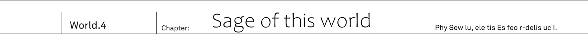

The stronghold Ruin S Fulham.

From its walls twenty military cars departed towards the western part of the country.
Mixed force of Urza and Yurun resistance armies...

Hundred people in total.

[Provisional supreme commander Balmung here.
Ladies and gentlemen of Urza's Resistance Army, on behalf of Jeanne-dono I shall be responsible for your lives during today's operation.]

This was radioed from the lead vehicle.

Hearty voice of the Lion King Balmung echoed throught Kai's car at a very loud volume.

"So noisy!"

Reiren screamed.
For elves, who possessed many fold sharper hearing than humans, it would seem that the loud voice of the Lion King was too loud.

"Kai, what is this loud voice?
Thee ought to tell that person to speak quietly!"

"Radio's volume is already at its lowest though..."

Besides the person in question was that giant.

On the battlefield where you may not get a hand on radio, being able to command soldiers with your natural voice alone -
for a commander it was one of these excellent talents.

[You've been already informed about it a day before yesterday,
this time goal of our expedition is not a battle.
We are to check our traps for spirits.]

Light trap - to lure spirits by means of artificially created light.

As beings that lacked organs like eyes and nose, spirits used their only organ, the magic organ to detect light and heat, and to move towards its direction.

It was speculated that due to phototaxis they are able to detect cities where humans hide, due to them being source of heat.

Therefore... This small experiment was meant to use this trait of theirs.

[And last thing for you members of Urza's Resistance.
We're going to pass through the plains, aiming for the city ahead.
That said it had been invaded dozens of years ago, now that land is just ruins.
Spirits set up one of their nests there, likely to be used as a breeding ground.]

The number of traps to be installed was nine.

It was to be installed 1km, 10km and 20km from the spirits' nest.
Furthermore each made with various amount of heat and light: strong, medium and weak - making it total of nine.

_How much they prefer of light and heat?_

_Not to mention I'm yet to know at what distance they can detect it._

Light traps were used during the great war in the true world.
But as one would expect Kai didn't check on details such as what amount of light they'd use.

"Say, Kai?
I have a bit of a bad feeling about it."

Ashlan, who was driving, said.

While chasing close after Yurun Resistance's cars on the path off road.

"We are going to experiment to lure them, right?
We were hastily in our preparations so we don't have a lot of ammunition.
I mean catching them all is likely impossible."

"I think so."

"If they'd learn about our trap what are we going to do?
Next time we set a big trap, but their bunch would be cautious and avoid approaching it, then there would be no meaning to it."

"They are not good with their heads, it is fine."

From the back seat...

Rinne, who was as usual sitting left to the Kai, completely glued to him, said.

"I have no idea what spirits are thinking about.
Or, rather because they don't think at all.
Even if they'd get caught in a trap, they wouldn't even remember about it."

"I'm of the same opinion.
Among four races they are the only one incapable of human speech."

Shrine maiden, who was by the right side of Kai, nodded in agreement.

"We are... I mean, sidhes learnt human language not because of wanting to have a dialogue with humans.
But because sophisticated language, first invented by humans, was a quite handy tool.
Naturally it wasn't taught by humans, just self-learnt."

What makes four races special is...
Their powerful innate abilities in magic and physical strength, as well as extremely high intellectual curiosity.

Naturally that includes elves, dwarves and angels.
But high ranking demons were also capable of speaking human language,
and even some part of cryptids, like dragons, was capable of comprehending human speech.

However.
Spirits completely lack any means of communication.

Or rather one had to wonder if they even posses clear intelligence.
Even in the true world, where the great war had ended, spirits were considered as primitive organisms that moved on their instincts.

"Remember traps placed by sidhes in the elven forest?
Even if thee know about traps, whether thee would be able to avoid them is another matter."

Both Rinne and Reiren approved of setting light traps.
No one expected it to bring down spirits' hero, but depending on amount of firepower it could take on high ranking individuals.

"Will be good if it works.
Gather them with a trap and then boom!
If it blows them off, then it is going to be easy.
I mean spirits are so weird.
Honestly don't wanna fight them fairly."

Saki was sitting down with her hands holding both knees.

"Not to mention they pass through buildings' walls and windows."

"They do not pass through, they melt.
Whether it is concrete or metal spirits can melt it and attack from there."

"Stop scaring me!?"

"Saki, you should probably know it already."

Spirits' bodies can be made of various things such as [light], [mist] or [viscous liquid],
and by consuming own body spirit can activate special magic of equal value.

Although it is know to be similar to demons' spells, Kai's first thought was Rinne's magic.
The one that she used to bring down Vanessa together with herself.

[This liquid is your _life_ itself.
Whatever defense you have, it cannot defend against it.
It is going to flow until your life itself will disappear.]

[Together with my own life.]

The magic that consumes the life upon its activation.
Thinking about it now he thought that magic roots may lay in spirits' magic.

_At any rate spirits' magic is worrisome._

_It is not like demons' destrucitve magic, but instead roundabout and far harder to get read on it._

If it is a fire, then it is hot.
If it is a ice, then it is chilling.

From appearance of such spells it is hard to get read on potential effects of spirits' magic.

_TL Note:_ This is somewhat weird to me, but I don't think I missed anything here.

"Well, there is no need for a worry.
After all range of spirits' magic is quite short.
At most maybe five meters, I think?
As long as thee is not all too close, thee shall not be basked in it."

"T-that's so... If so I'm relieved.
If they get close, I can run away."

"Still there are always exceptions.
There appears to be spirits' magic with a range over 50 meters."

"That absolutely not going to calm me down!?"

Saki's expression was becoming darker and darker as she was talking with Reiren.
But then.

[Comrades, slow down.
Once we cross the railroad bridge ahead, we'll be able to see our destination.]

It was Lion King Balmung.

[Along the southern border of the country lays Spirit' territory.
Great waterfall Gracial Fall - This river runs down from that great waterfall.]

"Isn't it a cryptids' territory."

In response to the Lion King's radio, Reiren whispered to herself.

[While abundant with large quantities of water, it cannot be be used by humans as it comes from the nest of spirits.
...That's to say right now it is rather useless information.
We're heading towards the city as per our plan.]

A great steel bridge spanned above the vigorously flowing stream.

Once it was a railroad that run from the east to the south of the country,
but now there were no trains running.
Once they pass these railway tracks, beyond...

Was group of buildings, emitting faint light.

Ruins, which became the nest of spirits, could be seen beyond the horizon.

"Yikes. It looks like tons of glowing mold grown there.
So creepy... Kai, take a look too?"

"Don't show it to me after saying it is creepy."

Receiving binoculars from Saki, he peered in the direction of a road ahead.

It was similar to the spirits' nest he saw few days before.
However, this time nest was still in use, so it was glowing with far more poisonous color.

[My friends of Urza Resistance, here is our stop. Stop.]

They were at distance where you could barely check the situation.

While Kai's company's car stopped, commander Balmung's leading car together with two escorting cars carried on.
As per plan only three cars will advance further as scouts.

[...Carry on according to the plan.]

Radio switched from hearty commander's voice to cool commander's voice.

[From now on Balmung-dono is going to check the state of the _nest_.
If something is amiss we shall keep watch.
Otherwise if there is no issue we shall proceed with setting up a trap.]

"...Hey, Kai.
Can I go outside?"

"Rinne?"

"It is ok. I'm not going far."

Rinne, who got out of the car, was glaring beyond the horizon without blinking.
In the direction of the ruins where spirits' nest was.

"Hmh... Kai, we're setting up the trap around that nest?"

"Yeah. Nine in total."

"But there is nothing."

"...Come again!?"

He jumped out of the car towards the Rinne.

Young girl's, whose hair was being shaken by winds mixed with dust, eyes were still captivated by ruins, remaining unmoved.

"By nothing you mean..."

"It is probably empty.
It is not as dry as the nest we saw before, so without mistake it is been used, I think?
But for the most part I don't feel any magic power."

Kai was looking through binoculars, unable to see anything unusual aside from shining buildings itself.

_But she is right._

_It wouldn't be strange to see one or two spirits loitering outside of the building._

There was the nest.
However there was no sign of even a single spiring being present.

"Did they notice us approaching and moved?
...No, that shouldn't be the case."

Spirits's nest was akin to a human fortress.
Even if enemy would be approaching, they wouldn't let go of it so simply.

"Kai, is something wrong?'

As if feeling that Kai being outside of the car meant that something is wrong, Jeanne dashed outside of the Cadillac One, half running.

"There might be no spirits in that nest.
Likely it is completely empty."

There was Lion King's car heading towards the ruins.
They were going to notice it soon, or maybe they already noticed it.
The fact that any sign of spirits in the nest ahead already disappeared.

"Jeanne-sama, is something wrong?"

"It became rather strange.
Could they really abandon that nest?"

Farin and Reiren.
As they were peering at the situation from within the car, one by one they headed outside.

"Shall we go and investigate that nest?
But, that's rather dangerous, isn't?
If spirits were to lurk among building's shadows, they might cause a devastating attack."

"...If that's the case, we cannot let Balmung-dono to go alone."

Nodding in agreement to elf's words, Jeanne grasped radio tightly.

"We shall head out too.
With our combined forces our search will be successful."

-------------------------------------------------------------------------------

Ruined capital city Yungberg.
During the spirits' great invasion it had fallen and was transformed into the nest.

Once city wall was 50cm thick concrete wall, now its had been scrambled without a single trace, leaving a gate alone,
covered in hyphae like shining buildings.

"Are you all right, Balmung-dono?"

"Yeah, my apologies, Jeanne-dono, for causing a worry."

Lion King turned his head in response to Jeanne's hail.

He held in his hand a maul, made of metal, likely being a weapon of Lion King as a soldier.
Such heavy maul would be difficult to lift even with both hands for a delicate woman, but this man could calmly hold it with a single arm.

_TL Note:_ I know it makes a little sense to use woman to compare his strength, but that's how author wrote it so...

"Situation?"

"Jeanne-dono, your keen insight is admirable.
For me, of all people, to be unable to notice it before actually approaching the nest..."

While caressing his beard, Yurun's Resistance Commander continued with a bitter look.

"It is empty.
We're yet to make a complete sweep, but it is strange to not see a single sign of spirits after going through a single city block.
Even if we set the trap, there is a little sense to do while we are without a target to catch."

"Then shall we investigate...?"

"Indeed.
Probably we should finish before sun sets.
We'll stop our cars here, take weaponry and sweep whole area..."

_TL Note:_ Last sentence is unfinished and contains `whole area...` only. I added `sweep` because I don't know how to take it literally in english.

Two commanders were making a fast exchange of words with one another.

No less than hundred soldiers were carefully listening to this exchange,
while two girls standing by Kai's side were looking into a complete different direction.

"...Fumu. This smell."

"But I don't feel any magic though?
And smell is slightly off."

"Unless we check it ourselves, we cannot know for sure.
I'm also not well versed when it comes to spirits."

Rinne and Reiren.
Both girls, who had far more keen senses than humans, became silent and pointed deeper inside.

"Hey, Kai, that building.
I smelled it the moment wind changed its direction."

"Possibly some is lurking out there."

"R-really...?"

Either it was few who was left after the migration.
Or the group of them was hidden out there.

"Jeanne, a second."

"M? Kai?"

"What is it?"

Jeanne turned towards him, and the Lion King noticing it followed suit.
At Kai's beckoning both commanders stepped forward with puzzled expression.

"I'm going to take a look at building over there. That's fine with you?"

They were in situation where they are surrounded by soldiers around them.
It was impossible to say whether Rinne and Reiren noticed it, but the commander, who disguised herself as man, noticed subtle change in Kai's expression.

"Did you find something?"

"...Maybe."

This single world was more than enough.

Farin, who was standing behind Jeanne, placed her hand on the sword,
moreover Balmung, who saw that, furrowed his brows.

"We'll go. Guard unit, follow me!
Jeanne-dono..."

"Of course both me and Farin shall join you.
If spirits are still left in this nest, it would be too dangerous to search in small numbers."

Soldiers led by Balmung.
Moreover Jeanne and Farin who lined up.
Kai too followed towards the ruins.

"Jeanne-dono, do not approach such piles of rubble.
Slime is a type that can change its form.
Sometimes they lurk in gaps among the rubble."

"I see."

"Upon meeting them, first distance yourself.
Still, saying that, you never know how it may turn out."

_TL TODO:_ The second sentence `とはいえ、こればかりは言ってどうにかなるものではないがな` is a bit confusing. Putting it simply says: `advice won't help`

With maul in his hand Balmung advanced over the main street.
His vigilance in checking every suspicious thing, be it melted traffic lights or twisted fences, was without doubt a behaviour befitting of a experienced soldier.

_When facing demons we wouldn't need to be so careful._

_They are not the type to hide by the building corner and attack._

Required soldier's skills were different.

Searching for signs of hidden enemy.
Having sharp intuition.

"Rinne, how about there?"

"Yup, probably soon...
Ah, that building on the other side I think."

"My nose thinks so too.
Smell is stronger."

They took left in the city area illuminated by the sunlight.
Lion King opened his eyes wide suddenly.

"...What's that!?"

"What's wrong, Balmung-dono!?"

Jeanne and Farin rushed over.
Both of them backed off too once they noticed that the Lion King was looking.

There were [marks] left on the road.

Asphalt's surface had been melted, in addition to that the road was completely covered in a mix of shining hyphae and mucus.

The spirits migration.

Even now magic lights were rising up from the road's surface into the sky.
It hadn't been a while.
Likely these are traces left by migration just few days before their arrival, or perhaps even few hours before.

"...Without mistake this nest has been completely emptied."

Lion King was looking over the [traces] left by spirits with annoyance.
As he said, traces, left by them, were directly leading out of the ruins.

Not even a single one was left here.

"Did they head towards the great plain?
Still, this is the first time they left such flashy footprints.
Spirits are elusive.
I thought their race would not let others know where they are going, but..."

Indeed that was so.

That was the reason for Balmung to be taken aback,
and Kai was speculating on the reason of that.

_To leave traces like that._

_They moved such large group at once, was it because they were in such rush to travel?_

One had to wonder what could be a reason.
Why would spirits to be so impatient.

"Commander Balmung."

"What, Kai?"

"I suggest pursuit.
With traces left behind now, it should be simple enough to chase after them."

Soldiers around them stirred with discomfort.

With all gazes focusing on him, Kai pointed the footprints left by the migration.

"These rising up particles of light are remnants of magic power.
I never saw in records any mention of such large quantities of power being used during the migration."

"..."

"Spirits ability to appear out of nowhere.
I think we have a lifetime chance to solve this mystery."

However it posed a risk.
If they chase after them right now, there was also a chance to be noticed and attacked.

"I'm fully aware of that, but..."

Lion King solemnly nodded in agreement.

"What about this place?
Before spirits would come back we have to burn down these revolting hyphae and mucus sticking to the buildings, to reduce their territory.
This is too one of our important battles."

"With two parties."

With sword's point... Shamshir's pointed end, Farin stabbed remaining trace.

"Split our group into two.
Standby squad to burn remnants of the nest here, and another squad to pursuit them.
It should be fine to split us roughly fifty fifty.
I leave personnel selection to you."

"What a boring theory.
However, it is reasonable...
Comrades, it is as you heard!"

Lion King's command roused up the spirits' nest.

"We're reorganizing our forces.
First, third, fifth, seventh and ninth squads to be on standby here.
Remaining shall join me.
To chase after them!"

 

Traces of light...
Shining spores and mucus, and finally remnants of magic power.

It was difficult imagine the number of spirits that came trampling down to leave tracks no less than 10 meters width.
Hundred or even two hundred wouldn't leave such tracks.

"Say, Kai, saying to chase after them, wouldn't they notice engine sounds if we're doing it on cars?
With ten cars here that's quite a great roving, don't you think?"

"That's up to your ability, Ashlan. Try to drive as quietly as possible."

"Say that to other nine cars...Oh"

Ashlan smoothly turned handle greatly to the right.

Going through the ruins of abandoned city, spirits's footprints were leading straight to the west.
However, with grass being overgrown it was rather troublesome as they couldn't see ground.

Glowing footprints were being hidden within the grass.

Great plain Grand Arc.

It was a big green plain, which spread west to the ruins of the capital, which was the spirits' nest.

One would think that plains are just smooth and flat, but here was a land where you could find giant lumps of rock, plenty of hills and walls of rocks.

"Hey, Kai."

Rinne, who was looking through the window, once again moved to back seat.

"The smell that goes with the wind, it is becoming stronger."

She said in low voice.
Whispering in secret so that Saki and Ashlan wouldn't hear.
Though with Reiren on the right, Rinne's whispering could probably be heard by her.

"We're drawing close, huh?"

"Yup, I think it hasn't been that long since they passed here... But I'm a bit scared though."

"Scared? You, Rinne?"

"For Kai's left shoulder.
You're not going to be reckless and get it torn off, right?"

"I'm not. It is all right,
and pain is almost gone too."

Rinne was looking with her upturned eyes full of worry.

Putting his hand on the left shoulder, Kai loosened bandages in front of her without a hesitation to show it.

"O-oi, Kai!?"

As he was driving, Ashlan turned towards the rear seats with his eyes opened wide.

"What are you doing, just when we stitched it up finally!"

"We're pursing spirits. There is no way I can go with my left shoulder out of commission during the fight."

As he loosened bandages, he started taking off bandages that was going from shoulder to the arm.
Leaving bare skin.

Although there were some marks left by stitches and it was still red, there was no bleeding.
While it wasn't a complete recovery, but tissue regeneration already started.

_I was doubtful of it._

_But it seems elven elixir really had an effect on humans._

Although he had difficulties to grasp Drake Nail with both hands, but light impact shouldn't cause anything like opening his wounds.

"Didn't I say?"

Reiren puffed her chest up with pride.

"There are no one prominent as me, who uses natural remedies of our forest!"

_TL Note:_ Author uses expression `右に出る者がいない` or at least some form of it as it is `右に出る者はそうそうおらん`.
It may seem confused, but it seems people in Japan thought that standing right to someone with authority(e.g. emperor) indicates that you're better.

"Yeah, I was quite seriously surprised."

"Umu! Therefore..."

Elf, who folded her arms in satisfaction, was about to say something when...

"...Huh? What's that? I spotted weird building!"

Saki was looking through binoculars.
While chewing through her favorite gum remaining focused on the front, she was murmuring as if speaking to herself.

"What is it, Saki, could be spirits' nest...!?"

"Nah, not that, Kai.
If that'd be a case, I wouldn't be so relaxed about it.
It seems there is some old building in a distance."

"Where?"

"Look there."

Saki pointed out, but they were still at the distance where it would look hazy to naked eye for Kai.

On other hand...
There was girl to his left.
He noticed Rinne's astonishment, after seeing her to look there without closing her opened mouth in a shock.

"..."

"Rinne? What's wrong?"

Something was off.

She was watching where Saki pointed without blinking.

"Mm, wonder what's that.
No matter how I look at it, that looks like relic of antique."

Meanwhile Saki titled her head with curiosity and continued.

"Is it black due to shadows? Or is it because some black stone like obsidian?
Still, it is quite beautiful triangle shape."

"...Saki, what did you say just now?"

"Eh?"

"The building that you saw through binoculars.
Once more, take a good look and describe how it looks to me already."

Kai still couldn't see it with naked eye.
But what Saki, who was sitting at front with binoculars, described made Kai to think of only one particular thing.

"As I said it is building shaped as black triangle."

"Saki, binoculars!"

"Eh? W-wait a sec!?"

He took binoculars as if mugging her, and looked in a direction where their car was heading.

Beyond the plain covered by vibrant overgrown grass...
As glittering sunlight downpours everything, black pyramid, the only thing that wasn't dyed in light, stands out in Kai's field of vision.

Graveyard.

One of the megaliths existing in the world.
In the true world Yurun's graveyard would be a place where spirits are sealed.
And then that graveyard was a destination to spirits' march.

"Commander Balmung!"

Picking up the radio, Kai shouted into as loud as possible.

"Tell cars to stop.
All cars, right now!"

[Wha...?]

There was no reason to do so.
Nevertheless he had some sorta bad premonition.

With their speed, heading towards the graveyard without taking any measures was just too dangerous.

"This black pyramid is not just some ruins!
..Anything can happen at that place.
It would be better to approach it carefully step by step."

Leading car suddenly stopped.
Next were second and third, until all all ten cars stopped in the middle of the great plain.

"Kai, what do you mean?"

Lion King get off from the cadillac one.

"It is not like I'm not aware of it.
With such weird aura to it.
But I think it was something left behind by sidhes and demons long ago."

"No, that's..."

In the true world this was a place where four races would be sealed.

But in this world these ruins are considered to be created by four races instead.

_Code Holder was hidden inside demons' ruins._

_That being the case, could there be something in Yurun's graveyard too?_

And then there was also the fact that spirits' march was heading towards the graveyard.
He was thinking it wasn't a coincidence.

"Their tracks are following in a direction of that black pyramid.
It would be conspicuous to head there on cars, so wouldn't it be reasonable for us to get off right here?"

Farin joined them from behind, already holding in her hand shamshir, ready for battle.

"Possibly these ruins is spirits' base."

"Then it our chance to find it out.
Comrades, hence on we shall head towards these ruins on foot.
Each squad, chose three people among you and follow me!"

Lion King raised his maul overhead.

Each squad in Yurun's Resistance consisted of five people.
So three people would be heading towards the ruins, while other two were going to be on standby in cars,
to start engines in case emergency escape would be necessary.

"Commander Balmung, shall I take a lead?"

"Weren't you the one who said to be careful?
If it is indeed their base, there is no guarantee that our vanguard shall survive."

"Well, since it was I who suggested that we should get off here."

Lion King remained silent.

In response to this silent affirmation, Kai stared straight ahead at lushful plains.

While his eyes could only vaguely catch it, Rinne, who walked besides him, was looking beyond the horizon without a blinking.

"Hey, Kai, that's... Is that a place where Kai saved me?"

As they were walking towards it.
Blond girl asked him timidly while her gaze was focused upon the graveyard.

"You call it graveyard, right?"

"Yeah. That's how it was called in the true world.
I do not know whether there was official name to it, but underlings like me and instructors were calling it like that."

No one knows who gave it such name.
However likely this was the name from when the great war ended.

"...Smell..."

Rinne's pace slightly slowed down.

Traces left by spirits' march...
Almost as if a storm, it moved down grass and bushes in a straight line, leaving there lights of magic power.

"The smell, it is becoming stronger."

"Hey now, do not leave me behind!"

Elven shrine maiden was catching after them, pushing aside grass.
Following her were Jeanne with Farin.
And then Lion King Balmung.

"Good grief... Thee shouldn't forget about me."

"Do not overdo it.
From now on it is going to be dangerous, so it would be better for you to stay behind."

Reiren was representative of the sidhes.
If something serious was to happen to the elven shrine maiden, that could affect cease fire treaty between sidhes and humans of Io.

_If due humans' incompetence Reiren is going to risk losing her life._

_Without mistake Io Resistance shall face elven anger._

Even while he was fully aware that she belonged to the enemy race, Kai had to protect Reiren's life as well as his human companions.

Considering that, Kai was walking at the head of the line.

"Forgive me, but as expected I have no wish to walk besides humans other than thee."

With a tempo run she chased after Kai, and in no time Reiren reached the head of the line.

"It is better be here than staying behind.
Besides wind is nice on these plains.
After all sitting still forever in that narrow thingy called car would dull even my body."

"Got it. But do not go too far ahead."

"Umu. The magic power that I feel from traces of their march is becoming stronger.
Spirits are nearby here..."

_TL TODO:_ `カサッ` how to do this sound?

The faint sound of leaves rubbing against each other...
Behind him Kai could hear footsteps of thirty strong mercenaries.

But, that sound was coming from the front.

_TL Note:_ sentences above are not well sounding, but that's how author intended it

"Guh!?"

Intense light burned Reiren eyes.
Then [something] jumped out, aiming at staggering elf.
The moment it entered Kai and Rinne field of vision, they started moving.

"Come here, elf!"

"Move, Reiren!"

Rinne forcibly pulled up a arm of petite elf.

In their stead Kai jumped out and swung his Drake Nail downward aiming at this [something] with all of his strength.
...But it went through

Almost as if he was cutting a air, Drake Nail's blade gave no response on contact.

_I know about you._

_Your race had always been like that._

The race against which neither a gun or sword were effective.

"Burst."

Drake Bullet.

The gunpowder loaded into the drake nail was fired off, sending luminous body that attacked Reiren off.

[....Oo!]

"That's Will-o'-the-wisp!"

It was a strange screaming orb.
Its body was constantly releasing electric energy as magic, making it a dangerous spirit which could bathe you in high voltage just by a touch.

Upon blast Will-o'-the-wisp's body was scattered, but it was yet to be destroyed completely.

"Spirits' ambush!?"

"Jeanne, be careful. It is yet to be defeated."

A range of its electric discharge was about 3 meters.
As he was shouting back reply to Jeanne, he himself jumped back outside of Will-o'-the-wisp's range of attack.
A area, where Kai was standing, was surrounded by a wall of gray.

That wall transformed into something akin to a dome, drawing near the Kai to crush him.

_Next is slime. Moreover it is so big._

_Finding such group just before the graveyard. Do they want to prevent us from reaching the graveyard!?_

It could be said that they are watchdogs.

Like animals preying on anyone who approach their [home], called the graveyard.

"Everyone, fire!"

Deformed slime, that was approaching, had been enveloped in flames.

Soldiers, that was gathered on left and right of Balmung, readied their flamethrowers, and thrown fire all at once.
Wave of fire, that died part of plains in red, swept both the slime and the Will-o'-the-wisp.

Fire was a weak point of spirits.
But...

All of the sudden one of the soldiers with flamethrower screamed with a horrified voice.

"...AAAAaaa!"

It was a long series of screams.

Soldier, who was firing crimson flames, got caught up in pale flames in a blink of eye.
And at the same time, something came flying through the flames that stopped spirits' attack.

A lump of pale flames.

Rather than being dispersed in flames of flamethrower, it was becoming bigger as it bathed itself in these flames.

"It is an ignis! That damn thing was hiding among Will-o'-the-wisps!"

"Stop fire, it is just going to swell!"

There was always an exception.
Among spirits who were weak to fire there was a sole exception: this monster that looks like a lump of fire.
It was one of the high ranking species which once exposed to fire, would become  more and more stronger as long it is exposed to fires.

Ignis was flying in air.

It was extremely difficult to deal with as neither guns or fire were effective against it.
It rushed overhead of its next prey.
And...

"Not so fast!" _TL Note:_ actually `甘いわっ！` but I really find it hard to express in english

Strike of Balmung's maul blown away the fire monster.

Metal hammer would be rather ineffective against Ignis, which was made of fire.
Yet despite that fire monster was blown away, purely by Lion King's unparalleled strength.

As if blast of wind, impact of maul blew away flames enveloping the Ignis...

Small crystal in a star shape was left exposed.

"Fire!"

His subordinates fired upon core of the spirit clad in flames.
Flames, shrouding partially destroyed core, instantly weakened,
Ignis screamed in pain and started to rise into the sky.

"Now, all forces advance. This way....mu...?"

In front of the Lion King who stand on guard.
They could see changes happening to the spirit hiding itself among grass.

"Farin? It seems to me these guys are withdrawing, but could it be a feint...?"

"No. I doubt spirits posses such wits."

In front of Jeanne and Farin, alongside Kai and other soldiers, who were cautiously standing on guard.
Even Ignis who was resilient against fire joined the flock of escaping slimes and will-o'-the-wisps outside of flamethrowers' range, fading away in the distance.

In the direction of the graveyard....

"Aid injured and contact standing by unit, right now!
Rest follow me.
We'll continue pursuit!"

Balmung, carrying his maul on shoulder, commanded.
Then this experienced soldier glanced towards him with uncouth smile.

"You got good senses.
Hope you'll continue with it."

The moment when the graveyard became visible and Kai requested to all cars to stop.
Had they continued at that speed, they would find themself surrounded by spirits in this place without even noticing.

"It is as you said, that black building is rather suspicious...
Let's go."

Lion King led their column.

Deep into the great plain, following escaping spirits.
At that rate they were going to reach the graveyard.

His hunch...
Suddenly transformed into greatly uncomfortable feeling.

"Stop."

Balmung extended his left hand to the left.
They were at about 200 meters distance.
The commander, who was fiercest among his soldiers, had even grimmer expression on his face now.

"Have spirits stopped... No, that's...?"

He said in almost a whispering voice.

"Are they... Gathering?"

There was group of spirits.
Number of specimens were less than one or two hundred.
And in addition to these who escaped flamethrower's flames, these scattered in all four direction of the great plains were amassing there.

"They are gathering at single place, are they intending to hide?
Or are they threating us..."

"Does it look like it?
It would be better to give it a better closer look."

Elven shrine maiden, who stood by Balmung's side, said.
Like that of human commander, her forehead shown a rather profound wrinkles, her lips slightly trembling.

"It is the fusion."

"What..?"

"Never heard?
Spirits' magic are spells that invoked by consuming their own bodies.
The same is true of Will-o'-the-wisp.
Likely their bodies are already burned out, aren't they?"

"That I understand. What I want to hear is why fusion... It cannot be!"

"Got it now?"

Elven shrine maiden made a big sigh.

It wasn't a disdain for the human commander.
Rather she was so amazed by the [magic] that spirits were putting in action over there that she forgot to even breath.

"Their fusion is likely the [flesh restoration].
It is a spell that sacrifices their whole flesh, it can be nothing else."

But the question was whose [flesh restoration] it was.

"No way..."

Without even realizing it a laugh escaped Kai's lips, like that of trembling with excitement.
Cold sweat, which wouldn't amount a droplet of water, couldn't help but to start to swell onto his chest in a blink of eye

_TL Note:_ `水滴一粒にも満たなかった悪寒が、胸中、みるみる肥大化していくのを禁じ得ない` I'm honestly confused by `悪寒` as it is really just chills rather than cold sweat.
But from sentence itself it would seem like author meant cold sweat

He had a bad feeling.
Such big number of spirits was gathered to restore someone.
There was only one being known to humans that would be of such importance to spirits.

"Kai, what are we going to do?"

Rinne's voice was mixed with a bit of tension.

"If Kai is fighting then I'm going too, you know?
But is it ok to do in such place?"

"Commander Balmung, withdraw!"

Kai shouted almost hurting his own throat.

"I'm pretty sure that at the center of that group is no other than spirits' hero!"

Resistance's equipment wouldn't be enough for that.
Today's goal was to check out traps, not spirits' extermination.
They didn't have weaponry for large scale battle, and without doubt neither soldiers were prepared for that.

If they'd battle here it would lead to massive casualties.

"Retreat! We're falling back to capital's ruins, and joining with squad standing by!"

Balmung brandished his metal maul pointing towards military cars.

The fact that they soldiers started to retreat all at once without a single doubt was saying how good is their organization.
Turning back here they run towards cars at full speed.

At the rear were Lion King Balmung, and Kai's group.

"Farin, we're leaving too.
It would seem we got into far more dangerous spot than we expected."

"Certainly."

Facing each other Jeanne and Farin came to agreement.
At that moment...

[...Humans...Forein gods...?] _TL Note_: Using `[]` for Rikugen's speech.

Grass cracked.
They could  hear zuzuzu as if giant snake was sliding over land.
A pale blue swarm of mucus was approaching them like a wall, pushing aside plains' grass.

He wondered whether it already caught up to them.
And the moment when he readied himself pale blue slime manifested itself there.

It had transparent blue body, like a [sea].
One could wonder if comparing its solidified body to that of a jelly would be appropriate.

[...]

There was that pale blue semi-transparent body.

Its appearance was that of human girl.
In a true history of the great war they witnessed a great amount of spirits, and among these there was only one specimen with outward appearance of a human.

_Right. The only spirit able to change its appearance freely_

_They said that for some reason only this guy alone prefered to take appearance of other races._

While tightly grasping the Drake Nail a cold sweat was running over his cheek.

Scariest slime ever...
Spirits' hero [Spirit Sovereign] Rikugen Kyouko.

It could compress itself to a size of a human body, but it was known to transform into the [sea] that could swallow the whole building.

_However did I mishear?_

_Just now it... talked!?_

Its intelligence was supposed to be virtually non-existent.
Even in MDA's records there was no mention of this spirits' hero speaking.

He thought maybe it was repeating words like a parrot.

[...]

Slime in a form of pale blue girl moved her right hand.
And then at the point of its elbow something made a noise.

"Scatter!"

Someone shouted these words.

But there was no time to see who it was.
Kai, Rinne and Reiren went to the right,
Jeanne and Farin went to the left,
and then rest of the soldiers together with Lion King threw themself out of the way in whenever direction they could.

_All-embracing mirror creation [sea]_ - _TL TODO:_ Need to think about its name `万象鏡化『海』`

Mass of mucus advanced on.
What was a right arm of the slime transformed into giant tidal wave, mowing down any plant on its way, crushing against big boulder and shaving off wall of rocks in front of it.

Its width was no less than 10 meters.
They saw how it moved down everything across 100 meters of the great plains.

"It can change land itself..."

Elven shrine maiden's voice was trembling.

What was now is nothing special that spirits' hero [Spirit Sovereign] Rikugen Kyouko did.
Only extending her hand.

_TL Note:_ I'll address Rikugen as female from hence on, since it took form of a girl.

In humans terms it would be something akin to put out a fist.
But it shown a destructive power, equal to that of demons magic, which changed land of the great plains itself.

[...]

Like a gum the slime shrunk back her right hand.

Her attack missed.
Whether she understood that or not, next she raised her left hand.
In face of that no one on human side raised voice in alarm.

But it went without saying.
Unless they evade it, they are going to be annihilated.

This time Left hand transformed into a sphere like a giant iron ball.

Fist made of mucus mass.
With a single punch she would gouge out land of the great plains.
Great deal of both of ground and plants will be blown away.

_Probably it has even greater power that from a direct hit by artillery?_

_Just how heavy is that swollen left arm!?_

It probably could even knock down angel in air.

It was as in records of the great war.
Originally spirits' hero wasn't someone humans could fight.

But even so...

"This sword, you probably see it for the first time, aren't you?"

He stabbed the Drake Nail into the pale blue mass of mucus.
The blade pierced through almost as easy as if slime's body was a softened jelly.
Immediately Kai pressed trigger to fire explosive.

Then explosion.

As the Drake Bullet explodes, pale blue [sea] bursts open from within.
And then blown away mass of mucus was enveloped in flames.

[!?]

Body of pale blue girl waved.

"It seems to be working, huh?"

Only a small fracture of mucus mass that composed Rikugen Kyouko disappeared.
But he also understood something.
She didn't have a steel skin like a cryptid which attacked them in the elven forest.
Therefore she could be cut.

_Remaining drake bulets, eight._

_If I use rest of what I brought form the true world, I certainly can do some damage._

Even if guns and swords were useless, flames would still work.
Slime, whose left hand was blown off, tried pull it back in hurry.
But before the swollen mucus could shrink down once again...

"Burn it down!"

Commander Balmung roared.

Yurun Resistance flames dyed pale blue slime body into crimson red colors.
All soldiers fired at the same time.
Just for single spirit they used all possible firepower to erase every single piece of mucus cell.

In the middle of that burning  blaze...

_All-embracing mirror creation [fire]_ - _TL TODO:_ The same as with sea, think of a better name.

With a murmur.
Tearing from the blazing fires, crimson red slime appeared with a size of giant.

Mucus mass which was supposed to be throughly burned became even more active.
Part that was blown away with Kai's Drake Nail soon enough restored itself.

This was...

"It is no use!"

Kai shouted.
Towards soldiers holding flamethrowers.

"It is the same as Ignis.
Even if you envelop it in fires, it is just going to absorb!"

Guns are useless.
Swords are useless.

With fire as its only weakness being absorbed it became completely resistant...

_[Spirit Sovereign] Rikugen Kyouko!_

_Does its body trully have no limits!?_

Slimes had bodies capable of any change.
That's what records in MDA said, but there was no mention of any kind of ability to change its body to become resistant to fire.

Whether it was something unrecorded in the true world, or newly acquired strength in this world.

"Kai!!"

Only Rinne's cry reached him.

If they weren't going to take it serious, they could end up being annihilated.
Therefore there was no time to hesitate.
He silently nodded towards Rinne.

At the same time...

Slime with appearance of crimson red girl took a deep breath, swelling her chest.

Was it a breathing?
No, there was no way that's the case.
Then what would be a reason for such action?
Among records of the great war the closest thing would be...

"Fire breath!?"

There was no time to hide or shout a warning.
The moment everything became dyed in crimson red, Kai's Drake Nail cut empty air.

"Code Holder!"

In response to sword's name metamorphose happened.

It took less than a 0.1 second for the black bayonet to be transformed into shining sword.
With its semi-transparent blade it was as beautiful as a gem.

This heavenly blade...

With a ding it cut hellfire breath emitted by Rikugen Kyouko.
Splitting apart the heat wave, which melted into thousands small flames.

"Wha!?"

Commander Balmung voice contained both shock and admiration.

"Kai, is that also a weapon from your world!?"

"..."

Without giving answer, he looked up at the slime that became a fire giant.
He only defended against a single attack.
While it looked like a flashy technique that cuts flames, in fact their situation didn't change much.

_She just [breathed]._

_Such attack just shows how much she is looking down on humans._

The thought pierced him reaching the very core.

When fighting against Dark Empress Vanessa, Kai was very close to death even tackling her with the Code Holder.
Four races hero wasn't something like that.

"I know it. It is not your full strength, isn't?"

All the while feeling the heat of flames that burned the air.

"Come, spirit."

Spirits' hero was just looking at human who cut her flame wave.
Then...

[...Code Holder... Sid... Why...?]

It was gentle and young voice.

The tone gave feel of being even younger than Rinne.
Soft and sweet voice echoed throughout the great planes.

"...Reiren? What is it all of the sudden?"

"It is not me, either thee or Rinne?"

"Not me. It can be only Jeannya."

"H-hey!"

In reflex Jeanne raised her voice towards Rinne who was leaking the fact that she was disguised as a man.
However the owner of the voice wasn't among three girls in this place.

[You're Sid... But feels different.]

"Eh."

[Different specimen?
Differentiating between humans is difficult.]

In a blink of eye slime's body shrunk.
Once again becoming a size of human, and changing back her body to pale blue body.

She spread both of her hands...
A gesture that would indicate her [surrender] and [defenselessness] in human terms.

[The end.]

Spirits' hero declared in a extremely listless way.

[Kyouko is tired. Will be your opponent another time.]

To a surprising degree her speaking was fluent.
While it did sound like she was talking from the underwater, the voice itself was very close to that of a young girl.
But what really deserved attention was the fact that spirit could speak human language.

_It is not a dream. This would cause quite a fuss at the MDA._

_It would turn upside down research into four races._

Taken aback everyone was watching the slime in front of them.
Even Rinne and Reiren.

Likely questioning assertion that [spirits possessed no intelligence]

And to the leader of such race...

"You speak human language?"

[Learnt from Sid.]

"!?"

[Mimicked Sid.
Afterwards found human ruins, learnt word rules.]

"...What?"

He was surprised by what this spirit said.
She was learning language by deciphering meaning of words left in the ruins?
It was a feat possible only for a group well versed in both archeology and linguistics.

What's more there was mention of Sid.

"Spirit."

There was voice from a group of soldiers with flamethrowers.
Leading them was Lion King Balmung, who pointed his maul.

"What are you trying to do by reverting back to your old appearance.
Are you intending to stall for time with your mimicry of human words?"

[Kyouko has a proposal.]

Spirits' hero turned facing the Lion King.

[Let's stop fighting.
Cryptids have an eye on this country.]

"...What did you say?"

[Cryptids are too strong.
Fang King Rath=IE's strength reached the level where it breaks the balance of this world.
No other race can stand alone and simply win against it.]

The meaning of these words...

Wasn't hard to grasp.
Both the Lion King and his soldiers behind should have guessed by that time.
What was proposing the leader of spirits.

"...What is meaning of that?"

Balmung had a loathsome expression on his face.

"You're hoping for humans and spirits join forces.
Is that what you want to say?"

[Not only humans. Sidhes too.]

Slime's gaze fell onto Reiren but no one among soldiers noticed the glance.

[Besides I want demons.
Unless four races destroy cryptids, the world shall belong to cryptids.]

"...Saying that now? All the while attacking us!"

The Lion King's doubts were natural.

Rikugen Kyouko was speaking of joining forces as something natural.
But if it wasn't for Kai intercepting fire breath with the Code Holder, Yurun Resistance wouldn't be left unscratched.

"Weren't you hostile to us just now?"

[Kyouko is tired. Humans approached aiming for this break.
So counter-attack.] _TL Note:_ Cannot argue :D

"..."

The Lion King was silent due to a certain reason.
Countless spirits were fusing in attempt to perform [restoration].
Reiren who suggested it was indeed correct.

_So it means Rikugen Kyouko was really exhausted._

_Was her injury so serious that it took several hundred spirits to fuse?_

From human perspective she was on a brink of death.
On other hand even in such mortal situation she was able to display her power.
Imagining full power of this hero was dreadful indeed.

"...Suggesting that so late now! Are you making fun of us!?"

The Lion King was grinding his teeth with apparent anger and distress.
These soldiers were continuously fighting to liberate the Yurun.
And now at the very last moment spirits' side made a proposal.

Likely There were also some soldiers who had grudge against spirits.

Moreover there was only handful of Yurun Resistance soldiers at the moment.
Many were awaiting the Lion King at fortress Ruin S Fulham.
It would be thoughtless to tell them something like [I accepted spirits' proposal to join forces.]

"I attest credibility of the proposal."

"Jeanne-dono!?"

"I too was witness to it.
There is no doubt that cryptids are sending out minions all over the world."

Light Knight Jeanne broke the silence.

"Soon after defeating Vanessa there was intrusion by wyvern when we were crossing Urza's border. And we were attacked by that wyvern."

"The same was in Io.
Behemoth spoiled the elven forest."

Next words came from Reiren.

With her delicate fingers she pointed towards the equipment of soldiers standing behind.

"Ain't humans of this land uses weaponry specialized in dealing with spirits?
Flamethrowers will be insufficient against cryptids."

"..."

Soldiers met each other gazes.
They just noticed it.

If Rikugen Kyouko words were truthful, then even if they defeat spirits, Yurun's liberation would be unlikely.
Instead it would be just invaded by cryptids.
In which case Yurun Resistance's preparations against spirits would be fairly useless.

Defeating spirits would just make situation even worse.

"This proposal that took into account upcoming threat.
It is inevitable for us humans to join forces."

Jeanne's words were directed towards soldiers, standing behind the Lion King.
It would hold a little meaning for only the Lion King alone to accept it.
Every member of the Resistance had to make the choice: whether to accept or reject the proposition.

"...Jeanne-dono, I'm ashamed to ask..."

The lion King spoke as if he was vomiting blood.

"What should I do.
What is the way to save people of Yurun.
I want to ask you, who fought against demons and sidhes, to lend me your wisdom."

"Change the order of who we have to defeat. That's it."

Light Knight's words shown no hesitation.

"Defeating cryptids is essential in order to liberate mankind.
So first you defeat cryptids, after that you can settle score with spirits."

[...]

Spirits' hero remained silent.
Maybe it was due to concern for far future course of actions, or silent approval.
But in fact...

[Human over there.]

With her indifferent tone.
As if to indicate that she has no interest in the Lion King's distress, Rikugen Kyouko's gaze fell onto the Kai.

[Kyouko has inquiry for you. What are you of Sid?] _TL Note:_ She indeed has weird manner of speaking: `キヨウコはお前に尋ねる。お前はシドの何？』`

"Oi, wait a second!
I'm having a talk with you right now.
Don't change the subject!"

[Proposal is finished.]

"...Gu!?"

Balmung gritted his teeth in anger at being rebutted by her directly.

Rikugen Kyouko presented the threat of cryptids on behalf of spirits.
So for her talk was over.
Rest was up to humans to decide.

"...I'll put replying to your proposition on hold.
But we shall finish our fight here."

_TL Note:_ Second sentence is weirdly phrased `この場は武器を納めてやる`, as if saying `we'll lower our weapons here`, but `納めて` is rather used to settle things up.
So I'm rather unsure how to phrase it correctly

After long, very long silence passed.
Yurun Resistance's Commander nodded with anguishing look.

"I cannot decide here on my own.
But do not forget, you're humanity's enemy.
Even if we'll deal with cryptids, this fact is not going to change!"

[I see.]

_TL Note:_ Below first sentence with `くるん`, but I'm not sure right now what is it.

Pale blue girl turned around.
Although not used yet, she was walking just like a human.

"Wait, where are you going!?"

[There.]

She was pointing towards the black pyramid.
This giant structure with such bizarre presence among these plains, was thought to be a home to the spirits.

[Code Holder human.]

It was third time.
Spirits' hero stopped and turned her face towards the Kai.

[Kyouko forgot.
What is that black house?]

"!"

Shiver run through his whole body.
She put emphasis on forgetting.
Which wasn't something you would say unless you didn't remember the purpose of the graveyard in the true world.

_No doubt about it._

_This spirits' hero have memory of the true world?_

When Kai mentioned [Sid] both Dark Empress Vanessa and Heavenly Lord Alfreyja had changes to their memories.

But this time it was different.
Rikugen Kyouko herself mentioned names [Sid] and [Code Holder].
Furthermore she was desperately trying to recall memories of the graveyard.

[That black house. What's that?]

"...Graveyard."

[Graveyard. Graveyard. Graveyard, GraveyardGraveyard... Ah... Right.]

She hummed as if with nostalgia.
Then she walked with in a new manner.

[Sid. The most detestable human. Enemy of all spirits.
However he brought _wisdom_ to Kyouko.
Kyouko studied to understand words of that human.]

_Fate's counter attack is started._

_Everything is my fault. My mistake brought upon us this future._

"...Is that true?"

These were unthinkable words.
That it was Sid' mistake.
The greatest hero who saved humanity for some reason felt of it as a crime.
Moreover for some reason he decided to tell that to the leader of enemy race.

[There is already no time.
I know not when cryptids shall come to take the graveyard.]

Pale blue girl turned back with a provocative smile.
And to these behind her...

[Graveyard, will you come with me?]

