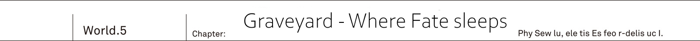
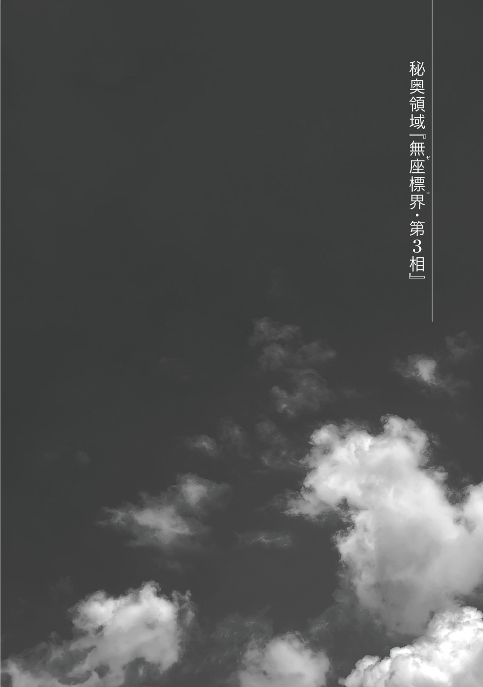

Yurun, Great Plain Grand Arc...

The huge black building [Graveyard].
In truth these ruins were built up by composing several millions carved into cubic form out of the rock that wasn't reflecting light.

But it was yet to be know who left it.

[Rath=IE, whom I met at the west border, said:
'You're going to disappear. Though it would be better for you to be sealed away at that place <ruby>there<rt>true world</rt></ruby>']

They were on their way heading to the graveyard.
Together with Kai and Resistance were Reiren and Rinne.
And leading them...

[But Kyouko didn't understand it.
That place? To be sealed?
I had no idea what it meant, but it struck me.
That's why I thought to search the most suspicious looking place.]

It was Rikugen Kyouko.

With her body made of semi-transparent mucus of sea color, at the moment she took an appearance of a young human girl.
One could say it was like a blue glass made in the image of young girl.

[And only this place feels different from human cities.]

"Hm? What do you mean?"

Lion King raised his voice as he was glaring at the graveyard, which height could rival that of skyscraper.

"Are you telling me that this absurdly big pyramid is not <ruby>yours<rt>spirits</rt></ruby>?"

[I meant different.]

"What then?"

[I do not know. Spirits thought it was made by humans.
Kyouko too, until I came here I forgot that it was called the graveyard.]

Spirit Sovereign Rikugen Kyouko answered with an indifference.

"..."

[Cannot believe?]

"Yes, I cannot.
Neither about these ruins that you call the graveyard nor about joining forces with you bastards.
I have no intention of trusting a single word of yours.
Jeanne-dono, you should certainly be careful too."

His unfaltering courage in face of spirits' hero was certainly praise worthy.

[I see.]

On other hand Rikugen Kyouko shown no indication of getting angry.

Next to the Liong King were Urza Resistance's Commander Jeanne and Farin.
Rinne and Reiren were in the them.
Looking at them from behind, Kai unintentionally clenched his fists.

This was a tension coming from thoughts of when war among three races would break out.

_We, Reiren and Rikugen Kyouko._

_Even putting aside Rinne, gathering here such variety of races is certainly exceptional._

Lion King Balmung's attitude was understandable.

These plains were part of spirits' territory.
Yet despite that they saw no one aside from Rikugen Kyouko.

Considering spirits' population, it wouldn't be surprising to find large ambush there.
Thus it was impossible to deny possibility of this invitation to the graveyard to be a trap.

_TL Note:_ Totally paranoia.

"I instructed my soldiers to stand by in the plains, waiting for my return within three hours.
They're not going to wait a minute longer and withdraw."

Just in case he'd be unable to return...
The Lion King Balmung considered that spirits betray and attack them inside the graveyard.

"Got it?"

[I see.]

Spirit's reply was as usual vague. _TL Note:_ No, I think she just doesn't care

And while watching this exchange...

"Reiren, I want to ask you one thing: say is there the graveyard in Io?"

"I've never seen."

Elven shrine maiden, who knew everything about the elven forest, shook her head.

"If there would be such gigantic ruins, as one would expect, it would stand out.
Maybe angels could know something."

"Maybe Alfreyja knew..."

_Now I think about it, it totally slipped my mind._

_I didn't even think about investigating what happened with the graveyard in the Io._

Demons' graveyard had the Code Holder.
Thus it was possible that Sidhe' graveyard would have something too.
It was certainly a blunder for him to forget about it and leave the country.

"That thing, the graveyard, from where we're supposed to enter it?"

Reiren asked Rikugen Kyouko.

"Is there some sort of door that you can see from the atop?"

[Don't know.]

"Oii!?"

[Kyouko still doesn't remember all about the graveyard.
Rath=IE mentioned the graveyard, so I remembered about its existence.
But I don't remember its role.]

Spirits' hero then looked at Kai.

For slimes whose body was composed of mucus cells, there was no such thing as human's five senses.
Even if these [eyes] were able to mimic that of human, it wasn't supposed to see him at all.

Yet.
He couldn't help but feel a intense spark of intelligence in these.

[You know about it well?]

"...I don't really know what happened to graveyards in this world.
But I might have some ideas."

[That's good.]

He guessed that she probably meant for him to guide.
As Kai started walking, Rikugen Kyouko too walked after him, in a manner that she was yet to become accustomed.

"Kai, aren't we going to the backside?"

"Yeah. Urza's graveyard had a secret passage there."

He beckoned both Jeanne and Farin.
Liong King Balmung, who was at the end of their formation, reluctantly followed them, while watching Rikugen Kyouko
Walking around outer perimeter of the graveyard, towards the other side.

"...As I thought."

At the back of the graveyard.
Kai narrowed his eyes in front of the grass in the shade.

Rolled over there was a big boulder in a shape of the globe.
Though normally it was supposed to be buried inside the graveyard's wall.

The sealing stone...

Locking four races inside the graveyard, it served as [stoprock] preventing their escape.
It was probably functioning considering the faintly glittering green pattern on the surface of the rock.

Where this stone was supposed to cover the graveyard's wall, they could see a hole.

_Again the same._

_As with the demons' graveyard where I found Rinne._

"When I found the graveyard in Urza, I also entered it from the back side.
As you can probably see, this building is so big that it would be a pain to search through it,
however this entrance leads to the shortest rout to the center."

"Is it dark there?"

Sunlight couldn't reach inside the graveyard.
As he stepped in, the Lion King immediately frowned.
Suddenly a cold air caressed their necks while passing them.

"Hey, Kai, is there really any point for us to search through this place?
You yourself said that you have no idea what is here, didn't you?"

"As I just said.
I already visited the Urza's graveyard once."

"...There you found monster of unknown origin, right?"

When they arrived to the Yurun Resistance, the Lion King also got report about the rasterizer from Jeanne.
About the monster that caused sudden change to the Heavenly Lord Alfreyja.

"Jeanne-dono, it is in a soldier's nature so I'd like you to excuse me, but I find it hard to believe such monster exists."

"I'm the same. Unless you see such thing yourself, it is difficult to believe."

As Jeanne replied, she stepped forward with a tensed expression on her face.

It was a narrow passage, that could barely fit two adults walking together.
Inside the walls were standing like that in a gigantic maze, making it hard to understand where you're.

"Was it a dream or a phantom?
It was a unimaginable monster.
The monster that attacked the Alfreyja was giving air of something that doesn't belong to five races.
Like the smell of death itself."

[Is it about the rasterizer?]

"...Halt. Why does thee know this name?"

Elven shrine maiden pointed her finger at the spirit, who mentioned monster's name.
Waving her seventh layered robes.

"This name should be known only to these present at that place...
If so, could it be thee is a ally of that thing!?" _TL Note:_ Big brain time...

[You're wrong. At the western border Rath=IE mentioned it.
And Rath=IE also knew that Alfreyja was gone.]

"...Mu!?"

[Kyouko fought too. But Kyouko's body was cut in pieces and lost.]

Everyone stopped and stared at the slime.
These words meant...
A mortal combat between two heroes?

In the end Rikugen Kyouko lost most of her body, and likely reached limits of supporting her life.

_It makes sense when she says that she was [tired]._

_She said that Rath=IE is just too strong, meaning it literally from her own experience, didn't she?_

"Wait, wait. Rath=IE knew?"

Reiren voice echoed inside the graveyard.

Elven shrine maiden was fearlessly talking with spirits' hero.

"Was that rasterizer's attack at the Alfreyja-dono instigated by the cryptids' Rath=IE?"

[I do not know.]

"...!?"

[Kyouko wasn't present at that time so she doesn't know.
Kyouko cannot say whether the rasterizer, that Kyouko saw, was the same thing as the one which attacked the Sidhe' hero.]

"...Is that so..."

Dropping her shoulders with disappointment, Reiren clenched her teeth.

"Still it also matches with Raphael's account.
Rath=IE tamed the rasterizer.
And without doubt cryptids were invading other countries."

At Urza it was the wyvern.
At Io it was gigantic behemoth.

And then cryptids's <ruby>hero<rt>Rath=IE</rt></ruby> himself appeared in the Yurun in order to get rid of the spirits.

"Early she mentioned attack on cryptids. So to speak turning conflict of five races into conflict of four races.
Isn't that what Rikugen Kyouko is suggesting?"

"...I'll consider that."

The Liong King made a small nod and walked with big steps.

"That's also why I feel we're wasting time dwelling into such weird ruins.
Let's just end it quickly.
Where exactly we even should go in this maze!?"

[Kyouko doesn't know. Human, what about you?]

"Me? It is the same for me. Even when I was in demons' graveyard I was just walking blindly in the end...
But well, at the end of endless walk there was a place with some light."

He remembered there was a wide open area.
The place, that was supposed to confine demons, was empty and instead he discovered sword, stuck in the ground.

[Fuun?] _TL TODO:_ Translate this `ふぅん`

Making interjection with her voice expressing admiration, Rikugen Kyouko pointed at the bayonet.
_TL Note:_ Sentence is rephrased a bit. `抑揚まじりの声で相づちを打つ六元鏡光が、ふとカイの銃剣を指さした。`

[Found Code Holder there?]

"...What makes you think so?"

[In this world there are no other place for it.]

While it was rather simple answer, it did make sense.

[Kyouko is sensing something weird about this world.
Sid told: be careful.
However, Kyouko has no memory of when this weirdness appeared.]

"..."

He silently exchanged glances with Rinne.
Only him himself and Rinne felt something [unusual] about this alternative world.
On other hand while Rikugen Kyouko didn't affirm the same [unusual], at the same time she was able to sense that something is [strange].

_She cannot remember when world became strange._

_Which means similarly to Jeanne she is not aware of the world reincarnation._

She wasn't able to recognize the world reincarnation.
Yet she was able to sense something strange about overwritten history.
The only question was why?

Both Vanessa and Alfreyja weren't like that.
Among four heroes only Rikugen Kyouko was aware that [this world is weird].
So what could cause such difference?

"Wind?"

Reiren murmured as if something rung a bell.
Buzzing winds caressed Kai's neck as its passing through.

"Is that a draught?"

"It is rather odd isn't, Jeanne-sama?
If it would be by entrance that would one thing, but here we're deep inside these ruins.
And there are no cracks from where wind would be coming."

Jeanne was looking as if understanding something.
Besides her was following Farin also with a sharp look.

"This is not just simple wind, right?"

[...Wave.]

"Is there a surge of power?" _TL Note:_ Here it is a bit vague as I cannot really say what exactly author could mean by power here, maybe magic. Also rephrased verb `渦巻いてる`

Just like in a refined chorus.
Beautiful voices of Rinne and Rikugen Kyouko created a harmony.

"Kai, here."

"O...oi, Rinne? It is dangerous so do not go on alone!"

Footsteps' sounds of half-running Rinne echoed from solid stone floor.
She was pushing through the complicated road of the maze almost without a single hesitation.

_TL Note:_ Second sentence is simplified a bit. Original `隔壁によって迷路状に入り組んだ通路を、まるで躊躇わず突き進んでいく`

"Eh, that?"

There was a dead end.

Standing in front of the wall that was dividing a small area.
Rinne had a questioning look as the area in front had nothing unusual about it.

"...How weird. Even though flow of power should be coming from somewhere here."

Rinne fixated her gaze on the empty space.
She was reaching out with her hand unable to grasp anything.

"What's wrong? Did you find something odd?"

It was the Lion King peeking out from the end of their line.
For him it was reasonable to question someone who suddenly started running inside such eerie ruins.

"Hey, Kai?"

Rinne whispered to him.

"Before Kai saved me, what exactly happened?"

"What you ask..."

He did nothing intentionally.
There was a similar hall in the demons' graveyard where shining sword was struck.
He remembered that after he reached out it with his hand there was voice.

It was solemn elderly voice.

_You, who was entangled by hatred of the fate. Never let go of this sword._

Sid's sword.
It was at that time when Kai found out the true name of this sword.

"...Code Holder, huh?"

There was no deep meaning to him muttering this name.
Although it was him purely recalling past, the moment he said it...

Shining sword in Kai's hand burst open.

"Wha!?"

Into countless glittering drops of light.
These glittering particles swept through the dim empty space, becoming a flash, and leaving there a trace of light.

Lights formed a door.

_It is same._

_The same as when I met Rinne!_

"W-what is it!? Kai, what did thee..."

Did Reiren's voice disappear?
No. It was they who disappeared.
Kai together with everyone else disappeared from the [world], leaving behind Reiren's voice echoing throughout the graveyard.

_TL Note:_ Text on picture is `秘奥領域「無座標界　第３相」`.
Where `無座標界` is annotated with furigana Zero.
It can be roughly translated as Secret Region [Zero Phase 3].
I'm not really sure as it is just weird name.

There was endless sea of rainbow clouds...

"...Am I dreaming?"

The Lion King Balmung used own fist to hit his forehead.
But even if he'd strike strong enough to leave red mark, he wouldn't wake up.

It was reality.

Far from a dream, in front of their eyes dreamlike dimension spread. _TL Note:_ This is a bit weird sounding `夢以上に夢のような異空間が目の前に広がっていた。`

"Where are we?
We... were supposed to be inside the graveyard.
Did we just get teleport into such weird place instantly!?"

The Lion King Balmung's voice pierced through this infinite area.

It was a complete change from the gloomy graveyard, anywhere you look, it was a fleeting world of the clouds filling the sky.
Moreover these clouds weren't just white, they were glittering slightly with rainbow colors.

"Completely agree with you, Balmung-dono"

Jeanne assented with a vexing.

"As a commander, one should remain calm in any situation.
That is what I strove to do, but as one would expect this...
Can shake such pledge."

Saying that Jeanne's voice started to get hoarse, making it hard speaking with her usual masculine voice.

"Farin, your opinion?"

"...If you're meaning to ask for an explanation, we have someone more qualified for that role, I think."

The one who was in Farin's line of sight.

She didn't outright declared who.
But her silent gaze was saying that it is <ruby>him<rt>Kai</rt></ruby>.

"So then, this place is...?"

"Seems similar to a place where I ended up after getting lost in the demons' graveyard."

He couldn't say it was the same.
While he could remember this scenery of wide sea of rainbow clouds, he couldn't say it was the same, but only that it was similar.

_Obviously I cannot say that Rinne had been captured here._

_Then I should tell..._

"Me and Rinne met the rasterizer here once."

"...Wait a second, Kai, you kept such important thing from me!?"

"I didn't mean it. Jeanne, even you wouldn't able to believe me, right? I mean such place..."

Even though he was her comrade.
He turned towards Jeanne, whose dissatisfied look was saying that, and pointed at their surroundings.

"Do you think I'd expect you to believe my story about such place, which I'm myself wouldn't be able to believe unless I'd see it."

"...T-that's... Might be true..."

"Even when I just came to the Urza Resistance, I've been just thought of as [some suspicious guy saying things],
but wouldn't me talking about such place just shock you?"

Being unable to speak truth without restraint...
For Kai it was quite troublesome thing.

Just talking about [world where the great war was finished] had been quite suspicious,
but he knew that saying something about such otherworldly place would just make him lose all trust.

"Both me and Rinne were escaping from the rasterizer's chase, and soon enough we escaped outside of the graveyard."

"You were able to break out?"

"There was a door.
It was similar to that shining door that we saw just now..."

However, at the moment there was no such thing.
As far as he could see there were only endless stone passage.

"I would love to get out of such weird place...
Still, all there is this passage, wonder who made it."

Big solder trampled down under his foot.

_TL Note_:This thing about is less confusing in japanese as different words are used to express it. What author wants to say is that it has design like marble floors and also white like real marble, but it is made from something different.

This stone passage was made with marble design in white, similar to marble.
And sturdy like it too.
Even if strong man like Balmung would kick it with all of his strength it would leave not even a single crack.

"With such sturdiness. It would take quite a lot of time to process the stone for this passage.
Considering rumors I heard, is it made by Sidhe?"

_TL Note:_ For some reason he really likes to pick on both Rikugen and Reiren...

There were majestic stone pillars, looking just like ancient sculptures.
Along the passage, where Kai and company where, these pillars were lined along the passage with few dozens meters intervals, almost as if it was a ancient temple.

They could clearly feel that it was someone's design.

"I heard that angels' palace is flying in the sky. So could it be the same?"

"Absolutely different thing."

It was no other than Reiren who outright asserted against.

Elf, who up until that moment remained silent, placed her hands onto nearest stone pillar and leaned against it.

"There are two differences from Sidhe'.
First both stone pillar and floor is made with different material.
And second is why this floor is flying.
Angels' palace is able to fly into the sky thanks to enormous magic power, but here it is different."

"Specifically?"

"Not a magic power.
Having said I don't think there is no trick to it or source of that.
I'm not very sure about it."

Like leaves floating on the water.
This stone floor too was floating along the boundary of vast sea clouds.
And as Reiren said, if there would be no trick to it, this stone corridor would be sinking down of sea clouds.

"Still, it is quite a wonder.
I wouldn't say I dislike such places, you know?
There could be treasure of novel wisdom.
So then, Kai, let us depart!"

"...And you're hiding behind me because...?"

"It is but my noble desire to leave it in thee capable hands to lead.
By no means it is out of a fear.
After all it is my duty to be brain here.
Also just making sure: it is not out of the fear, understood?"

Clinging from behind to Kai, she tightly grasped his jacket, not letting it go.

By the way, Rinne, who saw it, was glaring at Reiren with obvious displeasure,
but it would seem to certain elf had no time to notice it.

"Hey, Kai, that spirit is moving forward..."

"...Likely the one with the most guts among us too."

If they'd look.
They would see that they've been left behind by hundred meters by no other than spirits' hero.

While it wasn't clear whether spirits know of wariness, but once teleported to this place, she shown no sign of timidness.

"You cannot, flat board, get off from Kai!"

"Isn't it fine?
Or what, could it be thee is so scared that makes thee want to cling to Kai?"

"I-i'm scared of nothing!"

Two girls behind him were being busy.

_Oh, well, isn't it fine._

_In such place being so lively will in return calm you._

It was world without noise.
There, where even wind didn't blow, nothing except them would move.
Everything was still, as if time itself was missing.

It was quiet.

This place would seem to be most weird so far.

[...]

Rikugen Kyouko stopped, looked left and right.

Ahead there was a fork splitting into three.
They could go straight, left and right.
And further ahead they could see that these roads splits once more.

[Carry on?]

"Yeah, let's go straight ahead. Turning would just get us lost."

Kai nodded in response to the blue girl who turned around.

Holding Code Holder in his hand, he carried on.

They ignored forks.

_How nostalgic... Wait, that's a bit wrong way to put it._

_At first I had no idea what to do, making me feel lost._

He wondered if it was already one hour, or maybe two.

Then around the time when lively exchange between Rinne and Reiren diminished.

[There]

Rikugen Kyouko, who was leading them, pointed out.

[There is something. Altar? Seems similar to human ruins.]

"Ah, there was where I first found Rin..."

Rinne, who was crucified.

He hurried to push back these words coming from his month.

'There was a girl, crucified to the stone pillar.'

'As if she was hold there as some ceremonial sacrifice.'

_...How nostalgic, wait, it should be some different sentiment._

_At first I had no clue what to do, even lost._

The girl with tenma's wings.

He remembered being wary of her as he had no clue what was her race.
If at that time he'd do even single thing differently, then without doubt he wouldn't be able to arrive to this point with Rinne by his said.

[...Hee?]

This place stood out as an altar.
At the end of the stairs, which was less than ten steps, there were three solemn stone pillars, towering as if reaching the sky itself.

Voice of Rikugen Kyouko, who looked at the center, had gotten slightly hoarse.

[There is angel statue.]

It was a stone statue of the six winged angel [Heavenly Lord] Alfreyja.

Even though he was supposed to be disappear.
The archangel's image was installed here, carved as if it was petrified form of his.

"What!?"

With a cry, elven shrine maiden completely forgot about everything and run up the stairs.

Remaining still at their places, Jeanne, Farin and Lion King Balmung were looking up with expression of amazement.

Rinne leaned closer to Kai, with a vigilant look.

[Hmmm. Came to find a little doll.]

Rikugen Kyouko started her monologue.

[Kyouko remember to fight against this angel.
It resembles Sidhe's hero.
Rath=IE said he was supposed to be destroyed, so then this is?]

She slowly ascended onto altar.

With her hand, made of blue mucus, she attempted to touch stone image of the Heavenly Lord Alfreyja...

"Stop it. Do not touch."

Reiren's sharp words interrupted it.

"Spirit, what are thee trying to do!?
Even if it costs me my life, I will not let thee to touch Alfreyja-dono."

[...How folly.]

"What?"

[Kyouko couldn't be know whether it is Alfreyja or not.
Only thought it is well made stone statue.
However, such reaction of yours made it clear to Kyouko.]

This stone statue was Heavenly Lord Alfreyja himself.

For spirits' hero it was the greatest adversary.
But now he became completely defenseless.
With how he was at that time his destruction would be trivial.

[If you wanted to be wary of Kyouko, instead you ought to pretend not to recognize it.]

"...!"

[However]

Rikugen Kyouko reached the stone statue.
With her fingers she crawled over it to ascertain how its surface feels, but despite Reiren's fear,
she did nothing harmful to the stone statue.

[This statue is not alive. Kyouko has no need to attack.]

"I-it cannot be true!"

[Want Kyouko to attack?]

"N-no! I mean that it is yet to be decided if this petrification can be fixed or not.
It is a mere petrification.
This can be done with some demons' magic."

There was example of gargoyle attacking the Urza Resistance.
Among demons' magic [petrification] was known as the most atrocious.
For human without magic power there was no way to resist it.

But it was a different story for Sidhe, who possessed significant amount of magic power.

"If there would magic formula to undo it, they it would be possible to revive Alfreyja-dono.
In theory..."

[Suspect it is not so simple]

She spoke while caressing the stone statue.

[It is not a simple petrification.
Rather it looks like a complete freeze.
Most likely stone covers only surface.]

"Wha... I-is that so?"

[Can you heal it?]

"Eei, wait. I'll think about it right now."

Reiren remained silent in front of the angel statue.

"Kai, lend me thy wisdom."

"I'm thinking too. It is just..."

Then he recalled.
This appearance of the Heavenly Lord transformed into [something] like a stone status.
It was almost like...

'Stone doesn't speak. If it does, then it is no longer stone. What are you?

'I'm the being of the world, where the great war had ended.'

_TL Note:_ Refers to meeting with _talking_ stone statue in chapter 2.

It was like at the blue sanctuary.
Deep within the ancient forest, they saw goddess statue inside the megalith.

He couldn't help but remember meeting with that talking stone statue.
A god of prophecy who could see the fate itself.
And then the current image of the Heavenly Lord overlapped with that statue.

He wondered if it was a coincidence.

However, the Heavenly Lord Alfreyja was completely frozen in place, without any signs of being aware.
Kai couldn't deny that while similar, it was quite different too.

_Regardless, what is this place?_

_Did the defeated Heavenly Lord get sealed here? Or was he isolated?_

"Jeanne-dono. Is this angel statue that Sidhe' hero?"

The Lion King climbed the altar.

"This stone statue is detailed to a terrific degree, but is it truthful?"

"Yeah. It is the angel that we fought.
As they just discussed, it would seem to be more than a simple petrification.
And investigating it will take some time."

"No, no time for that."

Bearded big man raised metal maul with his strong hands.

"If it is truly that hero, then destroying it here would benefit all of mankind!
Leave it to me.
For such statue a single hit..."

"As I was saying stooooo!?"

"Mu. Let go, Reiren!"

"Like I would let you do it!"

Reiren was clinging onto back of the large man.
Maybe because Reiren was rather small even among elves, but it looked like a child clinging to the adult, wanting to remain together.

"Got it, little one. I'll get you some sweets later. Now it is fine?"

"Thee treating me like a child!?
Kai, Jeanne, thee don't stand silent there, cannot you say something!?"

"Ah... Balmung-dono?"

Urza Resistance commander stepped in to mediate with the solder whose maul was ready to swing down at any time.

"It would benefit us to carry on investigation of the stone statue.
If we destroy it now, we would lose important source of information."

"Mu... You might be right."

"There might be something else out there.
We should make it our priority to continue investigation."

Jeanne looked in the direction of the stone corridor once again.
This altar wasn't the final destination.
The corridor continued further on, going beyond even these absurd clouds.

"And above all we have to find exit.
There might be other altars like this one too."

Above the commander, who was disguised as a man...
It was at that time that something strange happened.

'Foreign instruction invaded the Zero.
Detected it close to the erased hero...'

Out of nowhere swirling black point appeared.
From within a hole, similar to that of whirlpool, widening it in silence [something] appeared.

'Danger of interference with new world require [caution].'

'Initiate expulsion by Rasterizer class 1 [Destruction will]'

It was girl belonging to a weird mix of races.
Her outward appearance was similar to that of human, but her lower half had a form with four legs like that of lion.
There was a gap in her abdomen, from which could be seen light shining like it was a strike of lighting.
On her back there were grown skeleton wings.

Having numerous races mixed in made her similar to Rinne...
But that was all.

It being disorderly combined together looked awfully unbalanced.

[...A...Haha, ha...]

It was a reverberant voice.
While having such repulsive appearance, this voice was fit to that of lovely girl.

_This time it is different from before guy._

_Another specimen!?_

"W-what is this monster!? Right now, where did it come from!?"

Monster, previously unheard of, landed on the altar.

While opening his eyes wide at this bizarre feel, the Lion King remains standing still without retreating, likely thanks to his long history as a solder.

[This guy...]

Blue girl said with cold voice.

[It had been together with Rath=IE.
It came to strike.]

"I see.
So it is pet of Rath=IE.
Which means it is one of the culprits behind how Alfreyja-dono ended up..."

Reiren's voice had anger to it.
She tightly grasped knife of crescent moon color in her hand.

"Will Rath=IE appear too then?
If so it would make my work quick."

[Impossible]

"...Whatever you mean, spirit?"

[No one will be able to defeat, if that beast and this thing would combine forces.
To begin with this thing in front of your eyes is strong.]

Rikugen Kyouko faced against the rasterizer...
Towards the monster with its creepy smile, spirits' hero spoke once again with piercing cold tone.

[This is world enemy. Just single one can destroy the balance of the world.]

It was an enemy of every being alive.
Able to change the world itself.

[And possibly stronger that four heroes.]

As if in affirmation.
Monster's charming smile shook the world of Zero.
